class: middle, center, title-slide
name: lecture1

# Machine Learning
## Lecture 1: Fundamentals of machine learning
  
Simon BERNARD 
[simon.bernard@univ-rouen.fr](mailto:simon.bernard@univ-rouen.fr)  
.center.height-4em[]

---
# Recent successes of AI

.center[**Image and video recognition**]

.center.width-80[
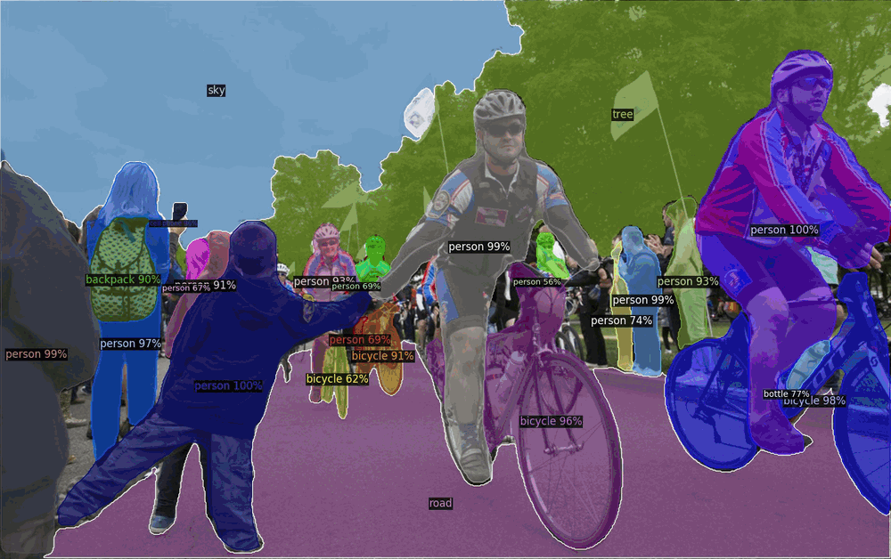
*[Detectron 2](https://github.com/facebookresearch/detectron2), Facebook AI Research (2019)*
]

---
# Recent successes of AI

.center[**Image and video recognition**]

.center.width-80[
    <video  preload="auto" autoplay loop controls>
        <source src="./medias/lec1/sam2.mp4" type="video/mp4">
    </video>
    *[SAM 2](https://sam2.metademolab.com/demo), Facebook AI Research (2024)*
]

---
# Recent successes of AI

.center[**Image and video generation**]

.center.width-80[
    <video  preload="auto" autoplay loop controls>
        <source src="./medias/lec1/megaportraits.mp4" type="video/mp4">
    </video>
    *[MegaPortraits](https://neeek2303.github.io/MegaPortraits/), Samsung (2022)*
]

---
# Recent successes of AI

.center[**Natural Language Processing**]

.center.width-70[
    <video preload="auto" autoplay loop controls class="framed">
        <source src="./medias/lec1/claude.mp4" type="video/mp4">
    </video>
    *[Claude AI](https://claude.ai/), Anthropic*
]

---
# Recent successes of AI

.center[**Autonomous AI**]

.center[
    <iframe width="700" height="400" src="https://www.youtube.com/embed/HYwekersccY?si=ZSMRaYB60wclJTCb&mute=1&autoplay=1" frameborder="0" allowfullscreen></iframe>
    *[Large Behavior Models](https://example.com), Boston Dynamics & Toyota Research Institute (2025)*
]

---
# Today's AI $\approx$ Deep Learning

.center.width-100[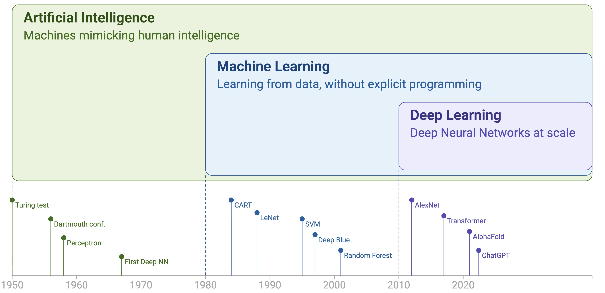]

.center.mt-2[In this course, we'll cover fundamentals of machine learning first and then focus on deep learning]

---
# Today's AI $\approx$ Deep Learning

.row[
.col-50.center[
.width-80.mt-3[]
]
.col-50.center[
.width-80.mt-3[
<video  preload="auto" autoplay loop controls muted>
    <source src="./medias/lec1/yann-dl.mp4" type="video/mp4">
</video>
*video taken from [Gilles Louppe](https://glouppe.github.io/) teaching materials*
]]]

---
class: middle, center

# Machine Learning

---
# Machine Learning

When one want a computer to perform a task, he have to program it to do so.
.row[
.col-30.center[
.mb-1[**Is it a picture of a cat?**]
.width-100[]
]
.col-50[
We could imagine writing a program based on simpler questions, such as:
- Does it have fur? &nbsp; .success.fa-check[]
- Does it have whiskers? &nbsp; .success.fa-check[]
- Does it have pointed ears? &nbsp; .success.fa-check[]
]
]

---
# Machine Learning

When one want a computer to perform a task, he have to program it to do so.
.row[
.col-30.center[
.mb-1[**Is it a picture of a cat?**]
.width-100[]
]
.col-50[
We could imagine writing a program based on simpler questions, such as:
- Does it have fur? &nbsp; .alert.fa-xmark[]
- Does it have whiskers? &nbsp; .alert.fa-xmark[]
- Does it have pointed ears? &nbsp; .alert.fa-xmark[]
]
]

---
# Machine Learning

Tasks are often too complex to define these rules, but we can make a computer learn them by:
1. Providing it with many examples of cat images
2. Using algorithms to identify features that are common to cat images
3. Using these features to make predictions on new, unseen images

.row[
.col-50.center[
.mb-1[**How to tell that they are all cats?**]
.width-100[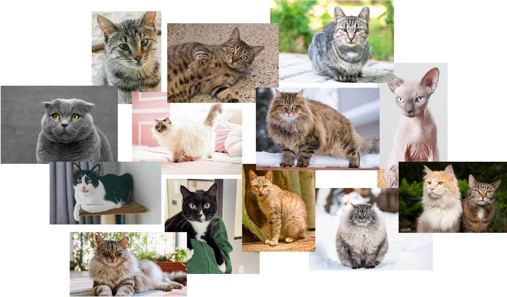]
]
.col-50.vcenter[
> Machine learning aims to **learn patterns from data** to make predictions or decisions, **without being explicitly programmed** for every rule.
]
]

---
# The machine learning pipeline

The ML pipeline is typically divided into two phases: 
- **Learning (or training)** : a (parametrized) model is learned from a training set
- **inference** : the model is used to make predictions on new, unseen data.

.center.width-80.mt-4[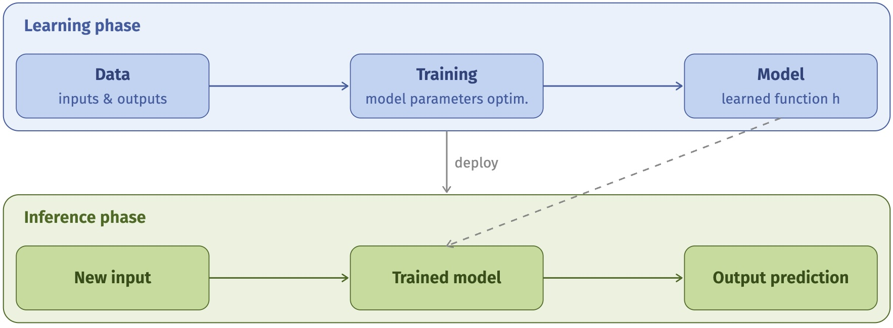]

---
# 50 shades of machine learning

.center.width-100[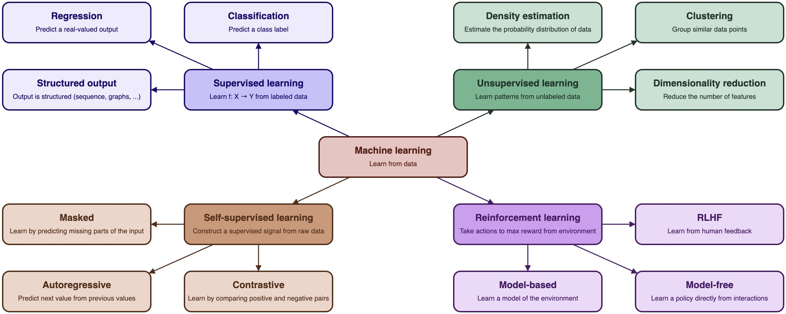]

In this course, we will focus on **supervised learning**, which is the foundational paradigm of machine learning, and the one that is most widely used in practice.

---
# Supervised Learning

- **Machine Learning is based on example data**
- These data represent "objects" of the problem (e.g. images, texts, patients, etc.)
- A data item (**instance**) is represented by a set of values (**features**)
$$
    \mathbf{x} = (x_1, x_2, \ldots, x_d), \mathbf{x} \in \mathcal{X} \subseteq \mathbb{R}^d
$$
- The features are a description of objects and often reflect properties of interest
- A **training set** is a collection of $n$ instances:
$$
    \mathbf{X} = \\\{ \mathbf{x}_i \in \mathcal{X}, i=1, \ldots, n \\\}
$$

---
# Supervised Learning

- **The data is associated with a target variable that we wish to predict**
- It is assumed that there is a true function $f$ (unknown):
$$
    f: \mathcal{X} \rightarrow \mathcal{Y}
$$
where $\mathcal{Y}$ is the domain of the target variable $Y$
- Learning consists in finding a prediction function (or **model**) $h$ that best approximates $f$:
$$
    \hat{y} = h(\mathbf{x}), \  \forall \mathbf{x} \in \mathcal{X}
$$
where $\hat{y}$ is the predicted value of $Y$ for a given instance $\mathbf{x}$.

---
# Supervised Learning

- For **supervised** learning, the training set is:
$$
    \mathcal{D} = \\\{ (\mathbf{x}_i, y_i) \in \mathcal{X} \times \mathcal{Y}, i=1, \ldots, n \\\}
$$
where $y_i$ is the true value of $Y$ for $\mathbf{x}_i$ (i.e. $y_i = f(\mathbf{x}_i)$)
- **Regression**: the target variable is continuous (e.g., predicting house prices)
$$
    \mathcal{Y} \subseteq \mathbb{R}
$$
- **Classification**: the target variable is categorical (e.g., predicting if an email is spam or not)
$$
    \mathcal{Y} = \\\{ \lambda_1, \lambda_2, \ldots, \lambda_k \\\}, k \geq 2
$$

---
# Regression

- The model learnt to solve regression problems is called a **regressor**.
- It is learnt to find a function that maps the input features to a continuous output variable.

.center.width-60[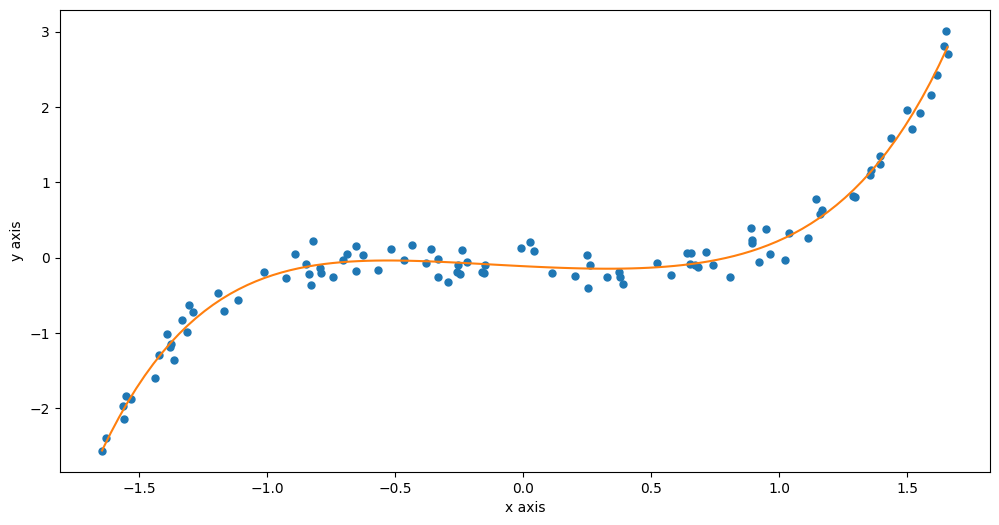]

---
# Classification

- The model learnt to solve classification problems is called a **classifier**. 
- It is learnt to find boundaries between classes in the feature space.

.center.width-40[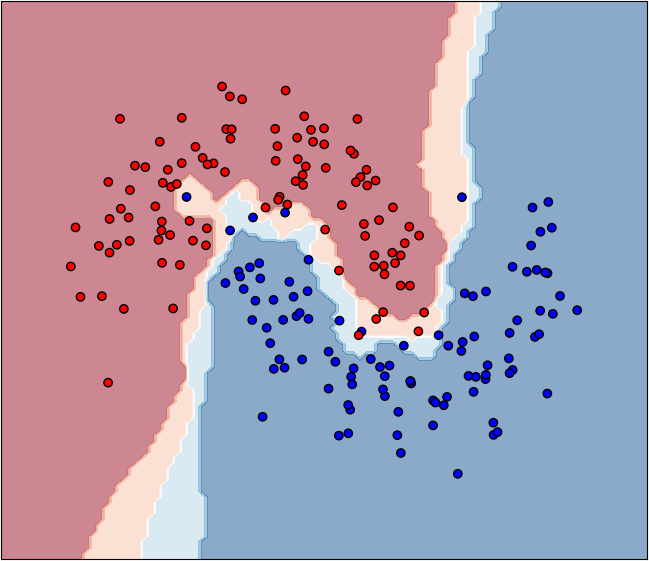]

---
class: middle, center

# Empirical Risk Minimization

---
# Parameterized models

- The goal of any ML method is to find the best $h$ possible
- Let $\mathcal{H}$ be the set of all possible models (called the **hypothesis space**)
- Most often, $h$ is defined by a set of parameters $\theta \in \Theta$
- In that case, **finding the best $h$** is equivalent to **finding the best $\theta$**

.row[
.col-50.center[
.width-90[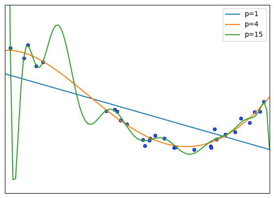]
]
.col-45[
Exemple:
- $\mathcal{H}$ is the set of polynomials of degree $p$
- $\Theta \subseteq \mathbb{R}^{p+1}$: coefficients of polynomials of degree $p$
]
]

---
count: false
# Parameterized models

- The goal of any ML method is to find the best $h$ possible
- Let $\mathcal{H}$ be the set of all possible models (called the **hypothesis space**)
- Most often, $h$ is defined by a set of parameters $\theta \in \Theta$
- In that case, **finding the best $h$** is equivalent to **finding the best $\theta$**

Note:
- The more complex the problem, the greater the number of parameters required
- The more parameters, the greater the amount of data required
- Today’s AIs = a LOT of parameters and a LOT of data
- Example .exponent[(1)] : GPT-3 model (2020 version)
    - $175$ billions parameters
    - $950$ Gb of learned texts
    - $34$ days of calculations, equivalent to $355$ years/GPU (and $4.6$ M$)

.footnote[(1) GPT-4 (2023 version) is estimated to have $10^{12}$ parameters and was trained on $25,000$ GPUs for 6 months, but the exact details are not publicly disclosed.]

---
# Loss function

- **The goal of any ML method is to find the best $h$ possible**
- To do so, we rely on a **loss function**:
$$
    L : \mathcal{Y} \times \mathcal{Y} \rightarrow \mathbb{R}^+
$$
s.t. $L(\hat{y}, y) > 0$ measures the extent to which the prediction $\hat{y}$ is different from the true value $y$.
- Example:
    - Quadratic loss or mean squared error (MSE) for regression: $$L(\hat{y}, y) = (\hat{y} - y)^2$$
    - 0/1 loss for classification:
        $$L(\hat{y}, y) = \begin{cases}
        1 &\text{if } h(\mathbf{x}) = y \\\\
        0 &\text{otherwise}
        \end{cases}$$

---
# Loss function

.grey[Example: Linear regression model fitted on the blue points by minimizing the sum of $L(\hat{y}, y) = (\hat{y}-y)^2$. The red dashed line have length of $|\hat{y}-y|$]

.center.width-70.mt-3[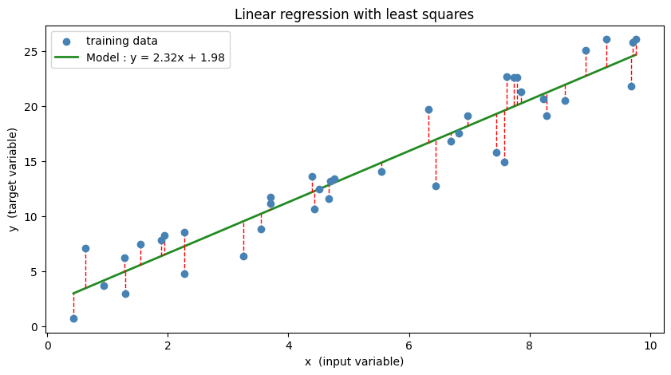]

---
# Loss function

.grey[Example: Decision tree classification on the Iris dataset (with only two features). The colored zones represent the decision boundaries of the model. The 0/1 loss is equal to 3 since 3 points are misclassified.]

.center.width-50.mt-3[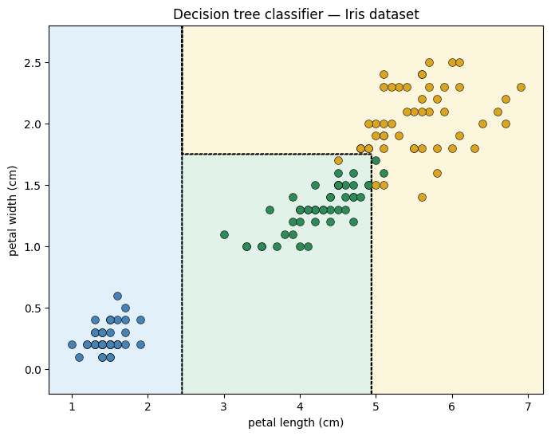]

---
# Expected risk

- The global "quality" of a model $h$ is measured by its **expected risk** (or **generalization error**):
$$
    R(h) = \mathbb{E}_{X,Y} \left[ L(h(\mathbf{x}), y) \right]
$$
- The best model $h^{\star} \in \mathcal{H}$ is the one that minimizes this risk:
$$
    h^{\star} = \arg \min_{h \in \mathcal{H}} R(h)
$$
- Problem: $R(h)$ cannot be computed because the distribution of the data is unknown 

---
# Empirical Risk

- BUT we have a training set from which we can compute an estimate, called the **empirical risk**:
$$
    R\_{\mathcal{D}}(h) = \frac{1}{n} \sum_{i=1}^{n} L(h(\mathbf{x}_i), y_i)
$$
- Empirical Risk Minimization (ERM) consists in finding the model that minimizes the empirical risk:
$$
    h^{\star}\_{\mathcal{D}} = \arg \min\_{h \in \mathcal{H}} R\_{\mathcal{D}}(h)
$$
- **A machine learning technique is a (hopefully effective) way of finding $h^{\star}\_{\mathcal{D}}$ from $\mathcal{D}$.**

---
class: middle, center

# Under-fitting and Over-fitting

---
# Model complexity

What happens if $h$ is too ”simple” or too ”complex” compared to $f$ ?

.center.width-80.mt-3[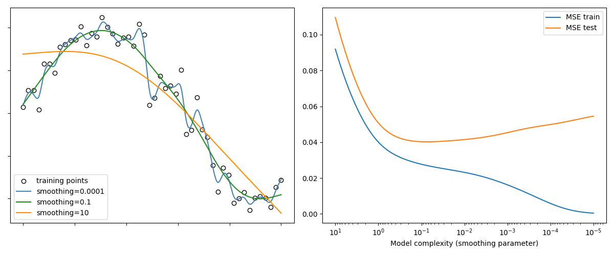]

---
# Generalization gap

The goal is to adjust the model complexity to reach the lowest possible expected risk $R(h)$.

.row[
.col-40.center[
.width-100.mt-3[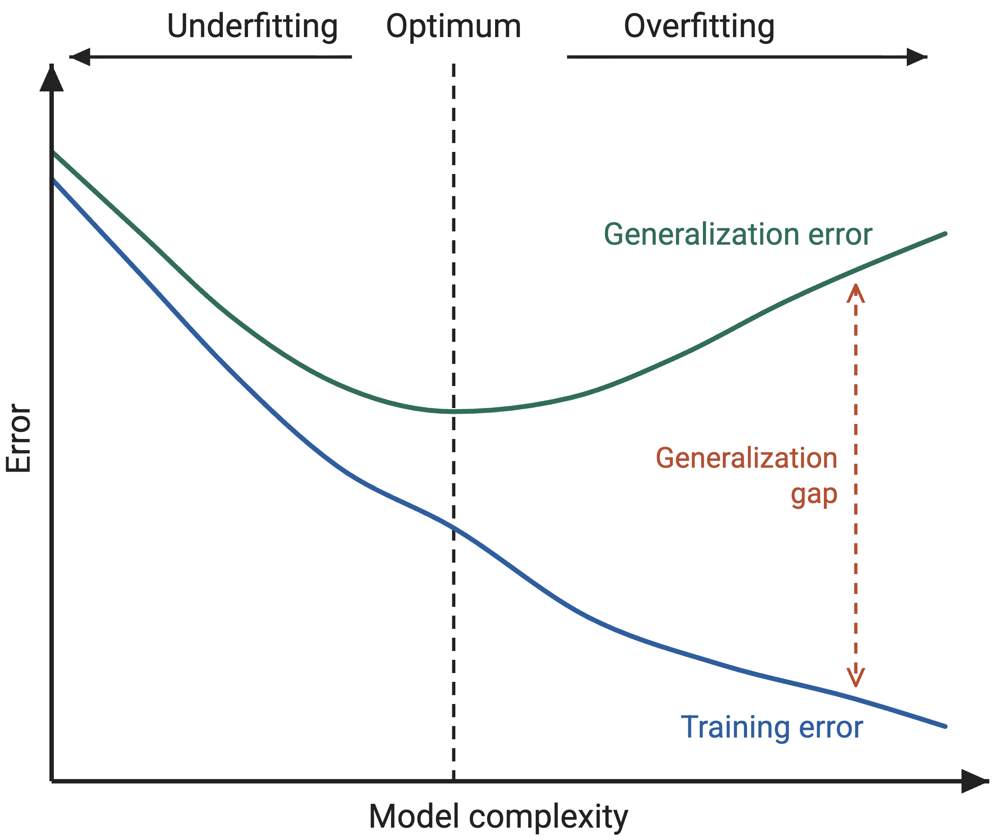]
]
.col-50.vcenter[
- overfitting means that $R\_{\mathcal{D}}(h^{\star}\_{\mathcal{D}})$ is a poor estimation of $R(h^{\star}\_{\mathcal{D}})$ .exponent[(1)]
- As model complexity increases, the generalization gap $R(h^{\star}\_{\mathcal{D}}) - R\_{\mathcal{D}}(h^{\star}\_{\mathcal{D}})$ increases
- How could we know this is the case when we can't calculate $R(h^{\star}\_{\mathcal{D}})$?
]
]

.footnote[(1) Reminder: $h^{\star}\_{\mathcal{D}}$ is the best model found during training, $R$ and $R$.subscript[$\mathcal{D}$] are the expected and empirical risks, respectively, or also called generalization error and training error.]

---
# Training and test sets

- We can still estimate the generalization error by using an independent test set $\mathcal{D}\_{test}$:
$$
    R\_{\mathcal{D}\_{test}}(h^{\star}\_{\mathcal{D}}) = \frac{1}{m} \sum\_{i=1}^{m} L(h^{\star}\_{\mathcal{D}}(\mathbf{x}\_i), y\_i)
$$
where $m$ is the number of instances in $\mathcal{D}\_{test}$.
- **Golden rule: $\mathcal{D}\_{test}$ should be used only ONCE and must NOT be used for anything else**

.center.width-70.mt-3[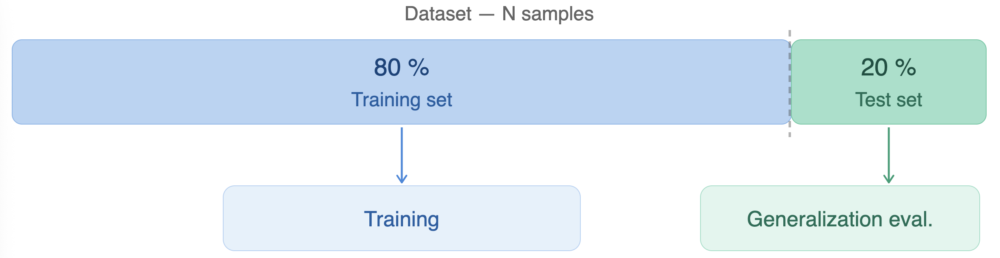]

---
# Prevent Over-fitting

- **Regularization**: add a penalty term to the loss function to discourage complex models:
$$
    R\_{\mathcal{D}}(h) = \sum_{i=1}^{n} L(h(\mathbf{x}_i), y_i) + \lambda \Omega(h)
$$
where $\Omega(h)$ is a regularization term that measures the complexity of the model and $\lambda$ is a hyperparameter that controls the strength of the regularization.
- **Early stopping**: for iterative training, stop when the generalization performance starts to degrade.
- **Complexity hyperparameter**: some model have a hyperparameter that controls the complexity of the model (e.g., depth of a decision tree, number of hidden units in a neural network).

---
# Training, validation and test sets

For all these methods, we need to use a **validation set** to estimate the generalization error.

.center.width-70.mt-3.mb-3[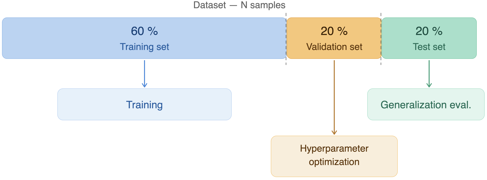]

- Proportions of the training, validation and test sets often depends on $N$
- Training/validation is repeated for each hyperparameter value to find the best one (called **hyperparameter tuning**)
- The final model is then evaluated on the test set to estimate its generalization error .exponent[(1)]

.footnote[(1) Reminder: $\mathcal{D}\_{test}$ **should be used only ONCE and must NOT be used for anything else**]

---
# Cross-validation

When the dataset is small, we can use a **cross-validation** procedure instead.

.center.width-70.mt-3.mb-3[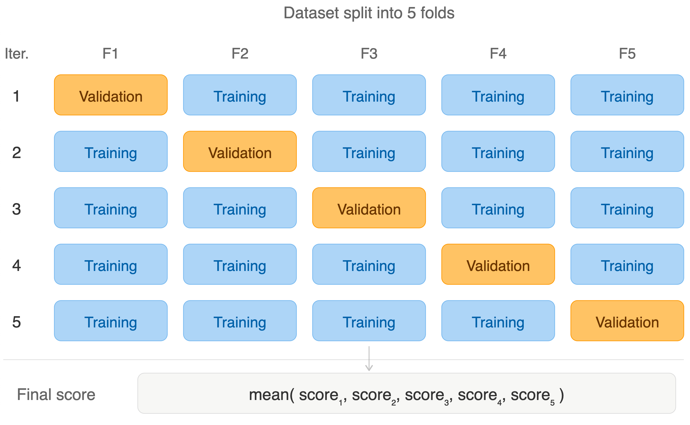]

---
# Takeaways

.box[**No data = no machine learning**]

.box[What is the ML task? what is the input and what is the output?]

.box[How to measure the quality of a model? what is the loss function?]

.box[
**Machine learning pipeline**:
1. Identifying the inputs and the outputs of the problem
2. Gathering data for training and testing
3. Preparing the data (feature extraction, normalization, etc.)
4. Selecting a machine learning technique
5. Setting hyperparameter values (see previous slides)
6. Learning the model on the training set
7. Evaluating the model on the test set
]

