class: middle, center, title-slide
name: lecture2

# Machine Learning
## Lecture 2: Linear models
<br><br>
Simon BERNARD<br>
[simon.bernard@univ-rouen.fr](mailto:simon.bernard@univ-rouen.fr)<br><br>
.center.height-4em[]

---
class: middle, center

# Linear regression

---
# First example: Hooker's experiment

- Joseph D. Hooker's experiment in 1849
- Measurement of atmospheric pressure $p_i$ and boiling water temperature $t_i$ in the Himalayas
- We know that $y_i = \ln(p_i)$ is (approx.) proportional to $t_i$, so we have :
$$
    y_i = \alpha t_i + \beta + u_i
$$
where $u_i$ represents the measurement error (or noise)
- Goal : Predict atmospheric pressure from the boiling temperature of water (which can then be used to deduce altitude, without using a barometer)

---
# First example: Hooker's experiment

.center.width-60.mt-2[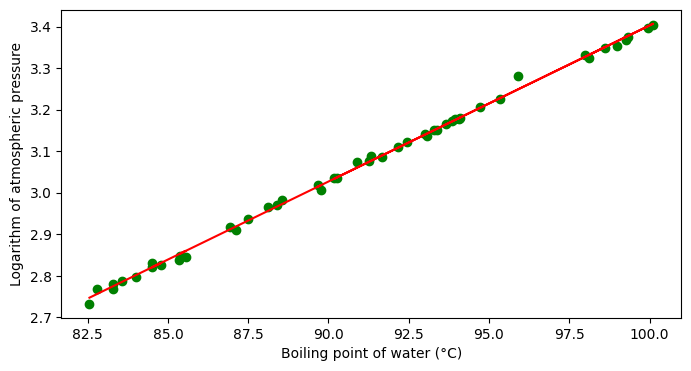]

- Green points represent the measurements and the red line is the model $\hat{y}_i = w t_i + b$
- The parameter $(w,b)$ are learned by minimizing the quadratic loss (least squares)
- This is called **simple linear regression** because there is only one input variable

---
# Second example: Diabetes dataset .exponent[(1)]

.center.width-70.mt-4[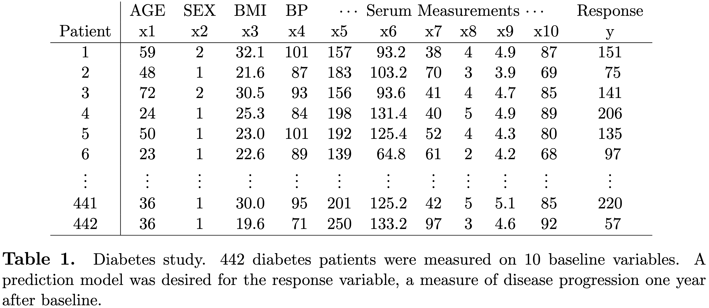]

- We assume that the relationship between the input features $x\_{i,j}$ and the output $y\_i$ is linear:
$$
    y\_i = w\_1 x\_{i,1} + w\_2 x\_{i,2} + \dots + w\_{10} x\_{i,10} + b
$$
- This is called **multiple linear regression** because there are multiple input variables

.footnote[(1) Bradley Efron et al., “Least Angle Regression”, Annals of Statistics, 2004]


---
# Second example: Diabetes dataset .exponent[(1)]

```python
from sklearn import datasets
from sklearn.linear_model import LinearRegression
X, y = datasets.load_diabetes(scaled=False, return_X_y=True)
clf = LinearRegression().fit(X, y)
print(clf.coef_)
print(clf.intercept_)
```

```shell
> [-3.63612242e-02 -2.28596481e+01 5.60296209e+00 1.11680799e+00
   -1.08999633e+00 7.46450456e-01 3.72004715e-01 6.53383194e+00
   6.84831250e+01 2.80116989e-01]
   -334.5671385187874
```

.footnote[(1) Bradley Efron et al., “Least Angle Regression”, Annals of Statistics, 2004]

---
# Matrix notations

- We have a set of $n$ samples $(\mathbf{x}_i, y_i)$, $i=1,\dots,n$ (the training set)
- In practice, the $\mathbf{x}\_i$ are gathered in a matrix $\mathbf{X} \in \mathbb{R}^{n \times d}$ and the $y\_i$ in a vector $\mathbf{y} \in \mathbb{R}^n$:

$$
\mathbf{X} = \begin{bmatrix}
\mathbf{x}\_1^\top \\\\
\mathbf{x}\_2^\top \\\\
\vdots \\\\
\mathbf{x}\_i^\top \\\\
\vdots \\\\
\mathbf{x}\_n^\top \\\\
\end{bmatrix}
= 
\begin{bmatrix} 
x\_{1,1} & x\_{1,2} & \dots & x\_{1,j} & \dots & x\_{1,d} \\\\
x\_{2,1} & x\_{2,2} & \dots & x\_{2,j} & \dots & x\_{2,d} \\\\
\vdots & \vdots & \vdots & \vdots & \vdots & \vdots \\\\
x\_{i,1} & x\_{i,2} & \dots & x\_{i,j} & \dots & x\_{i,d} \\\\
\vdots & \vdots & \vdots & \vdots & \vdots & \vdots \\\\
x\_{n,1} & x\_{n,2} & \dots & x\_{n,j} & \dots & x\_{n,d} \\\\
\end{bmatrix}, 
\mathbf{y} = \begin{bmatrix} 
y\_1 \\\\
y\_2 \\\\
\vdots \\\\
y\_i \\\\
\vdots \\\\
y\_n \\\\
\end{bmatrix}
$$

- Note : vectors are noted in bold, matrices in bold capitals, vectors are column vectors.

---
# The least squares method

- We want to learn a linear model :
$$h(\mathbf{x}) = \sum_{j=1}^{d} w_j x_j + b = \mathbf{w}^\top \mathbf{x} + b$$
with $\mathbf{w}^\top = [w\_1, w\_2, \dots, w\_d]$
- "linear" because it is linear in its parameters $\mathbf{w}$ and $b$ (not necessarily in the $x_j$)
- The least squares method consists in finding the parameters $\mathbf{w}^\star$ and $b^\star$ that minimize the quadratic loss, also called the residual sum of squares (RSS) :
$$(\mathbf{w}^{\star}, b^{\star}) = \arg\min\_{\mathbf{w},b} \text{RSS}(\mathbf{w}, b)$$

$$\text{RSS}(\mathbf{w}, b) = \sum\_{i=1}^{n}(y\_i - h(\mathbf{x}\_i))^2 = \sum\_{i=1}^{n}(y\_i - \mathbf{w}^\top \mathbf{x}\_i - b)^2$$

---
# The least squares method
## Geometric interpretation

The least squares method consists in finding the hyperplane that best fits the observations $(\mathbf{x}_i, y_i)$, such that the distances between the points and the hyperplane are minimized.

.row[
.col-50.center[
.width-70[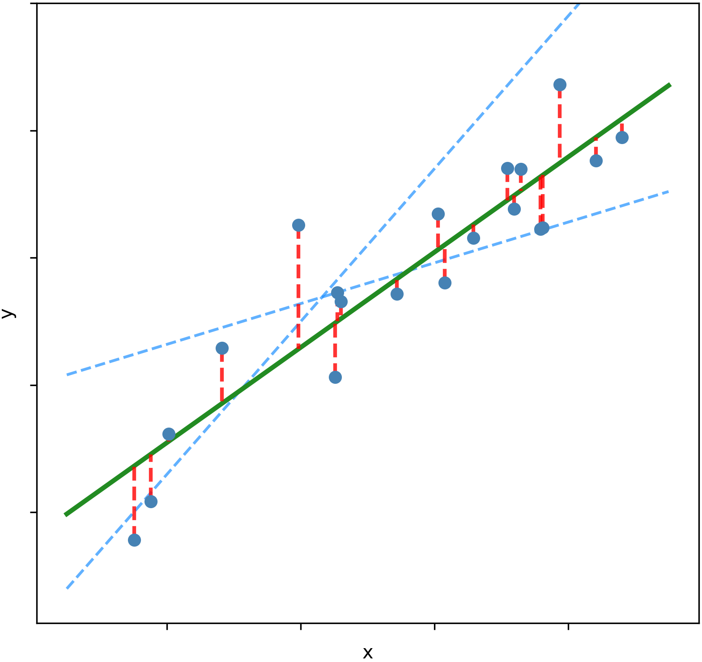]
]
.col-50.center[
.width-85[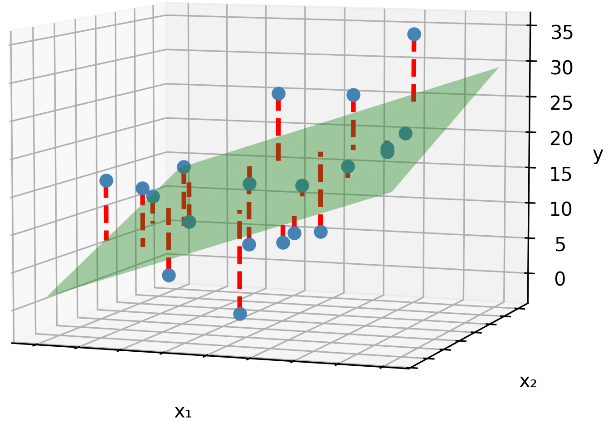]
]
]

---
# The least squares method

- For simplification, we usually add a column of 1 to $\mathbf{X}$ and incorporate $b$ to the vector $\mathbf{w}$ :

$$
\mathbf{X} = \begin{bmatrix}
\mathbf{x}\_1^\top & \color{orange}{1} \\\\
\mathbf{x}\_2^\top & \color{orange}{1} \\\\
\vdots & \vdots \\\\
\mathbf{x}\_n^\top & \color{orange}{1} \\\\
\end{bmatrix}
= \begin{bmatrix}
x\_{1,1} & \dots & x\_{1,d} & \color{orange}{1} \\\\
x\_{2,1} & \dots & x\_{2,d} & \color{orange}{1} \\\\
\vdots & & \vdots & \vdots \\\\
x\_{n,1} & \dots & x\_{n,d} & \color{orange}{1} \\\\
\end{bmatrix}
, \mathbf{w} = \begin{bmatrix} w_1 \\\\ w_2 \\\\ \vdots \\\\ w_d \\\\ \color{orange}{b} \end{bmatrix}
$$

- The model becomes :
$$h(\mathbf{x}) = \mathbf{w}^\top \mathbf{x}$$
with $\mathbf{w}^\top = [w\_1, w\_2, \dots, w\_d, {\color{orange} b} ]$ and $\mathbf{x} = [x\_{1}, x\_{2}, \dots, x\_{d}, {\color{orange} 1}]$

---
# The least squares method


- The RSS can be written in matrix form :
$$\text{RSS}(\mathbf{w}) = (\mathbf{y} - \mathbf{X}\mathbf{w})^\top (\mathbf{y} - \mathbf{X}\mathbf{w})$$
- The minimum is reached when the gradient of the RSS is zero :
$$\nabla\_\mathbf{w} \text{RSS}(\mathbf{w}) = -2\mathbf{X}^\top (\mathbf{y} - \mathbf{X}\mathbf{w}) = 0$$
- This leads to the normal equations :
$$\mathbf{X}^\top \mathbf{X} \mathbf{w} = \mathbf{X}^\top \mathbf{y}$$
- If $\mathbf{X}^\top \mathbf{X}$ is invertible, the (**closed form**) solution is :
$$\mathbf{w}^* = (\mathbf{X}^\top \mathbf{X})^{-1} \mathbf{X}^\top \mathbf{y}$$

---
# The least squares method

```python
import numpy as np
from sklearn import datasets

X, y = datasets.load_diabetes(scaled=False, return_X_y=True)
Xa = np.concatenate((X, np.ones((X.shape[0], 1))), axis=1)
w = np.linalg.inv(Xa.T @ Xa) @ Xa.T @ y
print(w[:-1])
print(w[-1])
```

```shell
> [-3.63612242e-02 -2.28596481e+01  5.60296209e+00  1.11680799e+00
   -1.08999633e+00  7.46450456e-01  3.72004715e-01  6.53383194e+00
    6.84831250e+01  2.80116989e-01]
  -334.5671385187874
```

---
# Regularized regression

- The Least squares solution is :
$$\mathbf{w}^* = (\mathbf{X}^\top \mathbf{X})^{-1} \mathbf{X}^\top \mathbf{y}$$
- **Problem** : the matrix $\mathbf{X}^\top \mathbf{X}$ may not be invertible
- It may be the case if the features are linearly dependent (collinearity) or if there are too many features compared to the number of samples
- Solution : use a **regularization term to stabilize the inversion** :
$$\text{RSS}(\mathbf{w}) = \sum_{i=1}^{n}(y_i - \mathbf{w}^\top \mathbf{x}_i)^2 + \lambda \Omega(\mathbf{w})$$
- Optimization : solve the problem of $\mathbf{X}^\top \mathbf{X}$ not invertible
- Machine learning : aim to **penalize models that are too complex** to avoid overfitting and to favor the least complex solutions if several are possible

---
# Ridge regression

- There exists several types of regularization, the most common is the **ridge regularization**
- The regularization term is the squared norm of the parameters $w\_j$ (called $L\_2$ regularization) :
$$\text{RSSR}(\mathbf{w}) = \sum\_{i=1}^{n}(y\_i - \mathbf{x}\_i^\top \mathbf{w})^2 + \lambda \sum_{j=1}^{d} w_j^2$$
- The solution is given by :
$$\mathbf{w}^* = (\mathbf{X}^\top \mathbf{X} + \lambda \mathbf{S})^{-1} \mathbf{X}^\top \mathbf{y}$$
where
$$S_{i,j} = \begin{cases} 1 & \text{if } i = j \text{ and } i \leq d \\\\ 0 & \text{otherwise} \end{cases}$$
- $\lambda$ is a hyperparameter that controls the "quantity" of regularization and is to be selected on a validation set or by cross-validation

---
# Lasso regression

- The regularization term is the sum of the absolute values of the $w\_j$ ($L\_1$ regularization) :
$$\text{RSSL}(\mathbf{w}) = \sum\_{i=1}^{n}(y\_i - \mathbf{x}\_i^\top \mathbf{w})^2 + \lambda \sum\_{j=1}^{d} |w\_j|$$
- No closed-form solution, but can be solved with iterative algorithms
- Lasso regression has the property of producing sparse solutions, i.e. some $w\_j$ are exactly zero
.center.width-40.mt-2[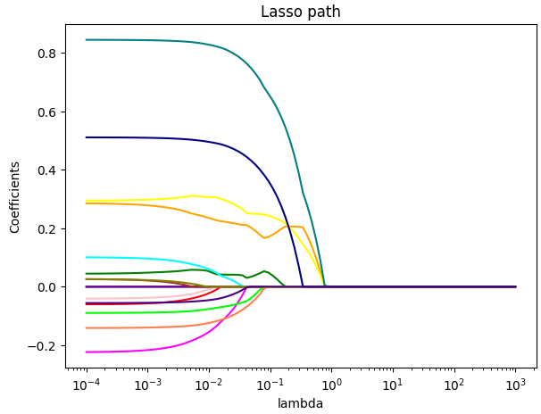]
- This allows to identify the most relevant features and to perform feature selection

---
class: middle, dark-slide

# Notebook [lec2-linear-regression.ipynb](./notebooks/lec2-linear-regression.ipynb)

---
class: middle, center

# Linear classification

---
# Linear classification

- Let's start with binary classification, i.e. $f : \mathbb{R}^d \to \mathcal{Y} = \\\{ -1, 1 \\\}$
- Linear model $h(\mathbf{x}) = \mathbf{w}^\top \mathbf{x}$
- How can we learn such a $h$ to make it a good approximation of $f$?
- First idea : use the least squares method and predict the class by taking the **sign** of $h(.)$ 

.center.width-60.mt-2[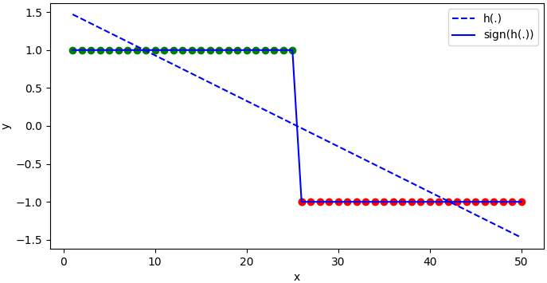]

---
# Linear classification

Several drawbacks:
- No natural transposition to cases with $> 2$ classes
- Residuals (distance points-model) meaningless
- Result very sensitive to the training data and not always relevant

.center.width-60.mt-2[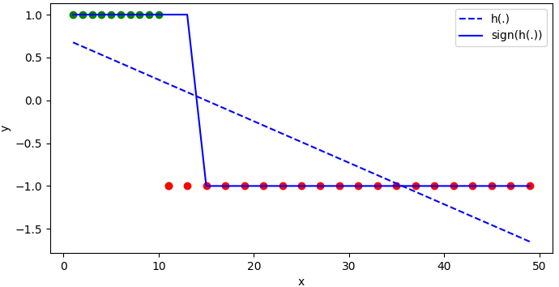]

---
# A posteriori probabilities

- Best alternative is to **predict probabilities of class membership**
- The linear model is learnt to predict $p(y=1|\mathbf{x})$, called *a posteriori probability* of class 1 :
$$h(\mathbf{x}) = p(y=1|\mathbf{x}) = \mathbf{w}^\top \mathbf{x}$$
- For a binary classification with $y \in \\{0, 1\\}$, we have :
$$p(y=0|\mathbf{x}) = 1 - p(y=1|\mathbf{x}) = 1 - h(\mathbf{x})$$
- For all $\mathbf{x}$, the final prediction is 1 if $p(y=1|\mathbf{x}) \geq p(y=0|\mathbf{x})$, 0 otherwise

---
# A posteriori probabilities

The main difficulty is that linear models are not suitable for modelling probabilities:
- can take any value in $\mathbb{R}$, while probabilities are in $[0, 1]$
- linear decision frontier, while probabilities are non-linear

.center.width-60.mt-2[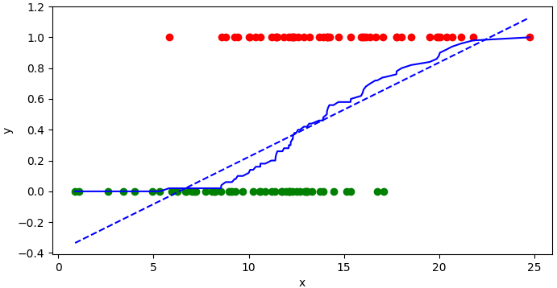]

---
# Logistic regression

- Logistic regression is based on a **transformation of the output of the linear model**
- The model is learnt to predict the *logit* of the a posteriori probability of class 1 :
$$\text{logit}(p(y=1|\mathbf{x})) = \mathbf{w}^\top \mathbf{x}$$
with
$$\text{logit}(p) = \ln\left(\frac{p}{1-p}\right)$$
which gives :
$$\ln\left(\frac{p(y=1|\mathbf{x})}{1-p(y=1|\mathbf{x})}\right) = \ln\left(\frac{p(y=1|\mathbf{x})}{p(y=0|\mathbf{x})}\right) = \mathbf{w}^\top \mathbf{x}$$
- A negative value means $p(y=1|\mathbf{x}) < p(y=0|\mathbf{x})$ and *vice versa*

---
# Logistic regression

- We want to predict $p(y=1|\mathbf{x})$ instead of $\text{logit}(p(y=1|\mathbf{x}))$
- Use the reciprocal of *logit*, called **logistic function** or **sigmoid** :

.row[
.col-40.center[
$$\sigma(z) = \frac{1}{1 + e^{-z}}$$
]
.col-50.center[
.center.width-80.mt-1[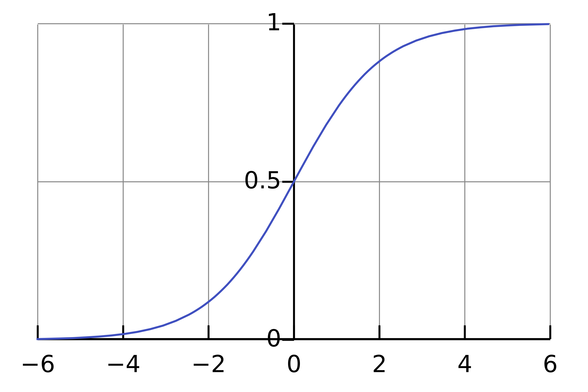]
]
]
- The resulting logistic regression model is :
$$p(y=1|\mathbf{x}) = \sigma\left(\mathbf{w}^\top \mathbf{x}\right)$$

---
# Logistic regression

- The resulting logistic regression model is :
$$h(\mathbf{x}) = \sigma\left(\sum_{i=0}^{d} w_i x_i+ b\right) = \sigma\left(\mathbf{w}^\top \mathbf{x}\right)$$

.center.width-60.mt-4[]

---
# Logistic regression

- The final prediction is given by $p(y=1|\mathbf{x}) \underset{y=0}{\overset{y=1}{\gtrless}} p(y=0|\mathbf{x})$
- The **decision frontier** is :
$$p(y=1|\mathbf{x}) = p(y=0|\mathbf{x}) = 0.5 = \sigma\left(\mathbf{w}^\top \mathbf{x}\right)$$
that is, when $\mathbf{w}^\top \mathbf{x} = 0$

.center.width-40.mt-2[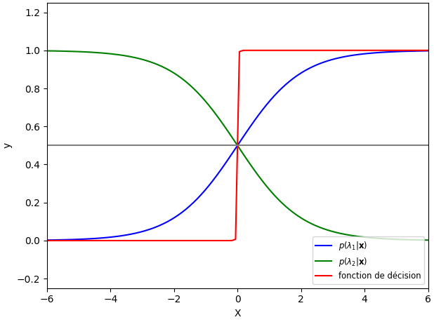]

---
# Loss minimization problem

- Parameter learning is based on the **maximum likelihood principle** .exponent[(1)]
- Results in the following loss function :
$$\begin{aligned}
LL(\mathbf{w}) &= -\sum\_{i=1}^{n} y\_i \log(h(\mathbf{x}\_i)) + (1-y\_i)\log(1-h(\mathbf{x}\_i))\\\\
&= -\sum_{i=1}^{n} y_i \log(\sigma(\mathbf{w}^\top \mathbf{x}_i)) + (1-y_i)\log(1-\sigma(\mathbf{w}^\top \mathbf{x}_i))
\end{aligned}$$
with $y_i \in \\{0, 1\\}$ the class of the $i$-th sample
- This loss function is known as the **binary cross-entropy loss**

.footnote[(1) This principle is not explained here as it is beyond the scope of this course.]

---
# Loss minimization problem

- The underlying minimization problem is :
$$\mathbf{w}^* = \arg\min\_\mathbf{w} LL(\mathbf{w})$$
- Same approach as usual : calculate the gradient and set it to 0
$$\nabla LL(\mathbf{w}) = \mathbf{X}^\top \left(\sigma(\mathbf{X}\mathbf{w}) - \mathbf{y}\right) = \mathbf{X}^\top (h(\mathbf{X}) - \mathbf{y}) = 0$$
- We'll spare you the math — it does not result in a closed form solution.
- Solution : iterative numerical method called **gradient descent**.

---
# Gradient descent

.row.mt-5[
.col-50[
.width-90[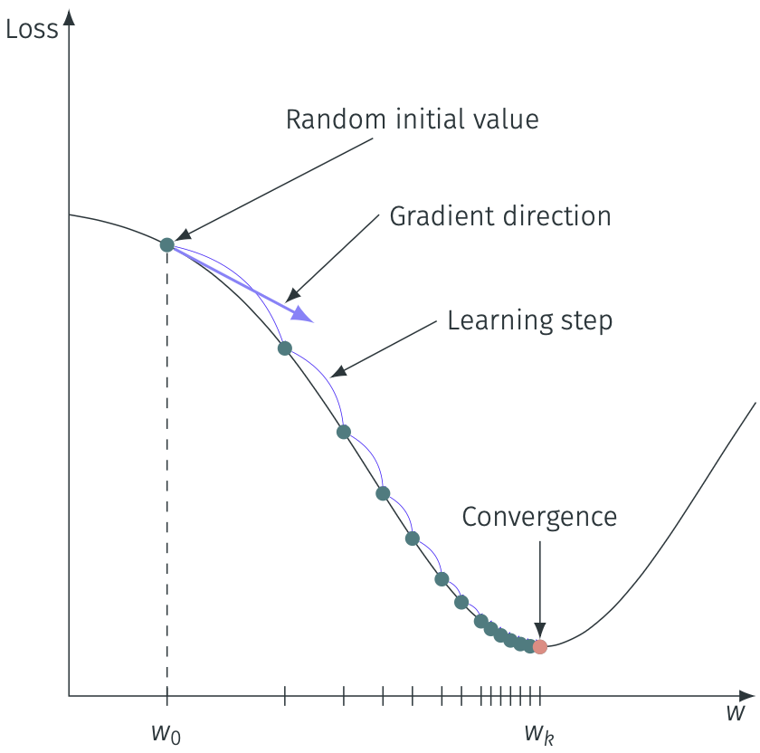]
]
.col-50.vcenter[
1. Initialise $\mathbf{w}_0$ with random values
2. Calculate the gradient $\nabla LL(\mathbf{w}_0)$
3. Update the parameters using the gradient :
$$\mathbf{w}\_{k+1} \leftarrow \mathbf{w}\_k - \eta \nabla LL(\mathbf{w}\_k)$$
with $\eta$ the **learning rate** (hyperparameter)
4. Repeat step 3 until convergence
]
]

---
# Gradient descent

- Learning rate $\eta$ crucial to control the convergence speed
  - Too small $\Rightarrow$ slow convergence; too large $\Rightarrow$ may diverge
  - Strategies to adapt $\eta$ during learning (e.g. backtracking line search)
- Reaching convergence is not trivial
  - Depends on $\eta$, parameter initialization, loss function, etc.
  - Stopping criterion : $\epsilon$ usually set to an arbitrarily small value (e.g. $10^{-6}$)
  - Alternative convergence criteria (e.g. based on the norm of the gradient)
- Well-known gradient descent based optimizers : Newton GD, Adam, RMSProp, etc. .exponent[(2)]

.footnote[(2) Not explained in this course, but you might encounter them in practice]

---
class: middle, dark-slide

# Notebook [lec2-logistic-regression.ipynb](./notebooks/lec2-logistic-regression.ipynb)

---
# Stochastic Gradient Descent

- Empirical risk minimization setup :
$$\begin{aligned}
LL(\mathbf{w}) &= \frac{1}{n} \sum\_{i=1}^{n} \mathcal{L}(y\_i, h\_\mathbf{w}(\mathbf{x}\_i))\\\\
\nabla LL(\mathbf{w}) &= \frac{1}{n} \sum\_{i=1}^{n} \nabla\_\mathbf{w} \mathcal{L}(y\_i, h\_\mathbf{w}(\mathbf{x}\_i))
\end{aligned}$$
- Complexity of an update grows linearly with $n$: **bad idea when dealing with large datasets**
- **Stochastic Gradient Descent (SGD)** : update using only one training instance at a time
$$\mathbf{w}\_{k+1} = \mathbf{w}\_k - \eta \nabla LL(\mathbf{w}\_k)$$
$$LL(\mathbf{w}\_k) = \mathcal{L}(y\_{rand}, h\_{\mathbf{w}\_k}(\mathbf{x}\_{rand}))$$

---
# Stochastic Gradient Descent

.row.mt-5[
.col-30[
.width-100[*Batch Gradient Descent*]
]
.col-30[
.width-100[*Mini-batch Gradient Descent*]
]
.col-30[
.width-100[*Stochastic Gradient Descent*]
]
]

---
# Stochastic Gradient Descent

- With very large dataset : trade-off between Batch GD and Stochastic GD
- SGD results in more updates but with raw approximation of the gradient
- BGD results in fewer updates but with better approximation of the gradient
- What is the best?
- Usually more updates is better but with really big datasets, convergence is hard to reach
- In practice, computational costs often dictate the size of the batch

---
# Softmax regression

- Reminder for binary classification : $y \in \\{0, 1\\}$
- Predict *a posteriori* probabilities :
$$p(y=0|\mathbf{x}) = \sigma\left(\mathbf{w}^\top \mathbf{x}\right) = \frac{1}{1 + \exp(\mathbf{w}^\top \mathbf{x})}$$
$$p(y=1|\mathbf{x}) = 1 - p(y=0|\mathbf{x}) = \frac{\exp(\mathbf{w}^\top \mathbf{x})}{1 + \exp(\mathbf{w}^\top \mathbf{x})}$$
- Decision rule : $\hat{y} = 0$ if $p(y=0|\mathbf{x}) \geq p(y=1|\mathbf{x})$, $\hat{y} = 1$ otherwise

---
# Softmax regression

- Multiclass classification : $y \in \{1, \dots, K\}$, $K > 2$
- Predict *a posteriori* probabilities :
$$p(y=k|\mathbf{x}) = \frac{\exp(\mathbf{w}\_k^\top \mathbf{x})}{\sum\_{l=1}^{K} \exp(\mathbf{w}\_l^\top \mathbf{x})}, \quad \forall k = 1, \dots, K$$
where $\mathbf{w}_k$ is the vector of parameters for class $k$
- This is the **softmax function**, a generalization of the sigmoid function
- It allows to have a probability distribution over the $K$ classes (sums to 1)
- Decision rule : $\hat{y} = \arg\max_k\, p(y=k|\mathbf{x})$

---
# Softmax regression

Example : 2D version of Iris dataset

.center.width-60.mt-2[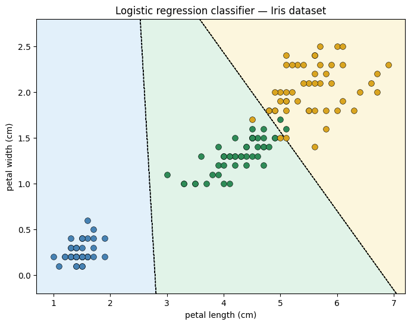]

---
# Takeaways

.box[Linear models are simple and interpretable, but may not capture complex patterns]

.box[**Linear models are foundational for deep learning** and many other machine learning techniques]

.box[Regularization is a key concept, and is often essential to prevent overfitting and improve generalization]

.box[Gradient descent and its variants are the most used technique for optimizing models, especially in deep learning]

.box[The softmax function is a key component for the design of deep learning methods for classification tasks, allowing to model probabilities over multiple classes]
