class: middle, center, title-slide
name: lecture3

# Machine Learning
## Lecture 3: Deep neural networks
<br><br>
Simon BERNARD<br>
[simon.bernard@univ-rouen.fr](mailto:simon.bernard@univ-rouen.fr)<br><br>
.center.height-4em[]

---
class: middle, center

# From logistic regression to neural networks

---
# Logistic regression

.center.width-55[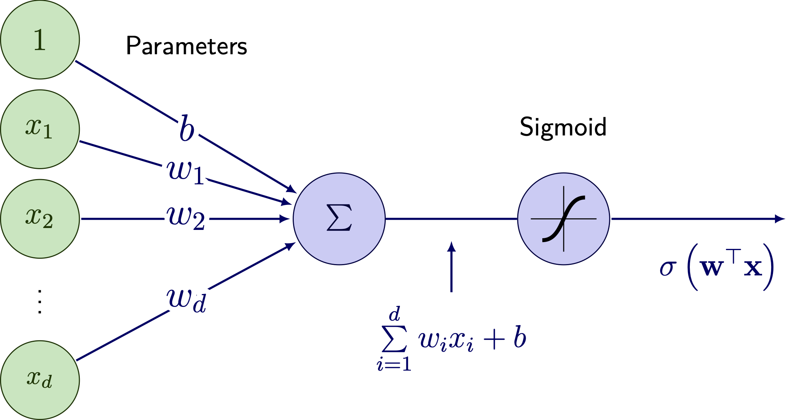]

- Predict $\sigma(\mathbf{w}^\top \mathbf{x}) = p(y=1|\mathbf{x}) \in [0,1]$
- Decision function is:
$$\hat{y} = \begin{cases} 1 & \text{if } \mathbf{w}^\top \mathbf{x} > 0 \\\\ 0 & \text{otherwise} \end{cases}$$

---
# Perceptron (a.k.a. neuron)

.center.width-55[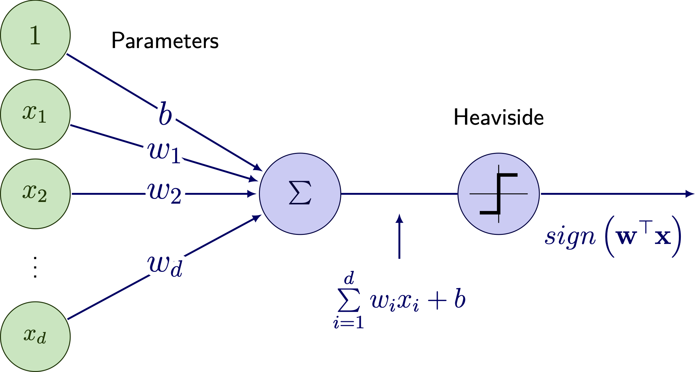]

- Predict $y \in \\{0,1\\}$ instead of $p(y=1|\mathbf{x}) \in [0,1]$
- Decision function is:
$$\hat{y} = \begin{cases} 1 & \text{if } \mathbf{w}^\top \mathbf{x} > 0 \\\\ 0 & \text{otherwise} \end{cases}$$

---
# Perceptron learning algorithm

1. Initialize $\mathbf{w}$ either with zeros or small random values
2. For each sample $(\mathbf{x}\_i, y\_i) \in \mathcal{D}$:
  - Compute the prediction with the current weights: 
    $$h(\mathbf{x}\_i) = \begin{cases} 1 & \text{if } \mathbf{x}\_i^\top \mathbf{w} > 0 \\\\ 0 & \text{otherwise} \end{cases}$$
  - Update the weights: 
    $$\mathbf{w} \leftarrow \mathbf{w} + \eta (y\_i - h(\mathbf{x}\_i)) \mathbf{x}\_i$$
    where $\eta$ is the learning rate (as in gradient descent)
3. Repeat until convergence, i.e. for a user-specified small value $\epsilon$:
$$\frac{1}{n} \sum\_{i=1}^n |y\_i - h(\mathbf{x}\_i)| < \epsilon$$

---
class: middle, dark-slide

# Notebook [lec3-perceptron-learning.ipynb](./notebooks/lec3-perceptron-learning.ipynb)

---
# Multi-output perceptron

Several perceptrons can be used in parallel to predict multiple outputs (e.g. for multi-class classification)

.center.width-40[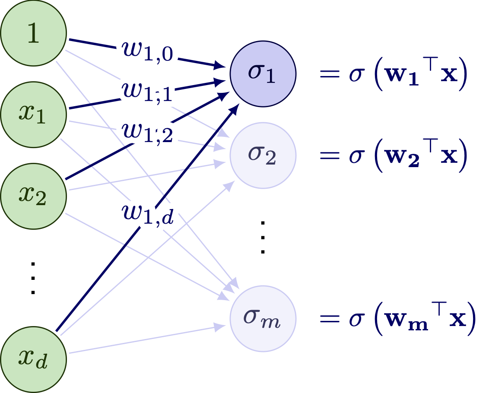]

- $\sigma$ must be a nonlinear activation function
- If $\sigma$ is the softmax function, we retrieve the softmax regression model

---
# Multilayer perceptron (MLP)

MLP is a generalization where the output of each unit is an input of the next layer

.center.width-40[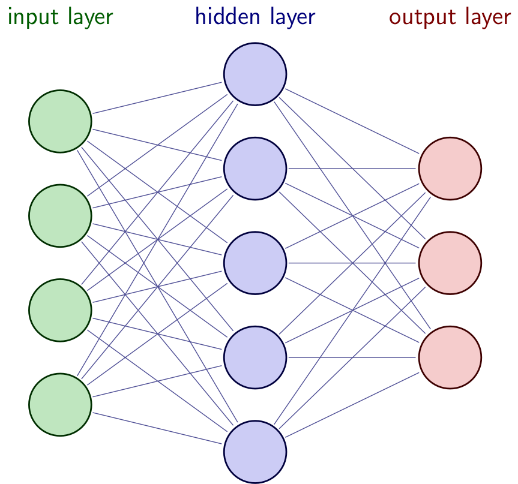]

---
# Deep Neural Network (DNN)

A Deep NN is a NN with many layers, and thus many parameters (one per connection)

.center.width-60[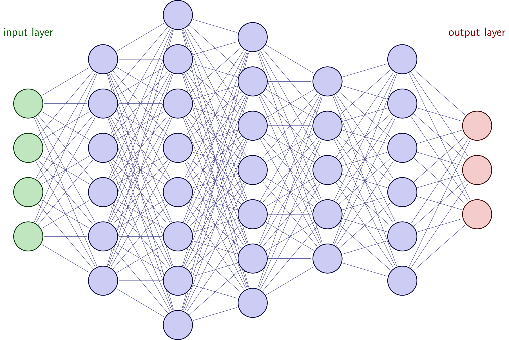]

---
# Deep Neural Network (DNN)


- A layer is composed of $m$ units (or neurons) in parallel, each with its own parameters
- The output of a layer can be computed at once using matrix multiplication and vectorization:

.center.width-70[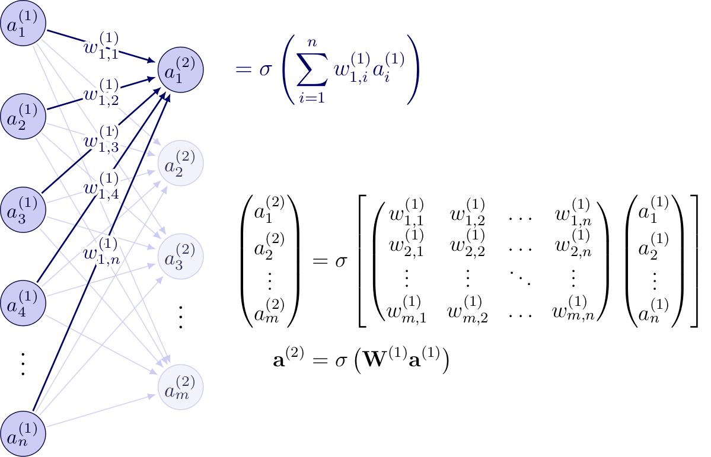]

---
# Deep Neural Network (DNN)

- A DNN is composed of $L$ layers in sequence, such that:
$$\begin{aligned}
\mathbf{a}^{(0)} &= \mathbf{x} \\\\
\mathbf{a}^{(1)} &= \sigma^{(1)}(\mathbf{W}^{(1)} \mathbf{a}^{(0)}) \\\\
\mathbf{a}^{(2)} &= \sigma^{(2)}(\mathbf{W}^{(2)} \mathbf{a}^{(1)}) \\\\
&\vdots \\\\
\mathbf{a}^{(L)} &= \sigma^{(L)}(\mathbf{W}^{(L)} \mathbf{a}^{(L-1)}) \\\\
h(\mathbf{x}) = \hat{\mathbf{y}} &= \mathbf{a}^{(L)}
\end{aligned}$$
- $\mathbf{W}^{(l)}$ is the weight matrix of layer $l$, to be learnt
- $\sigma^{(l)}$ is the activation function of layer $l$ and is not necessarily the same for all layers
- For classification tasks, $\sigma^{(L)}$ is the sigmoid or the softmax function
- For regression tasks, $\sigma^{(L)}$ is the identity function


---
# Activation functions

.row[
.col-50.center[
.width-90.mt-2[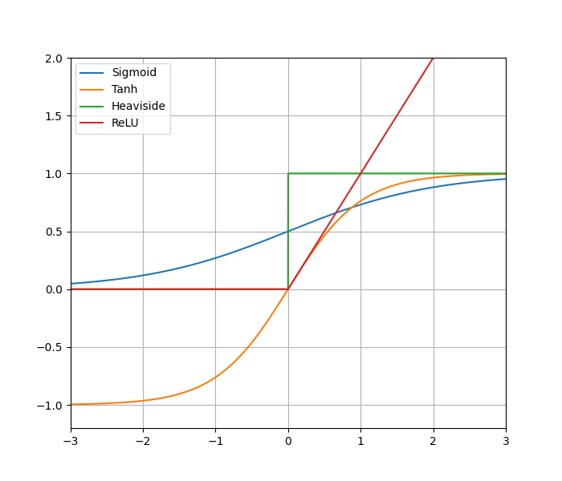]
]
.col-50[
- Sigmoid:
$$\sigma(x) = \frac{1}{1 + \exp(-x)}$$
- Hyperbolic tangent:
$$\sigma(x) = \frac{\exp(x) - \exp(-x)}{\exp(x) + \exp(-x)}$$
- ReLU:
$$\sigma(x) = \max(0,x)$$
- Heaviside:
$$\sigma(x)= \begin{cases} 1 & \text{if } x \geq 0 \\\\ 0 & \text{if } x < 0 \end{cases}$$
]
]

---
class: middle, center

# Training a deep neural network

---
# Parameter learning

- Parameters: $\mathbf{W} = \\{ \mathbf{W}^{(1)}, \ldots, \mathbf{W}^{(L)} \\}$ (weights on the connections between units)
- We want to find the $\mathbf{W}$ that minimize a loss function:
$$LL(\mathbf{W}) = \sum\_{i=1}^n L(y\_i,h(\mathbf{x}\_i))$$
- Any differentiable loss function can be used, but the cross-entropy loss is the most common for classification tasks and the mean squared error for regression tasks
- For the same reasons as with logistic regression, we use the **gradient descent** method
- To do so, we need to compute the gradient of the loss function w.r.t. the parameters

---
# Forward pass

- For one sample $\mathbf{x}$ and a $L$-layers network, we have:
$$\mathbf{x} = \mathbf{a}^{(0)} \overset{\mathbf{W}^{(1)}}{\longrightarrow} \mathbf{s}^{(1)} \overset{\sigma^{(1)}}{\longrightarrow} \mathbf{a}^{(1)} \rightarrow \ldots \rightarrow \mathbf{a}^{(L-1)} \overset{\mathbf{W}^{(L)}}{\longrightarrow} \mathbf{s}^{(L)} \overset{\sigma^{(L)}}{\longrightarrow} h(\mathbf{x}) = \hat{\mathbf{y}}$$
with, $\forall l \in \\{1, \ldots, L\\}$:
$$\begin{aligned}
\mathbf{s}^{(l)} &= \mathbf{W}^{(l)} \mathbf{a}^{(l-1)} \\\\
\mathbf{a}^{(l)} &= \sigma^{(l)}(\mathbf{s}^{(l)})
\end{aligned}$$
and with the output of the network being $h(\mathbf{x}) = \hat{\mathbf{y}} = \mathbf{a}^{(L)}$
- This is called the **forward pass**

---
# Chain rule

- $L(y\_i,h(\mathbf{x}\_i))$ is expressed as a function of $h$, which depends on $L$ and $\sigma^{(l)}$:
$$h(\mathbf{x}\_i) = \textcolor{red}{\sigma^{(L)}(\mathbf{W}^{(L)}} \textcolor{blue}{\sigma^{(L-1)}(\mathbf{W}^{(L-1)}} \ldots \textcolor{green}{\sigma^{(1)}(\mathbf{W}^{(1)} \mathbf{x}\_i)} \ldots \textcolor{blue}{)}\textcolor{red}{)}$$
- **How do you calculate the gradient?**
- Solution: use the **chain rule** of differential calculus
$$\frac{\partial f}{\partial w\_i} = \sum\_{k} \quad \frac{\partial f}{\partial a\_k} \underbrace{\frac{\partial a\_k}{\partial w\_i}}\_{recurrence}$$
where $a\_k$ are the input functions of $f$ (e.g. units in the previous layer)

---
# Chain rule

- Simplified example: a 2-hidden layer MLP, with $x, w\_1, w\_2, w\_3 \in \mathbb{R}$ such that:
$$x \textcolor{blue}{\overset{w\_1}{\longrightarrow} s^{(1)} \overset{\sigma^{(1)}}{\longrightarrow}} \textcolor{green}{a^{(1)} \overset{w\_2}{\longrightarrow} s^{(2)} \overset{\sigma^{(2)}}{\longrightarrow}} \textcolor{red}{a^{(2)} \overset{w\_3}{\longrightarrow} s^{(3)} \overset{\sigma^{(3)}}{\longrightarrow}} h(x) = \hat{y}$$
We have:

.row[
.col-30[
$$\begin{aligned}
h(x) &= \textcolor{red}{\sigma^{(3)}(s^{(3)})} \\\\
\textcolor{red}{s^{(3)}} &= \textcolor{red}{w\_3 a^{(2)}} \\\\
\textcolor{red}{a^{(2)}} &= \textcolor{green}{\sigma^{(2)}(s^{(2)})} \\\\
\textcolor{green}{s^{(2)}} &= \textcolor{green}{w\_2 a^{(1)}} \\\\
\textcolor{green}{a^{(1)}} &= \textcolor{blue}{\sigma^{(1)}(s^{(1)})} \\\\
\textcolor{blue}{s^{(1)}} &= \textcolor{blue}{w\_1} x
\end{aligned}$$
]
.col-60[
$$\begin{aligned}
\frac{\partial h(x)}{\partial w\_1} &=
\frac{\partial h(x)}{\textcolor{red}{\partial s^{(3)}}}
\frac{\textcolor{red}{\partial s^{(3)}}}{\textcolor{red}{\partial a^{(2)}}}
\frac{\textcolor{red}{\partial a^{(2)}}}{\textcolor{green}{\partial s^{(2)}}}
\frac{\textcolor{green}{\partial s^{(2)}}}{\textcolor{green}{\partial a^{(1)}}}
\frac{\textcolor{green}{\partial a^{(1)}}}{\textcolor{blue}{\partial s^{(1)}}}
\frac{\textcolor{blue}{\partial s^{(1)}}}{\textcolor{blue}{\partial w\_1}} \\\\
&= \frac{\textcolor{red}{\partial \sigma^{(3)}(s^{(3)})}}{\textcolor{red}{\partial s^{(3)}}} \textcolor{red}{w\_3}
\frac{\textcolor{green}{\partial \sigma^{(2)}(s^{(2)})}}{\textcolor{green}{\partial s^{(2)}}} \textcolor{green}{w\_2}
\frac{\textcolor{blue}{\partial \sigma^{(1)}(s^{(1)})}}{\textcolor{blue}{\partial s^{(1)}}} x
\end{aligned}$$
]
]

---
# Backpropagation

- This is called the **backward pass or backpropagation**
$$x
\overset{\frac{\textcolor{blue}{\partial s^{(1)}}}{\textcolor{blue}{\partial w\_1}}}{\longleftarrow} \textcolor{blue}{s^{(1)}}
\overset{\frac{\textcolor{green}{\partial a^{(1)}}}{\textcolor{blue}{\partial s^{(1)}}}}{\longleftarrow} \textcolor{green}{a^{(1)}}
\overset{\frac{\textcolor{green}{\partial s^{(2)}}}{\textcolor{green}{\partial a^{(1)}}}}{\longleftarrow} \textcolor{green}{s^{(2)}}
\overset{\frac{\textcolor{red}{\partial a^{(2)}}}{\textcolor{green}{\partial s^{(2)}}}}{\longleftarrow} \textcolor{red}{a^{(2)}}
\overset{\frac{\textcolor{red}{\partial s^{(3)}}}{\textcolor{red}{\partial a^{(2)}}}}{\longleftarrow} \textcolor{red}{s^{(3)}}
\overset{\frac{\partial h(x)}{\textcolor{red}{\partial s^{(3)}}}}{\longleftarrow} h(x) = \hat{y}$$
- **$\sigma^{(l)}$ must be differentiable**
- The same principle applies to calculating the gradient of the loss function
- This can be generalised with several neurons and several layers
- This can also be extended to tensor calculus

---
# Activation functions

- Heaviside: not differentiable
- Sigmoid and tanh: differentiable, but derivative shrink to zero as the number of layers increases .exponent[(1)]
- ReLU: differentiable, but zero derivatives for any values $\leq 0$ .exponent[(2)]
- Variants of ReLU (e.g. LeakyReLU) solve the dying ReLU problem in modern deep NN

.center.width-40[]

.footnote[(1) Not suitable for modern DNN. This problem is called the *vanishing gradient* problem<br>
(2) Can "deactivate" the neuron when large gradients are propagated. This is called the *dying ReLU* problem]

---
# Automatic differentiation

> Automatic differentiation (AD) is a set of techniques to **numerically evaluate the derivative** of a function specified by a computer program. It exploits the fact that **computer program executes a sequence of elementary arithmetic operations** (addition, subtraction, multiplication, division, etc.) and elementary functions (exp, log, sin, cos, etc.). By applying the **chain rule to these operations**, derivatives of arbitrary order can be computed automatically.

- Modern DL frameworks implement automatic differentiation
- Allows to compute the gradient of the loss function w.r.t. the parameters of the network
- Enables the use of gradient descent methods for training

---
class: middle, center

# DNN in practice

---
# DNN Softwares

- Implementing and using DNN is made easy by modern frameworks

.center.width-60[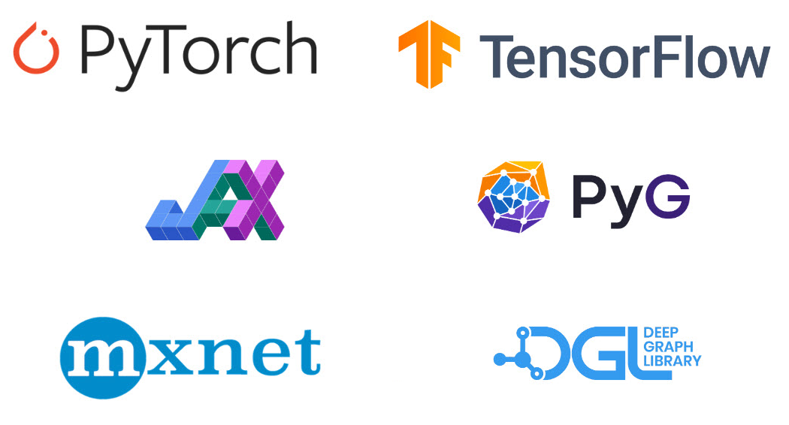]

- Examples in this lecture are made with Keras, a high-level API for TensorFlow
- Low-level APIs (e.g. PyTorch, TensorFlow) are more flexible, and for more complex architectures

---
# Example with Keras

```python
from keras.models import Sequential
from keras.layers import Dense, Activation

model = Sequential()
model.add(Dense(128, input_dim=X.shape[1]))     # hidden layer with 128 units
model.add(Activation('relu'))                   # ReLU activation function
model.add(Dense(128))                           # hidden layer with 128 units
model.add(Activation('relu'))                   # ReLU activation function
model.add(Dense(10))                            # 10 output units for 10 classes
model.add(Activation('softmax'))                # softmax activation function

model.compile(optimizer='rmsprop', loss='categorical_crossentropy')

print("Training...")
model.fit(X, y, epochs=10, batch_size=16)
```

- Many choices: number of layers/units, activation functions, loss function, optimizer, etc.
- What is behind the `fit` method?

---
# Reminder on gradient descent methods

.row[
.col-60[
- **Batch gradient descent**: approx. the gradient on the entire dataset
$$\begin{aligned}
\nabla LL(\mathbf{W}) &= \frac{1}{n} \sum\_{i=1}^n \nabla\_{\mathbf{w}} L(y\_i,h\_{\mathbf{W}}(\mathbf{x}\_i)) \\\\
\mathbf{W}\_{k+1} &\leftarrow \mathbf{W}\_{k} - \eta \nabla LL(\mathbf{W}\_{k})
\end{aligned}$$
]
.col-40.center[
.width-80[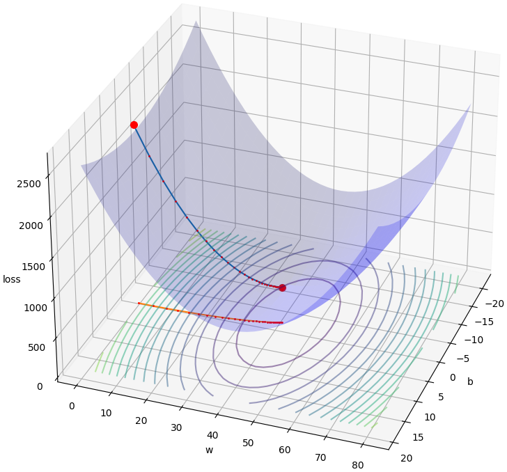]
]
]

- compute the gradient on the whole dataset for having a better approximation
- but rapidly inefficient for large $n$ (computationally expensive)

---
# Reminder on gradient descent methods

.row[
.col-60[
- **Stochastic gradient descent**: approx. the gradient (and update) with every sample
$$\begin{aligned}
\nabla LL(\mathbf{W}) &= \nabla\_{\mathbf{w}} L(y\_i,h\_{\mathbf{W}}(\mathbf{x}\_i)) \\\\
\mathbf{W}\_{k+1} &\leftarrow \mathbf{W}\_{k} - \eta \nabla LL(\mathbf{W}\_{k})
\end{aligned}$$
]
.col-40.center[
.width-80[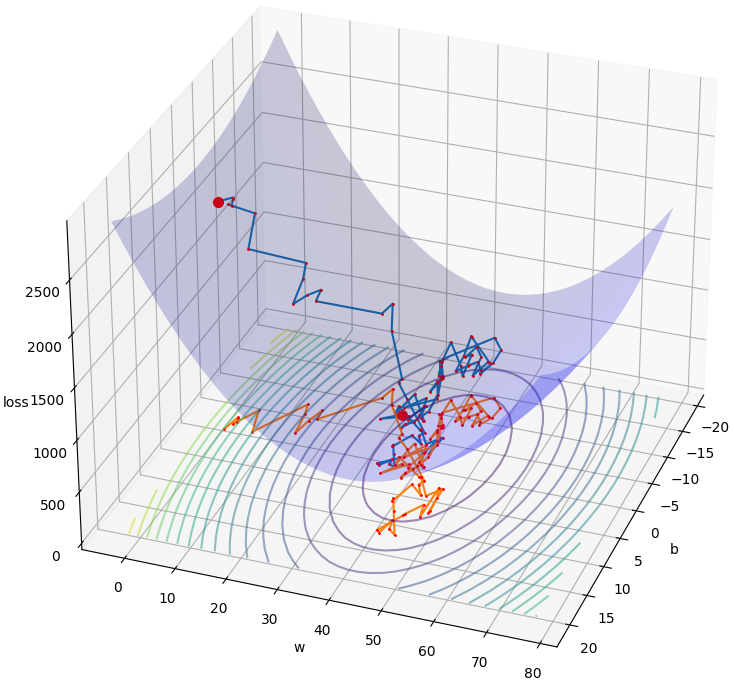]
]
]

- iterations computationally faster than batch gradient descent
- but can be very noisy and convergence can be very slow

---
# Reminder on gradient descent methods

.row[
.col-60[
- **Mini-batch gradient descent**: approx. the gradient on a subset of the dataset
$$\begin{aligned}
\nabla LL(\mathbf{W}) &= \frac{1}{m} \sum\_{i=1}^m \nabla\_{\mathbf{w}} L(y\_i,h\_{\mathbf{W}}(\mathbf{x}\_i)) \\\\
\mathbf{W}\_{k+1} &\leftarrow \mathbf{W}\_{k} - \eta \nabla LL(\mathbf{W}\_{k})
\end{aligned}$$
]
.col-40.center[
.width-80[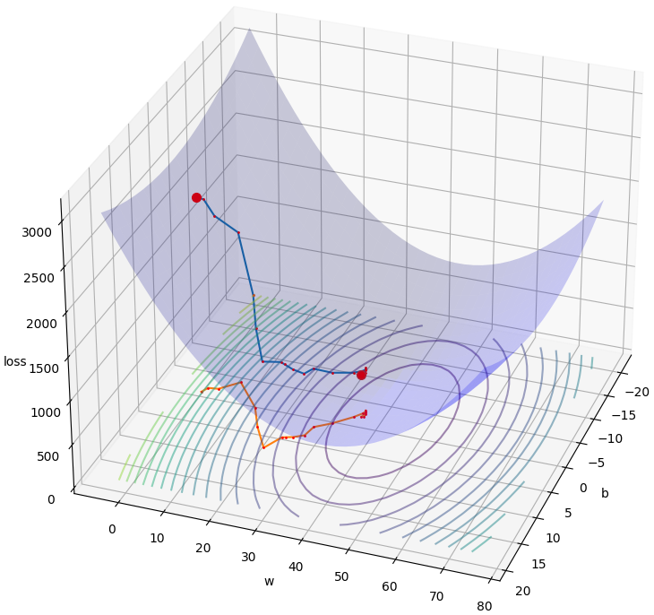]
]
]

- increasing $m$ reduces the noise and speeds up convergence
- but setting $m$ and $\eta$ can be tricky

---
# Optimizers

- Modern optimizers improve the GD with various techniques .exponent[(1)]:
  - **Momentum**: add inertia to the gradient to avoid oscillations
  - **Adaptative learning rate**: adjust the learning rate at each iteration
  - **Scheduling (decay)**: reduce the learning rate every few epochs to avoid overshooting
- The three most popular optimizers are **Adagrad**, **RMSprop** and **Adam** .exponent[(2)]
- They help to reach convergence but do not avoid the need to tune hyperparameters

.footnote[(1) We won't go into detail about all these techniques, as they are generally well implemented in libraries.<br>
(2) Adam is the default choice most of the time]

---
# Hyperparameter tuning

In practice, we usually...
- set the batch size to the largest that fits in memory
- set a maximum number of iterations depending on computing resources
- monitor the evolution of the training and validation loss to see what's happening .exponent[(1)]
- adjust architecture and hyperparameters depending on the result

.row.mt-2[
.col-30.center[
.width-100[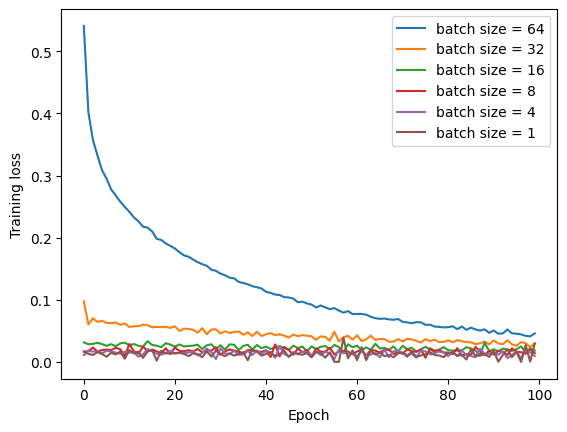]
]
.col-30.center[
.width-100[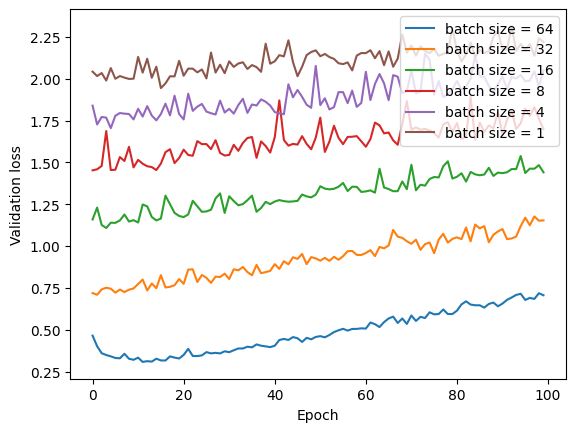]
]
.col-30.center[
.width-100[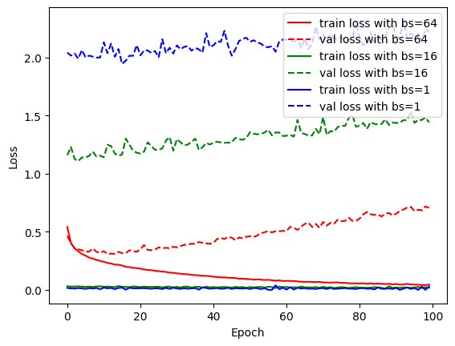]
]
]

.footnote[(1) **always plot your losses!**]

---
# Hyperparameter tuning

Common symptoms when training a (deep) NN are:
- the training loss is decreasing nicely but the validation loss is not
- the training loss is decreasing so slowly that we don't know if it will converge
- the training loss is oscillating a lot and global trends are not clear (training instability)
- the training loss is not decreasing (the NN is not learning)
- the training loss is increasing (?)

**Can you suggest possible cause and potential solution for each of these problems?** .exponent[(1)]

.footnote[(1) Check Claude Fable 5 answers [here](./lec3slide23-claudeanswers.html)]

---
# Playground

Let's play: [https://playground.tensorflow.org/](https://playground.tensorflow.org/)

.center.width-70.mt-2[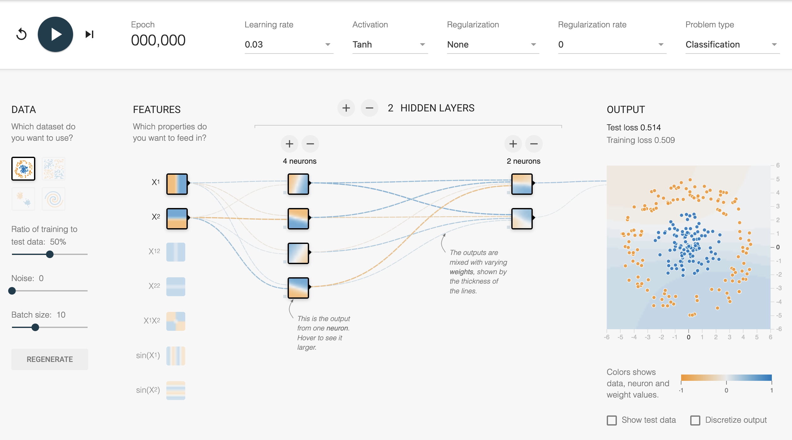]

---
# Takeaways

.box[DNN can model complex patterns .exponent[(1)], but they require a lot of data and computing resources to train]

.box[The backpropagation algorithm allows the use of gradient descent methods for training]

.box[Activation functions play a crucial role in the performance of DNN]

.box[Modern optimizers can help improve convergence and stability during training, but **hyperparameter tuning and monitoring of training/validation losses are still essential for successful training of deep neural networks**]

.footnote[(1) cf. "Universal Approximation Theorems" that state that neural networks with a certain structure can, in principle, approximate any continuous function to any desired degree of accuracy]


