class: middle, center, title-slide
name: lecture4

# Machine Learning
## Lecture 4: Deep learning for images
<br><br>
Simon BERNARD<br>
[simon.bernard@univ-rouen.fr](mailto:simon.bernard@univ-rouen.fr)<br><br>
.center.height-4em[]


---
class: middle, center

# Learning from images

---
# Computer Vision

One of the primary goals of AI is to enable a computer to see and understand what it sees

.center[
<iframe width="460" height="330" src="https://www.youtube.com/embed/FwFduRA_L6Q?si=sWFf2THjirjUpUNw&autoplay=1&mute=1" frameborder="0" allowfullscreen></iframe>
*Demo of "LeNet 1" by Yann LeCun in 1989, the first convolutional neural network that could recognize handwritten digits with good speed and accuracy*
]

---
# Machine learning with images

.row[
.col-45[
**Image classification**

- Given an image, we want to predict its content
$$\text{Image} \rightarrow \mathbb{N}$$
- Labels are classes in a finite set
- Example: [ImageNet](https://www.image-net.org), [CIFAR-10](https://www.cs.toronto.edu/~kriz/cifar.html), [MNIST](https://yann.lecun.com/exdb/mnist/)
]
.col-55.center[
.width-90[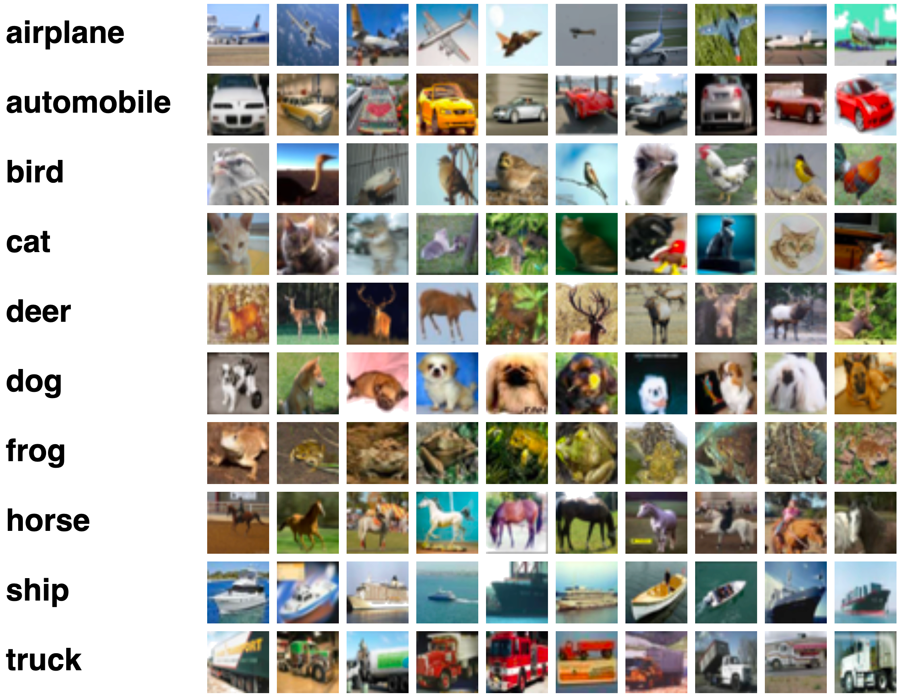*Samples from the CIFAR-10 dataset*]
]
]

---
# Machine learning with images

.row[
.col-45[
**Object detection**

- Given an image, we want to detect and localize objects
$$\text{Image} \rightarrow \mathbb{N} \times \text{Image} \rightarrow \mathbb{R}^4$$
- Classes and bounding boxes
- Example: [COCO](https://cocodataset.org/#home), [VOC](http://host.robots.ox.ac.uk/pascal/VOC/)
]
.col-55.center[
.width-90[*Object detection with the YOLOv3 model on a sample from the COCO dataset (source: [wikipedia](https://en.wikipedia.org/wiki/Object_detection))*]
]
]

---
# Machine learning with images

**Semantic segmentation**

- Given an image, we want to label each pixel
$$\text{Image} \rightarrow \mathbb{N}^{width \times height}$$
- the output is a mask of the same size, where each pixel is assigned a class label
- Example: [Cityscapes](https://www.cityscapes-dataset.com/), [COCO Stuff](https://cocodataset.org/#stuff-2019)

.center.width-90.mt-2[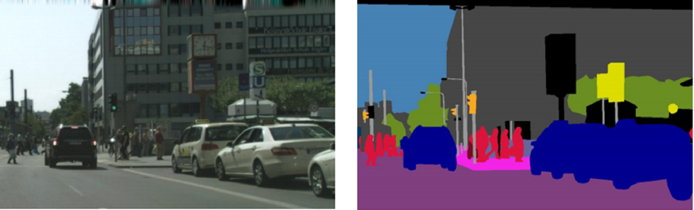*A sample from the Cityscapes dataset with its semantic segmentation mask*]

---
# Machine learning with images

.row[
.col-50[
**Panoptic segmentation**

- Given an image, we want to label each pixel and distinguish between different instances of the same class
$$\text{Image} \rightarrow \mathbb{N}^{width \times height} \times \mathbb{N}^{width \times height}$$
- Each pixel is assigned a class label and an instance ID
- Example: [ADE20K](https://groups.csail.mit.edu/vision/datasets/ADE20K/), [COCO Panoptic](https://cocodataset.org/#panoptic-2020)
]
.col-50.center[
.width-95[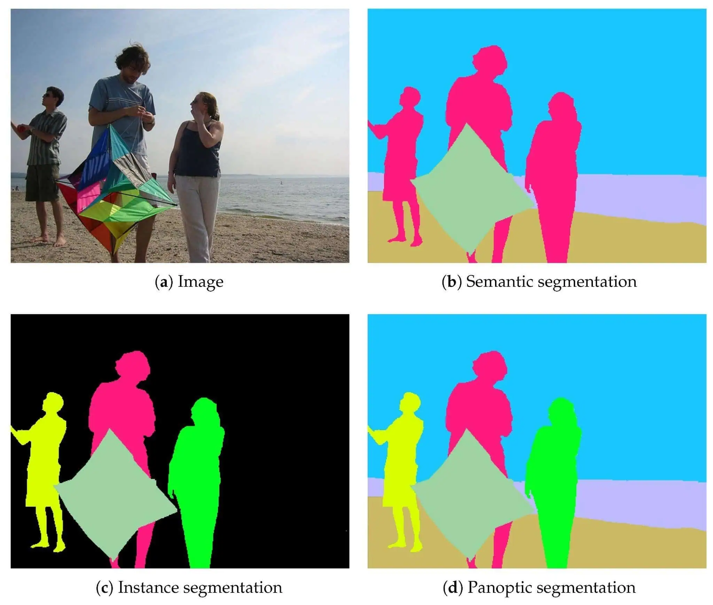*A sample from the COCO dataset with all its segmentation masks (source: [Jung et al. 2022](https://www.mdpi.com/2076-3417/12/17/8856))*]
]
]

---
# Machine learning with images

**Image captioning**

- Given an image, we want to generate a caption
$$\text{Image} \rightarrow \text{Text}$$
- Example: [COCO Captions](https://cocodataset.org/#captions-2015), [Flickr30k](http://shannon.cs.illinois.edu/DenotationGraph/)

.center.width-65.mt-2[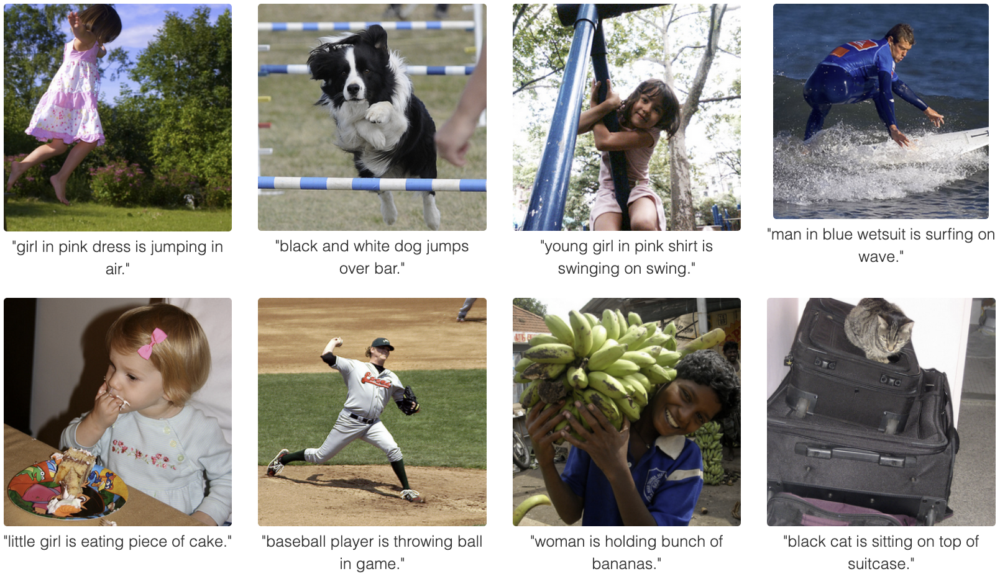*Examples of image captioning with the COCO dataset from [Karpathy et al. 2015](https://cs.stanford.edu/people/karpathy/deepimagesent/)*]

---
# Machine learning with images

**Image generation**

- Given a prompt, we want to generate an image
$$\text{Text} \rightarrow \text{Image}$$
- Example: [DALL-E](https://openai.com/dall-e), [Stable Diffusion](https://stability.ai/blog/stable-diffusion-public-release), [MidJourney](https://www.midjourney.com/)

.center.width-55.mt-2[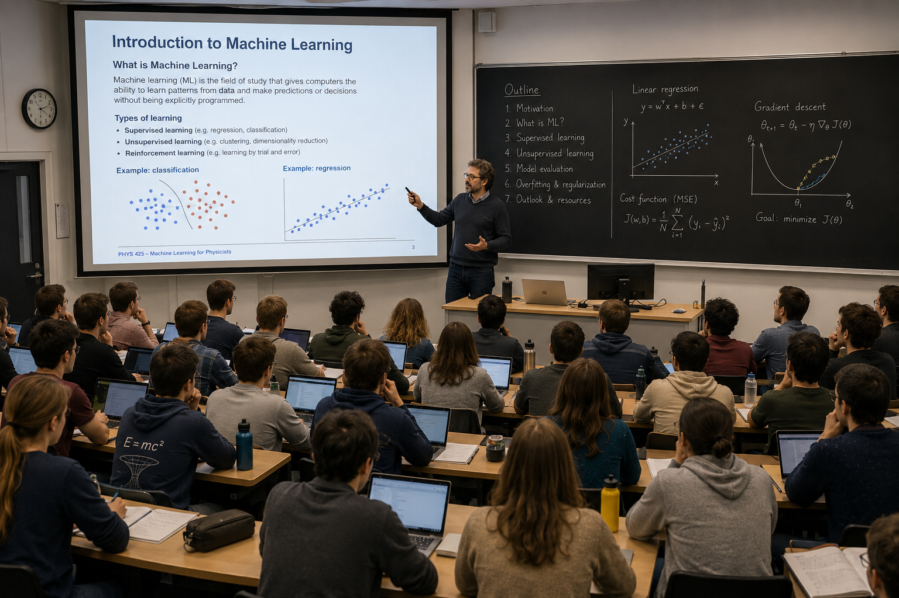*Image generated by ChatGPT Images 2.0 with the prompt "Hi. Can you generate an image of a university professor teaching an introductory course on machine learning to a group of 30 students in physics please?" (take a look at the french version [here](./medias/lec4/imagegeneration.png) and spot the differences)*]

---
# Machine learning with images

.row[
.col-40[
**Applications in computer vision**

- Autonomous vehicle
- Medical imaging
- Robotics
- Photo/video manipulation
- Biometrics
- etc.
]
.col-60.center[
<iframe width="440" height="330" src="https://www.youtube.com/embed/fuCEB_QQDso?si=22tkXNMdsB3hMY4D&mute=1&autoplay=1" frameborder="0" allowfullscreen></iframe>
*Tesla Autopilot (2020)*
]
]

---
# Make a neural network capable of seeing

Making a computer able to see and to understand what it sees implies to design methods able to:
- process images or videos
- learn from images and videos, i.e. to **extract relevant information** from them
- understand, interpret and exploit this relevant information to perform a task

.center.width-60[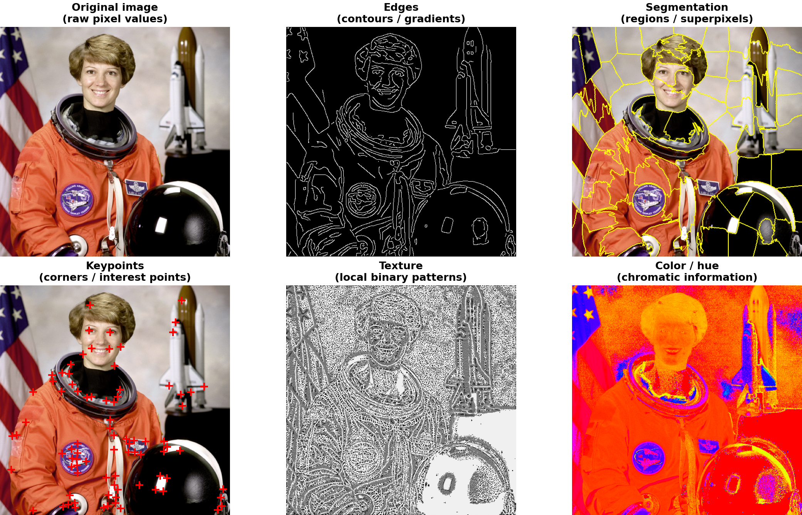*Produced by Claude (Sonnet 5)*]

---
# Deep neural network on images

.center.width-55.mt-4[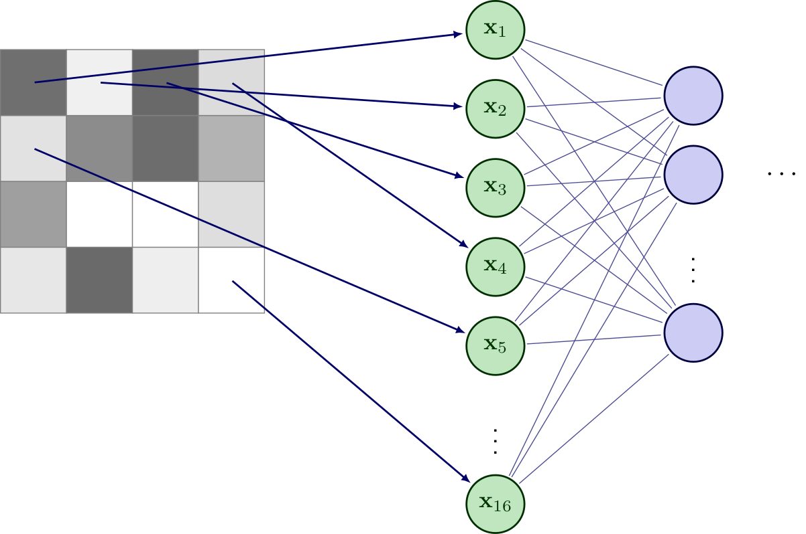]

- MLP are made for "tabular" data: inputs are vectors
- Images must be flattened

---
# Deep neural network on images
## First problem: number of parameters

- For a first layer with $100$ neurons...
- Grayscale image of size $28 \times 28$ (0.0008M pixels) $\rightarrow$ $28 \times 28 = 784$ pixels
- $784$ input neurons $\rightarrow$ $784 \times 100 = 78400$ parameters for the first layer
- RGB image of size $1024 \times 1024$ (1M pixels) $\rightarrow$ $1024 \times 1024 \times 3 = 3145728$ pixels
- $3145728$ input neurons $\rightarrow$ $3145728 \times 100 = 314572800$ parameters for the first layer
- ... and this is just for "small" .exponent[(1)] images and a single layer!

.footnote[(1) Image resolutions nowadays are typically 24M pixels (e.g. $6000 \times 4000 \times 3$ pixels)]

---
# Deep neural network on images
## Second problem: loss of spatial information

- When working with images, we want to exploit the spatial information
- Model must be robust to translation, rotation, scaling, etc.
- We want **models with visual perception**

.center.width-65.mt-2[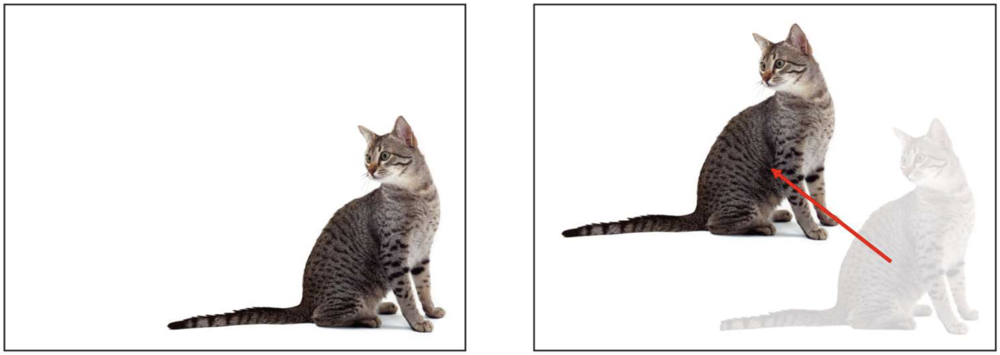*(source: Prof. Kainz [Deep Learning course](https://wp.doc.ic.ac.uk/bkainz/teaching/70010-deep-learning/) @ Imperial College London)*]

---
class: middle, center

# Convolutional neural networks

---
# Convolutional neural networks

- Visual perception is based on **local features**: edges, corners, textures, etc.
- Visual perception is based on **hierarchical features**: edges $\rightarrow$ shapes $\rightarrow$ objects
- The goal is to make a model able to learn these features

.center.width-75.mt-4[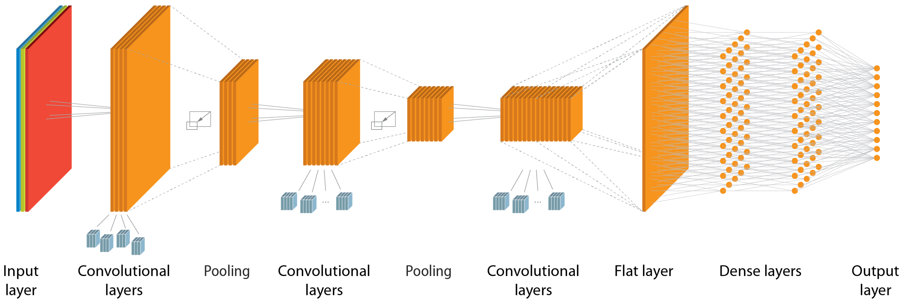*source: [https://fidle.cnrs.fr/](https://fidle.cnrs.fr/)*]

---
# Convolutional neural networks

.center.width-95.mt-2[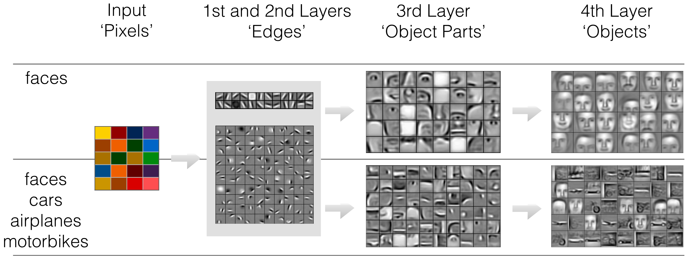]

- Each layer of the network learns a new level of abstraction
- The first layers learn generic low-level features (edges, corners, etc.)
- The last layers learn high-level features (objects, etc.), specific to the task

---
class: middle, dark-slide

# Notebook [lec4-cnn-feature-maps.ipynb](./notebooks/lec4-cnn-feature-maps.ipynb)

---
# Convolution

.center.width-80.mt-2[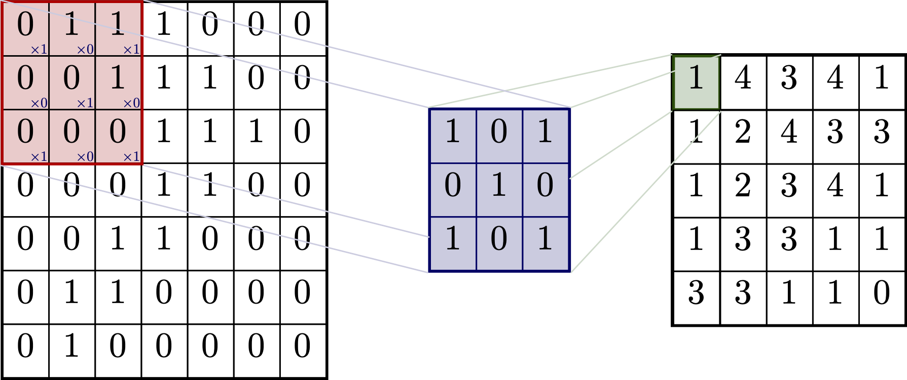]

---
count: false
# Convolution

.center.width-80.mt-2[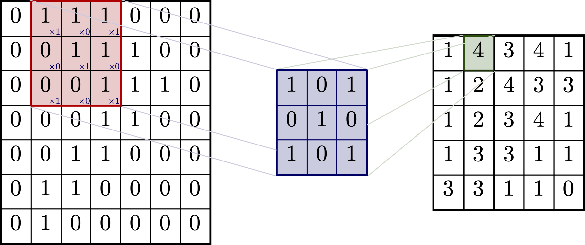]

---
count: false
# Convolution

.center.width-80.mt-2[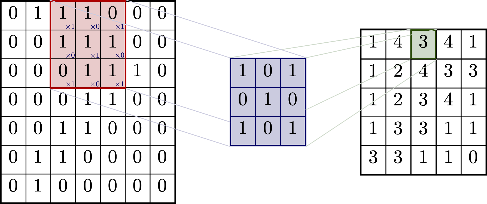]

---
count: false
# Convolution

.center.width-80.mt-2[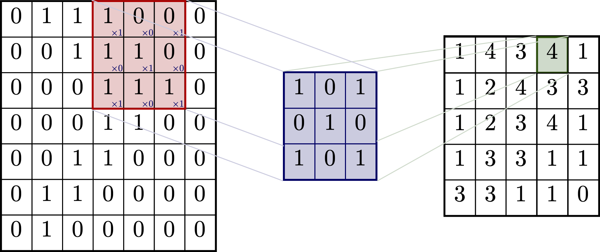]

---
count: false
# Convolution

.center.width-80.mt-2[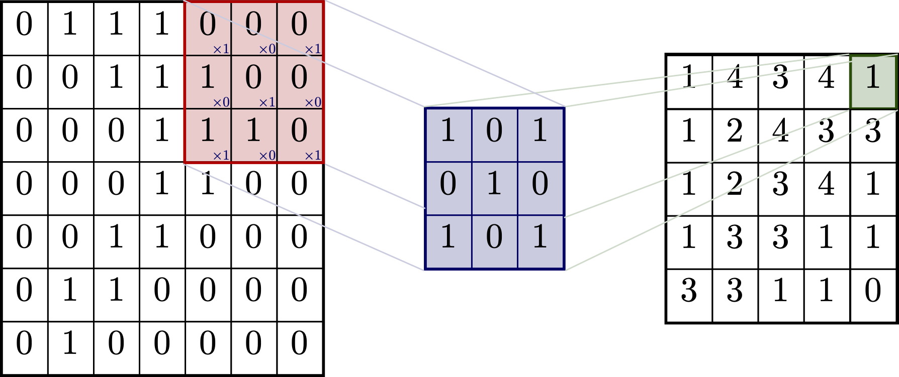]

---
count: false
# Convolution

.center.width-80.mt-2[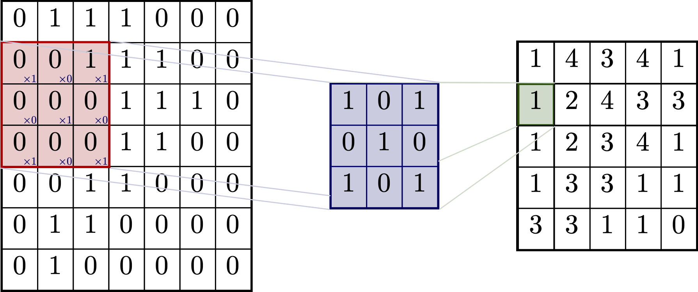]

---
count: false
# Convolution

.center.width-80.mt-2[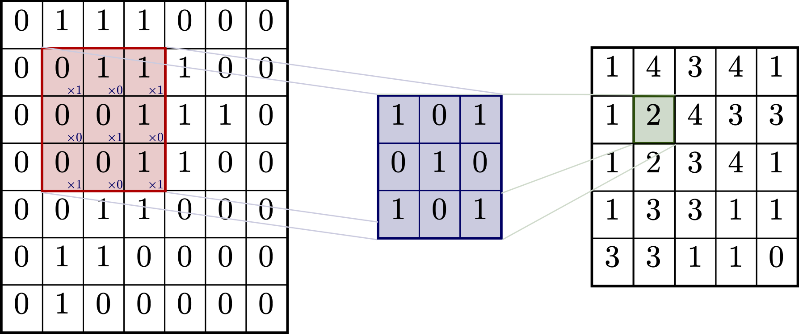]

---
# Convolutional layer

.center.width-75.mt-4[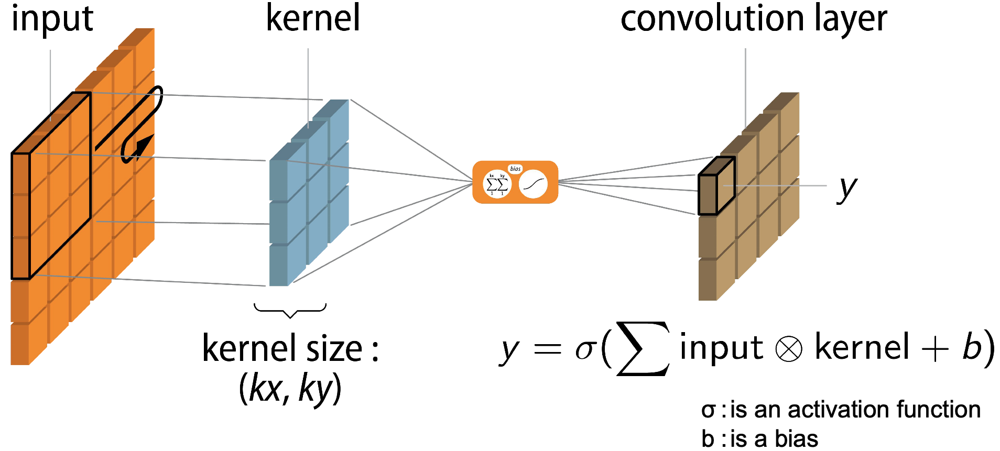*source: [https://fidle.cnrs.fr/](https://fidle.cnrs.fr/)*]

- Parameters to learn: filter values
- Number of parameters for one neuron is $k\_x . k\_y + 1$
- Small filters allow extraction of more features and allow to build deeper NN

---
# Convolutional layer

- A convolutional layer is typically made of several filters
- **Each filter is learned during training** with backpropagation
- One $3 \times 3$ filter is only 10 parameters to learn regardless of the size of the image
- A convolutional layer with 64 filters $\rightarrow 64 \times 10 = 640$ parameters
- Main difference with fully connected networks is that **parameters are shared by all pixels**

---
# Padding

.center.width-75.mt-4[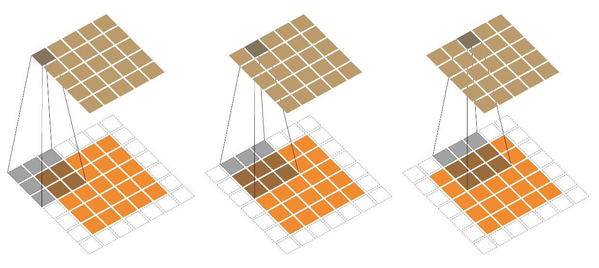*source: [https://fidle.cnrs.fr/](https://fidle.cnrs.fr/)*]

- Help to build deeper networks (avoid shrinking the image at each layer)
- Without padding, border pixels are neglected which could impact the performance

---
# Strides

.center.width-75.mt-4[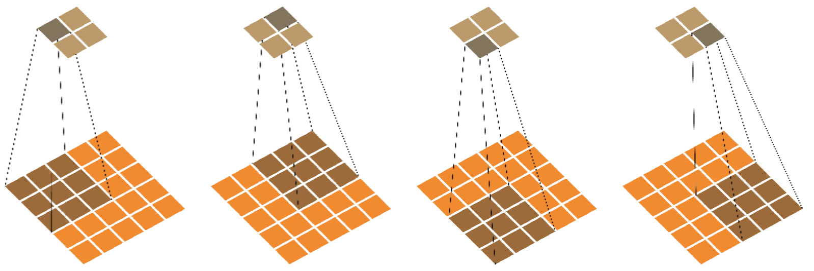*source: [https://fidle.cnrs.fr/](https://fidle.cnrs.fr/)*]

- Skip pixels from one filter application to the next
- Reduces the size of the output $\rightarrow$ less computation
- Higher-level features at the cost of some loss of spatial information

---
# Pooling layer (max pooling)

- Pooling layers are used to reduce the spatial size of the feature maps
- A pooling layer is typically applied after a convolutional layer
- Help to reduce the number of parameters, and to make the network invariant to small translations
- Other pooling methods exist (average pooling, global pooling, etc.) but max pooling is the most common

.center.width-55.mt-4[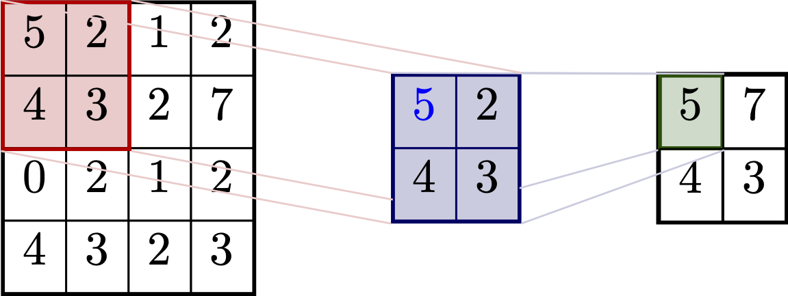]

---
count: false
# Pooling layer (max pooling)
- Pooling layers are used to reduce the spatial size of the feature maps
- A pooling layer is typically applied after a convolutional layer
- Help to reduce the number of parameters, and to make the network invariant to small translations
- Other pooling methods exist (average pooling, global pooling, etc.) but max pooling is the most common

.center.width-55.mt-4[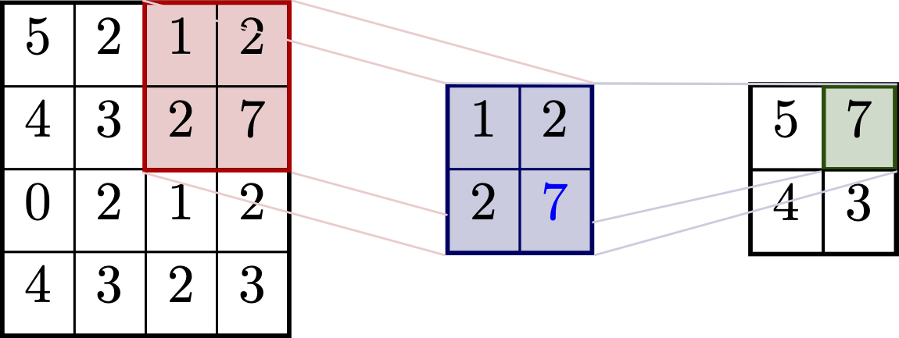]

---
count: false
# Pooling layer (max pooling)

- Pooling layers are used to reduce the spatial size of the feature maps
- A pooling layer is typically applied after a convolutional layer
- Help to reduce the number of parameters, and to make the network invariant to small translations
- Other pooling methods exist (average pooling, global pooling, etc.) but max pooling is the most common

.center.width-55.mt-4[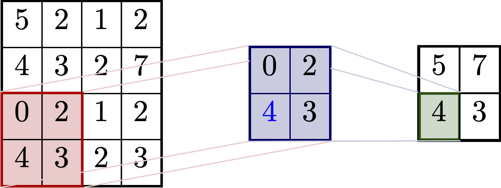]

---
count: false
# Pooling layer (max pooling)

- Pooling layers are used to reduce the spatial size of the feature maps
- A pooling layer is typically applied after a convolutional layer
- Help to reduce the number of parameters, and to make the network invariant to small translations
- Other pooling methods exist (average pooling, global pooling, etc.) but max pooling is the most common

.center.width-55.mt-4[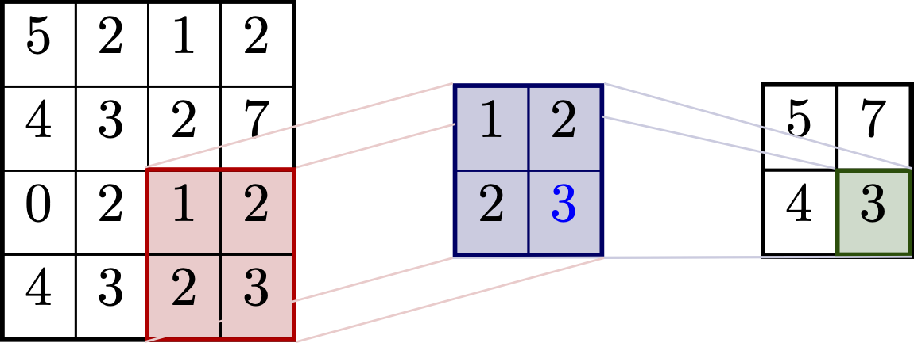]

---
# Convolutional neural networks

.center.width-95.mt-4[*source: [https://fidle.cnrs.fr/](https://fidle.cnrs.fr/)*]

---
# Convolutional neural networks

```python
model = Sequential()

# Convolutional layers
model.add(Conv2D(32, 3, strides=2, activation='relu', padding='same'))
model.add(MaxPooling2D(pool_size=(2, 2), strides=(2, 2)))

# Fully connected layers
model.add(Flatten())
model.add(Dense(128, activation='relu'))
model.add(Dense(10, activation='softmax'))
```

- 32 filters of size $3 \times 3$
- Padding="same": add zeros around the image to keep the same size
- Strides=2: skip 1 pixel out of 2
- Max-pooling of size $2 \times 2$

---
class: middle, center

# CNN in action

---
# CNN in action

.center.width-75[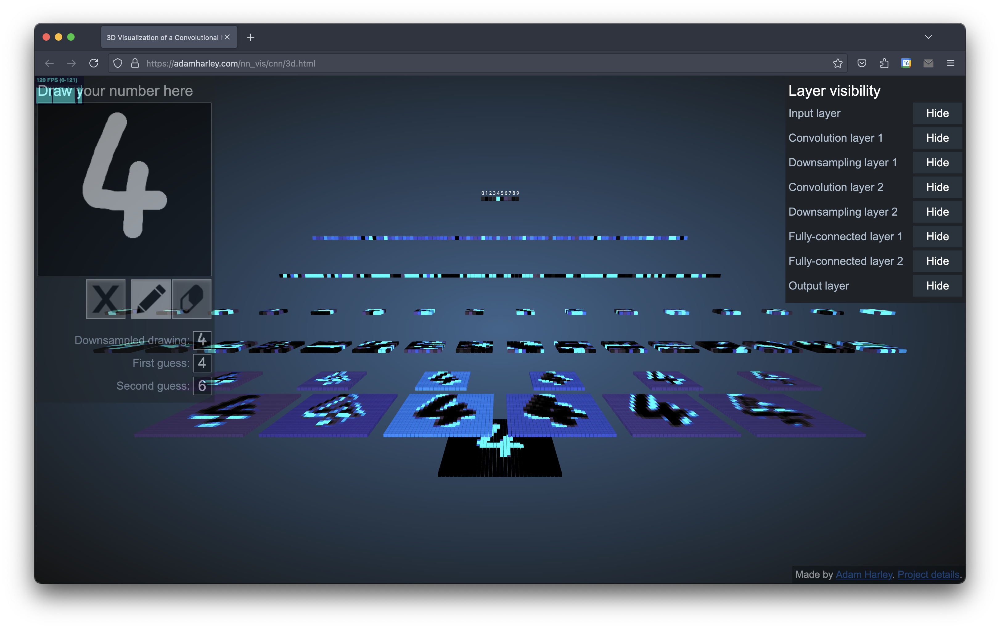*[https://adamharley.com/nn_vis/](https://adamharley.com/nn_vis/)*]

---
# CNN in action

- The first successes of DL were on image classification with CNN
- E.g. ImageNet challenge in 2012: [winner is by far a CNN](https://www.image-net.org/challenges/LSVRC/2012/results.html)
- Today, CNNs are at the heart of virtually all computer vision AI systems
- **Going deeper and deeper is the key to success**
- But deeper networks are harder to train, require a lot of data and many tricks to work

---
# Well-known architectures

**AlexNet** .exponent[(1)]: winner of the ImageNet challenge in 2012

.center.width-80[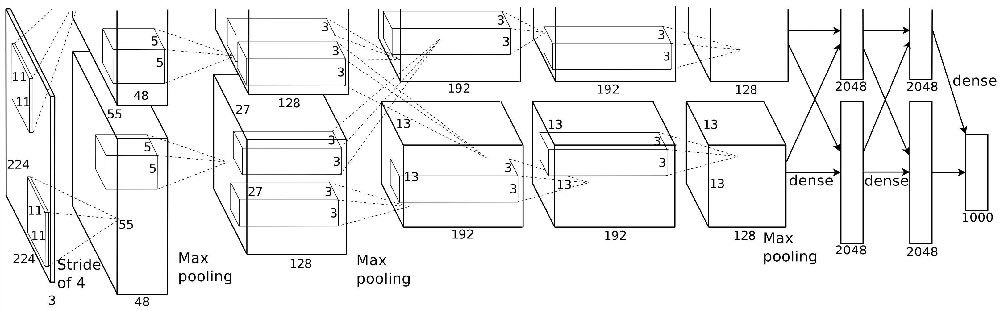*8 layers, 60M parameters*]

.footnote[(1) Alex Krizhevsky, Ilya Sutskever, and Geoffrey Hinton "ImageNet Classification with Deep Convolutional Neural Networks", NeurIPS 2012]

---
# Well-known architectures

**VGG** (2014) .exponent[(1)]: uses smaller filters and more layers to improve performance

.center.width-45[*16-19 layers, up to 144M parameters*]

.footnote[(1) Karen Simonyan and Andrew Zisserman "Very Deep Convolutional Networks for Large-Scale Image Recognition", ICLR 2015]

---
# Well-known architectures

**ResNet** (2015) .exponent[(1)]: introduces skip-connections (or residual connections) to allow training of very deep networks

.center.width-75[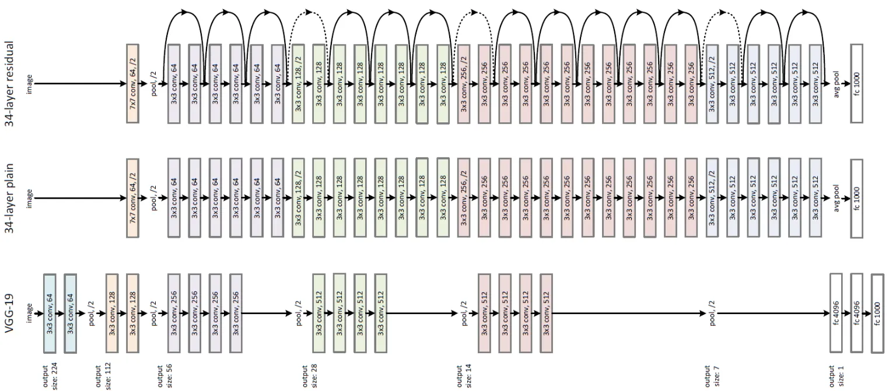*34 to 152 layers, skip-connections*]

.footnote[(1) Kaiming He, Xiangyu Zhang, Shaoqing Ren, and Jian Sun "Deep Residual Learning for Image Recognition", CVPR 2016]

---
# Well-known architectures

**U-Net** (2015): .exponent[(1)]: encoder-decoder architecture for semantic segmentation tasks

.center.width-70[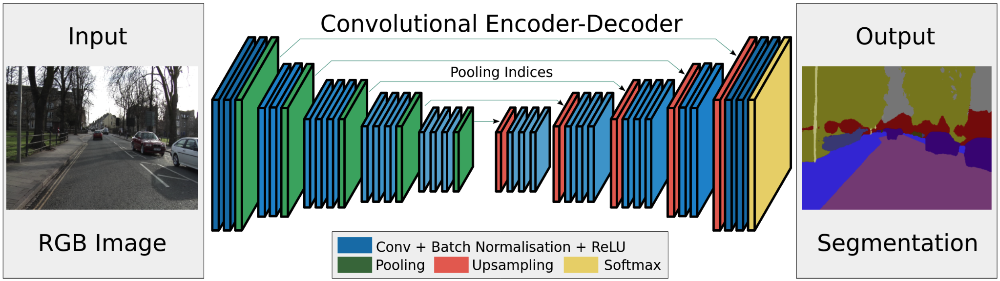*Encoder-decoder architecture with skip-connections*]

.footnote[(1) Olaf Ronneberger, Philipp Fischer, and Thomas Brox "U-Net: Convolutional Networks for Biomedical Image Segmentation", MICCAI 2015]

---
# Well-known architectures

**YOLO** (from 2016 to today): first foundation models for image understanding and recognition tasks, with many versions (v1 to v13)

.center.width-70[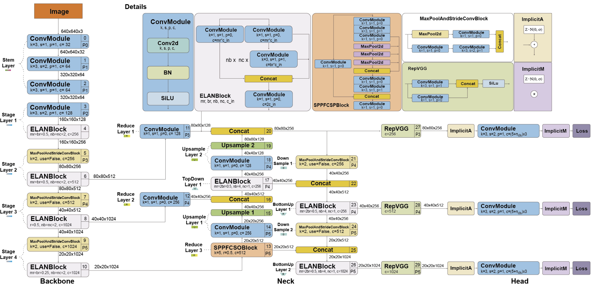*Several versions (here v7), with many different blocks*]

---
# Well-known architectures

**Vision Transformer** (2021) .exponent[(1)]: applies successful NLP techniques to image understanding instead of text understanding

.center.width-65[*Transformer applied to image patches instead of text tokens*]

.footnote[(1) Alexey Dosovitskiy, Lucas Beyer, Alexander Kolesnikov, Dirk Weissenborn, Xiaohua Zhai, Thomas Unterthiner, Mostafa Dehghani, Matthias Minderer, Georg Heigold, Sylvain Gelly, Jakob Uszkoreit, and Neil Houlsby "An Image is Worth 16x16 Words: Transformers for Image Recognition at Scale", ICLR 2021]

---
# Takeaways

.box[Representation learning is the key to success in deep learning for images]

.box[**Convolution, convolution, convolution**... and few other things]

.box[Going deeper and deeper is the key to success, but harder to train]

.box[Only possible thanks to GPUs and large datasets, with images massively collected from the web]

.box[50 shades of CNN architectures, with many variations and improvements over time]

.box[Used with specific techniques (diffusion, adversarial training, etc.) it can now generate realistic images and videos to the point of being indistinguishable from real ones]
