class: middle, center, title-slide
name: lecture5

# Machine Learning
## Lecture 5: Deep learning for sequences
  
Simon BERNARD 
[simon.bernard@univ-rouen.fr](mailto:simon.bernard@univ-rouen.fr)  
.center.height-4em[]

---
class: middle, center

# Learning from sequences

---
# Machine learning with sequences

- Fully connected networks: inputs are fixed-size vectors

.center.width-30[]

- Convolutional networks: inputs are fixed-size 2D/3D tensors

.center.width-30[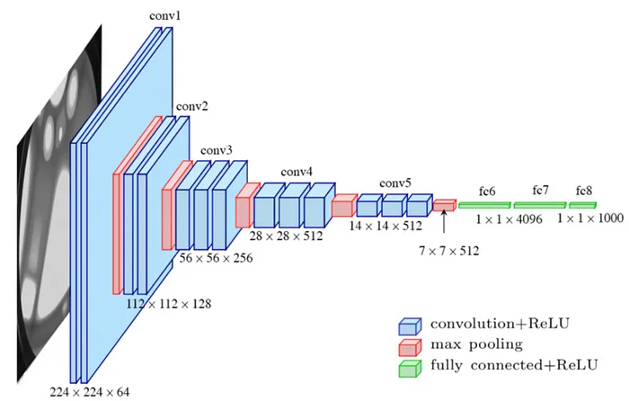]

---
# Machine learning with sequences

- Recurrent networks: inputs are variable-length sequences (e.g. text, audio, signals)

.row.mt-2[
.col-50.center[
.width-80[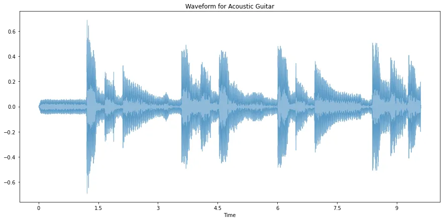]
]
.col-50.center[
.width-90[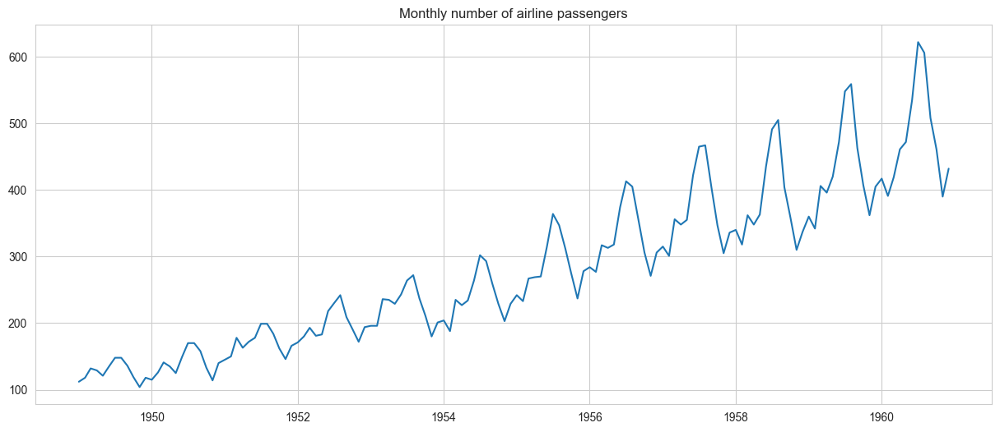]
]
]

.row[
.col-50.center[
.width-80[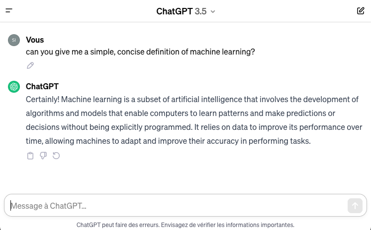]
]
.col-50.center[
.width-80[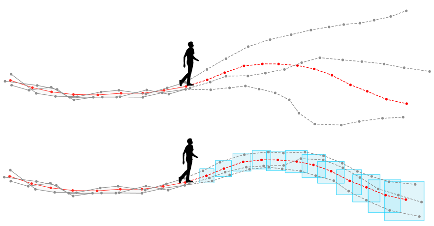]
]
]

---
# Machine learning with sequences

.row[
.col-50[
**Sequence classification**

- Assign a class to a given sequence
$$\text{Sequence} \rightarrow \mathbb{N}$$
- Example: sentiment analysis, DNA sequence classification
]
.col-50.center[
.width-90[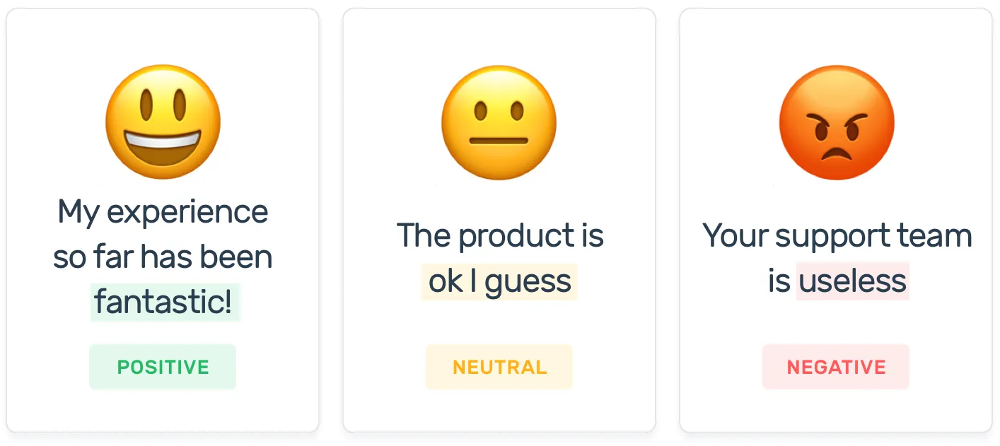]
.width-90.mt-2[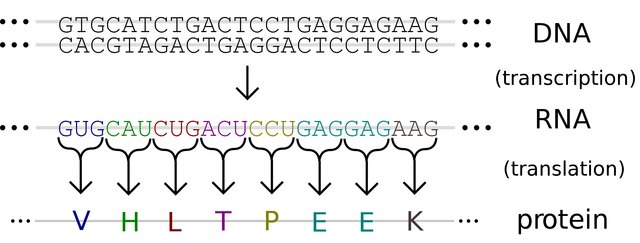]
]
]

---
# Machine learning with sequences

.row[
.col-50[
**Sequence labeling**

- Assign a class to every item of a given sequence
$$\text{Sequence} \rightarrow \mathbb{N}^{T}$$
$T$ being the length of the sequence
- Example: Named-entity recognition, Part-of-speech tagging, audio annotation
]
.col-50.center[
.width-90[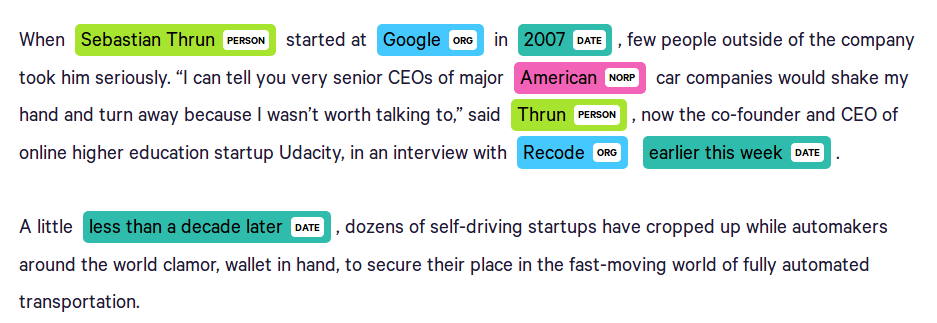]
.width-80.mt-2[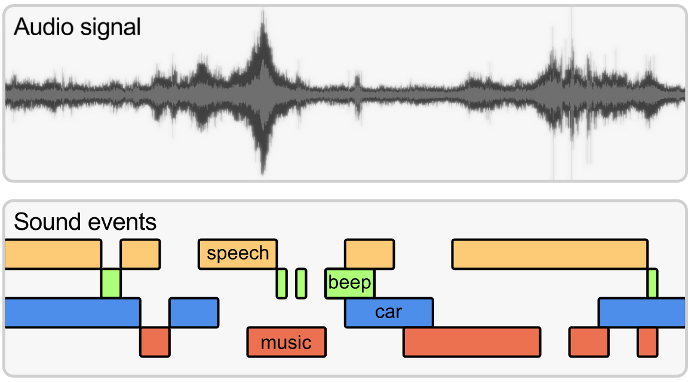]
]
]

---
# Machine learning with sequences

.row[
.col-50[
**Sequence synthesis**

- Generate a sequence from a given input
$$\mathbb{R}^{d} \rightarrow \text{Sequence}$$
- Example: Image captioning, Question answering, Music generation
- Note: inputs are considered to be vectors such as image or text embeddings
]
.col-50.center[
.width-90[]
.width-65.mt-2[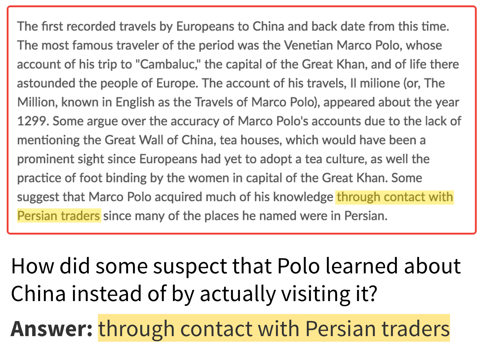]
]
]

---
# Machine learning with sequences

.row[
.col-50[
**Sequence to sequence translation**

- Generate an output sequence from a given input sequence
$$ \text{Sequence} \rightarrow \text{Sequence}$$
- Example: Speech recognition, Machine translation, Text summarization
]
.col-50.center[
.width-90[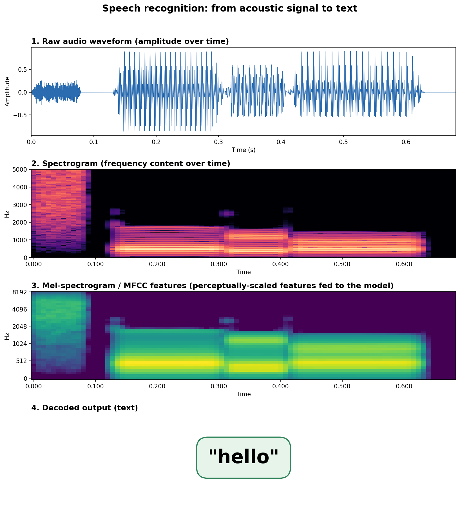]
]
]

---
# What is a sequence?

- A $T$-length sequence is a set of elements $\mathbf{X} = \mathbf{x}\_{(1)}, \mathbf{x}\_{(2)}, \dots, \mathbf{x}\_{(t)}, \dots, \mathbf{x}\_{(T)}$
- Discrete sequences: $\mathbf{x}\_{(t)} \in \mathcal{A}$ where $\mathcal{A}$ is a finite set of symbols (alphabet) and $|\mathcal{A}| = N$
  - Text as sequence of characters: $N \approx 100$ symbols
  - Text as sequence of words: $N \approx 200000$ words or more
  - Text as sequence of tokens (subwords): $N \approx 50000$ tokens

.center.width-70.mt-2[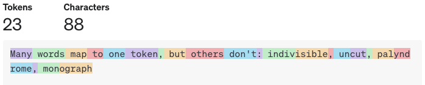*source: [OpenAI tokenizer](https://platform.openai.com/tokenizer)*]

---
count: false
# What is a sequence?

- A $T$-length sequence is a set of elements $\mathbf{X} = \mathbf{x}\_{(1)}, \mathbf{x}\_{(2)}, \dots, \mathbf{x}\_{(t)}, \dots, \mathbf{x}\_{(T)}$
- Continuous sequences: $\mathbf{x}\_{(t)} \in \mathbb{R}^d$
  - Audio signals: $d = 1$
  - EEG signals: $d = 32, \dots, 64$

.row[
.col-50.center[
.width-90[]
]
.col-50.center[
.width-90[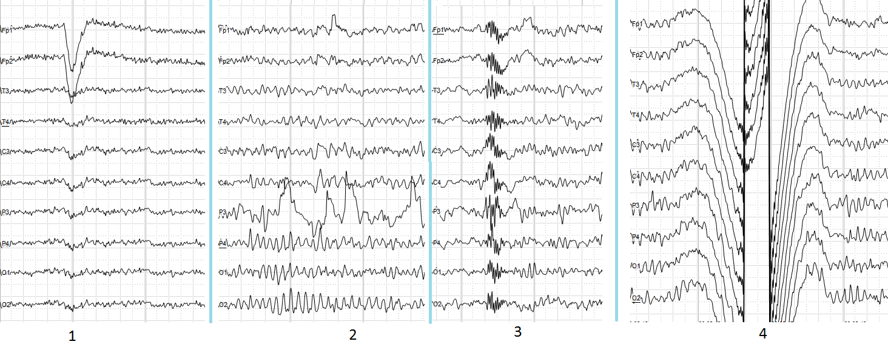]
]
]

---
# Learning from sequences

- As with CNN, the challenge is to learn a relevant representation of the sequence:
  - Learn to extract local features from the sequence
  - Each layer produce new features with higher-level abstraction
  - Weights are shared across parts of the sequence
  

- But, we need to model the **temporal dependencies** instead of spatial dependencies
- Implies to model long-range dependencies instead of short-range (local) dependencies

---
class: middle, center

# Recurrent neural networks

---
# Recurrent neuron

.row[
.col-45.center[
**Classical neuron**

.width-80[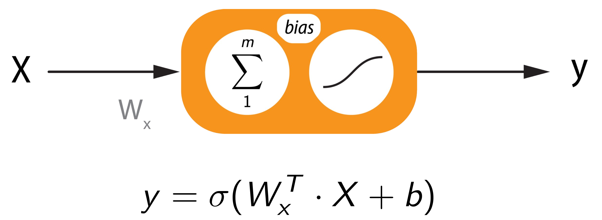]
]
.col-45.center[
**Recurrent neuron**

.width-80[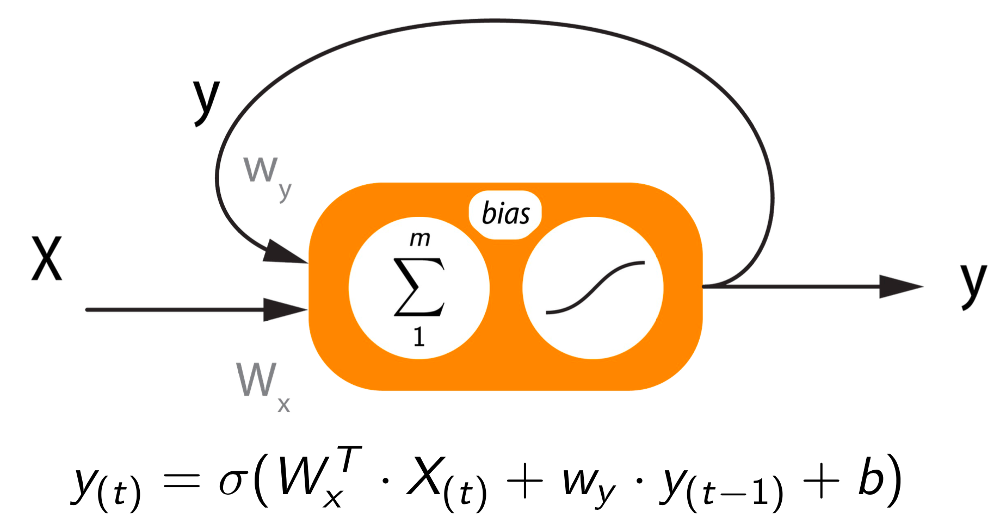]
]
]

- $\mathbf{x}\_{(t)}$ given to the neuron one after the other, following the order in the sequence ($\mathbf{x}\_{(1)}$, then $\mathbf{x}\_{(2)}$, and so on up to $\mathbf{x}\_{(T)}$)
- $\mathbf{y}\_{(t)}$, output at time $t$ depends on $\mathbf{x}\_{(t)}$ and on $\mathbf{y}\_{(t-1)}$

---
# Recurrent neuron

- Same neuron unfolded $\approx$ $T$ classical neurons
- $\mathbf{y}\_{(t)}$, reinjected into the neuron at each step, is the **hidden state** of the neuron
- Form of **memory** that allows the neuron to "remember" the previous inputs

.center.width-75[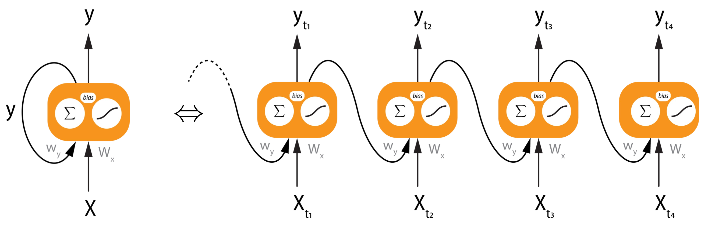]

---
# Recurrent layer (or cell)

- Same principle transposed to the combination of $N$ neurons
- In that case, neurons are called **units** and their combination is a **cell**
- Output is a vector instead of a scalar (as with a single neuron)

.row[
.col-30.center[
.width-80[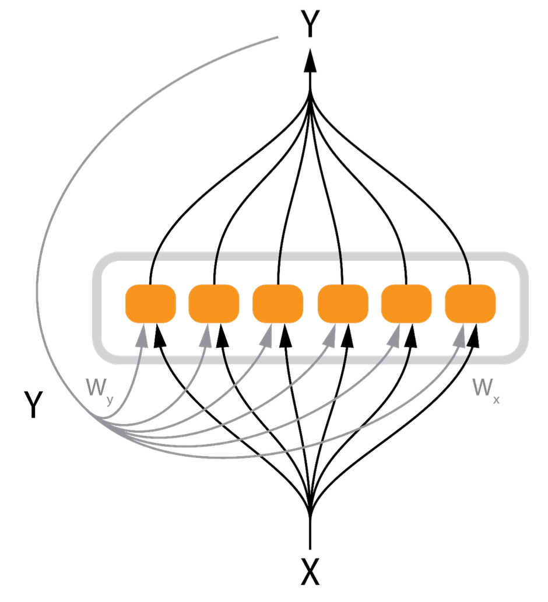]
]
.col-70.center[
.width-80[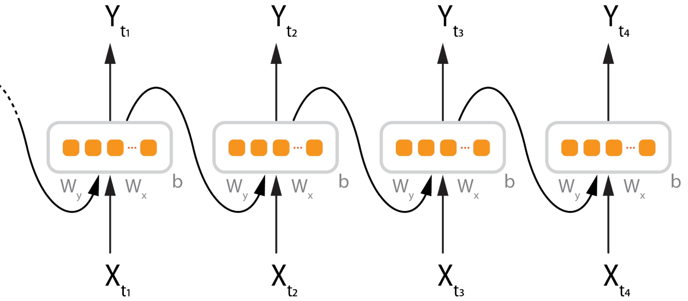]
]
]

---
# Recurrent layer (or cell)

- Output at time $t$ is $\mathbf{y}\_{(t)} = \sigma \left( \mathbf{W}\_y \mathbf{y}\_{(t-1)} + \mathbf{W}\_x \mathbf{x}\_{(t)} + b \right)$
- $\mathbf{x}\_{(t)}$ is a $d$-sized vector, $\mathbf{y}\_{(t-1)}$ is a $N$-sized vector
- $\mathbf{W}\_y$ is a $N \times N$ matrix of weights, $\mathbf{W}\_x$ is a $N \times d$ matrix of weights

.row[
.col-30.center[
.width-80[]
]
.col-70.center[
.width-80[]
]
]

---
# Recurrent neural networks

- RNN are made up of **one or several cells of recurrent neurons**
- The architecture depends on the task and the nature of input/output

.center.width-90[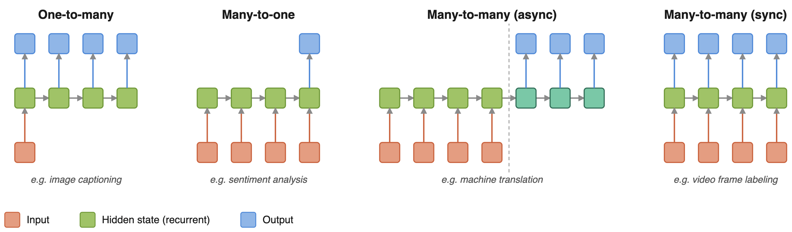]

---
# Recurrent neural networks

Several problems in practice during training:

- Backpropagation through time (BPTT): gradients propagated through the unfolded network

.center.width-80[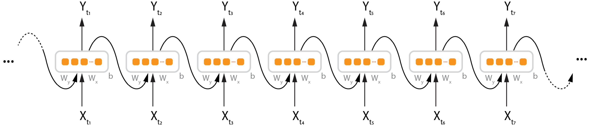]

- Can cause **vanishing or exploding gradient problems**
- **Influence of the first inputs can vanish rapidly**: hard to learn long-term dependencies
- Convergence of **training can be very slow**, especially for long sequences
 
Long story short: **it doesn't work well in practice**

---
# Long Short-Term Memory

- Solution: use a separate memory cell that can store information for a long time
- The cell is controlled by **gates** that regulate the flow of information in and out of the cell
- This is the principle of **Long Short-Term Memory (LSTM) cells** .exponent[(1)]

.row[
.col-50.vcenter[
.center.width-95[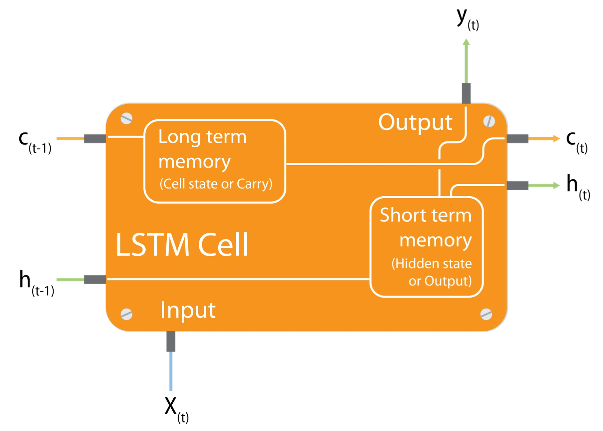]
]
.col-50.vcenter[
- $\mathbf{h}\_{(t)}$: hidden state vector (output of the cell)
- $\mathbf{c}\_{(t)}$: cell state vector (memory of the cell)
- $\mathbf{h}\_{(t-1)}$ : previous hidden state vector
- $\mathbf{c}\_{(t-1)}$ : previous cell state vector 
]
]

.footnote[(1) or a more recent and simplified variant, the Gated Recurrent Unit (GRU) cell]

---
# Long Short-Term Memory

.center.width-60[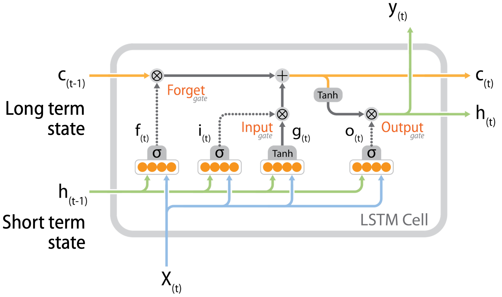]

.row.small[
.col-50.vcenter.small[
$$\begin{aligned}
\mathbf{f}\_{(t)} &= \sigma ( \mathbf{W}\_{hf} \mathbf{y}\_{(t-1)} + \mathbf{W}\_{xf} \mathbf{x}\_{(t)} + b\_f ) \\\\
\mathbf{i}\_{(t)} &= \sigma ( \mathbf{W}\_{hi} \mathbf{y}\_{(t-1)} + \mathbf{W}\_{xi} \mathbf{x}\_{(t)} + b\_i ) \\\\
\mathbf{g}\_{(t)} &= \tanh ( \mathbf{W}\_{hg} \mathbf{y}\_{(t-1)} + \mathbf{W}\_{xg} \mathbf{x}\_{(t)} + b\_g ) \\\\
\mathbf{o}\_{(t)} &= \sigma ( \mathbf{W}\_{ho} \mathbf{y}\_{(t-1)} + \mathbf{W}\_{xo} \mathbf{x}\_{(t)} + b\_o ) \\\\
\mathbf{c}\_{(t)} &= \mathbf{f}\_{(t)} \otimes \mathbf{c}\_{(t-1)} + \mathbf{i}\_{(t)} \otimes \mathbf{g}\_{(t)} \\\\
\mathbf{y}\_{(t)} &= \mathbf{o}\_{(t)} \otimes \tanh(\mathbf{c}\_{(t)})
\end{aligned}$$
]
.col-10[with
]
.col-40.vcenter.small[
- $\mathbf{x}\_{(t)} \in \mathbb{R}^d$: input vector
- $\mathbf{f}\_{(t)} \in \mathbb{R}^h$: forget gate's activation vector
- $\mathbf{i}\_{(t)} \in \mathbb{R}^h$: input gate's activation vector
- $\mathbf{o}\_{(t)} \in \mathbb{R}^h$: output gate's activation vector
- $\mathbf{g}\_{(t)} \in \mathbb{R}^h$: current entry vector
- $\mathbf{c}\_{(t)} \in \mathbb{R}^h$: cell state vector
- $\mathbf{y}\_{(t)} \in \mathbb{R}^h$: hidden state / output vector
]
]

---
class: middle, center

# Attention is all you need

---
# Seq2seq modeling

- Sequence-to-sequence (seq2seq) modeling: generate a sequence from a given input sequence
- Many seq2seq methods are based on **encoder-decoder architectures**
- Encoder: compress the input sequence into a hidden vector representation
- Decoder: generate the output sequence with autoregressive model

.center.width-85[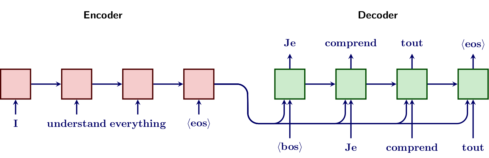]

---
# Seq2seq modeling

- Problem: the whole input sequence is encoded into a single vector (the last hidden state)
- This **hidden state can not capture all the information of the input sequence**
- Elements of the output sequence do not depend in the same way on all the input elements

.center.width-100[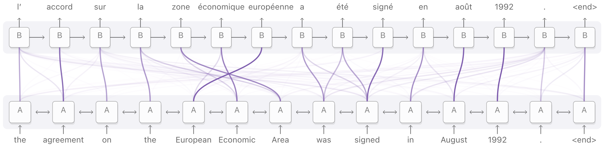*source: [https://distill.pub/2016/augmented-rnns/](https://distill.pub/2016/augmented-rnns/)*]

---
# Bahdanau's attention

- Solution: attention mechanism
- Transport information from part of the input sequence to part of the output sequence
- The attention block is designed such that **the focus is dynamic and content-based**

.center.width-70[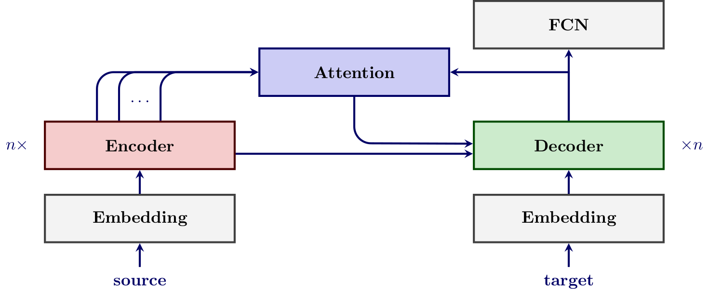*RNN encoder–decoder architecture with the Bahdanau attention mechanism*]

---
# Bahdanau's attention

.center.width-50[]

- let $\mathbf{h}\_{(t)}$ and $\mathbf{s}\_{(t)}$ be the encoder and decoder hidden states at time $t$
- For generating $\mathbf{s}\_{(t')}$, a **context vector** $\mathbf{c}\_{(t')}$ is computed as :
$$\mathbf{c}\_{(t')} = \sum\_{t=1}^{T} \alpha(\mathbf{s}\_{(t'-1)}, \mathbf{h}\_{(t)}) \mathbf{h}\_{(t)}$$
where $\alpha(\mathbf{s}\_{(t'-1)}, \mathbf{h}\_{(t)})$ measures **the importance of $\mathbf{h}\_{(t)}$ for generating $\mathbf{s}\_{(t')}$**

---
# Attention as a soft lookup

- Attention is **inspired by information retrieval**
- Dictionary lookup: find the **key** that matches a **query**, and return the corresponding **value**
- Attention: the query is compared to every key, the output is a weighted average of all the values s.t. weights measure how well the query matches each key

.center.width-95.mt-2[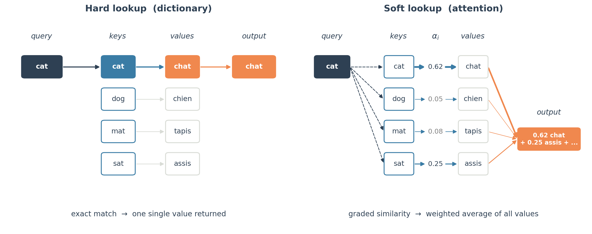]

---
# Queries, keys and values

Translating *"The European Economic Area was created in 1992"*:

- The encoder produces one hidden state $\mathbf{h}\_{(t)}$ per source word
- Three **learned projections** turn hidden states into the three roles of the lookup
$$\mathbf{q}\_{(t')} = \mathbf{W}\_Q\, \mathbf{s}\_{(t'-1)} \qquad \mathbf{k}\_{(t)} = \mathbf{W}\_K\, \mathbf{h}\_{(t)} \qquad \mathbf{v}\_{(t)} = \mathbf{W}\_V\, \mathbf{h}\_{(t)}$$

.center.width-80[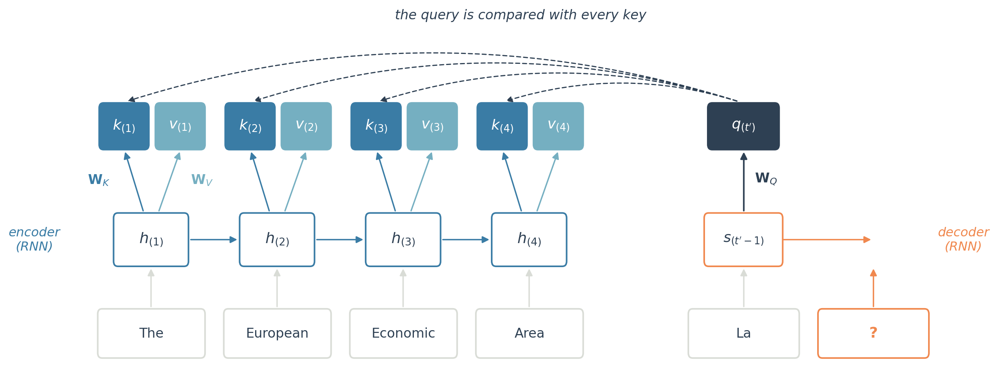]

---
# Computing the context vector

.center.width-90[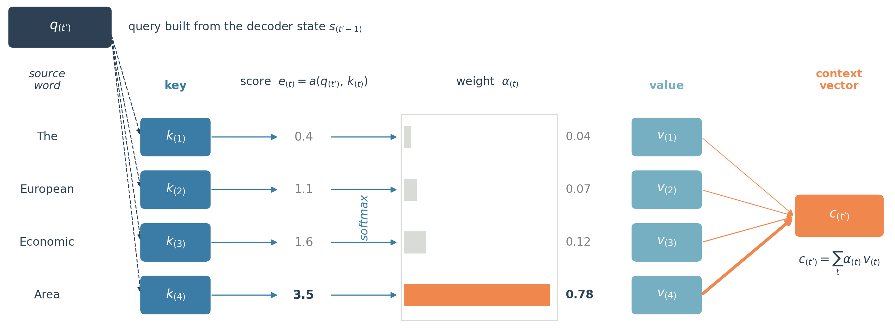]

- $a$ is typically the scaled dot product between the query and the key .exponent[(1)]
- $\alpha$ is a softmax over the $a$ values, so that they sum to 1
- Bahdanau's attention is the special case where the three roles are not projected:
$$\mathbf{q}\_{(t')} = \mathbf{s}\_{(t'-1)} \qquad \mathbf{k}\_{(t)} = \mathbf{v}\_{(t)} = \mathbf{h}\_{(t)}$$

.footnote[
  (1) $a(\mathbf{q}\_{(t')}, \mathbf{h}\_{(t)}) = \frac{\mathbf{q}\_{(t')} \cdot \mathbf{k}\_{(t)}}{\sqrt{d\_k}}$ where $d\_k$ is the dimension of the key vectors
]

---
# Attention learns the alignment

.width-45[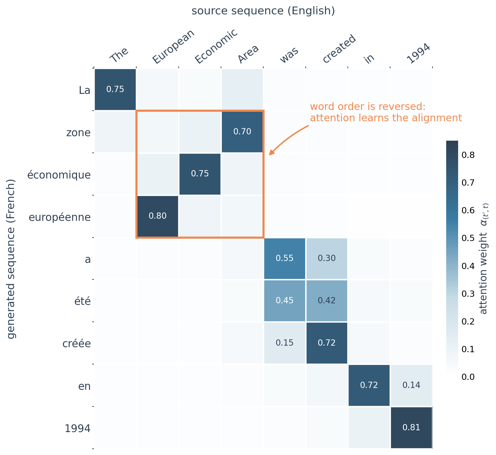*Alignment matrix with the attention weights (illustrative weights, not the output of an actual trained model)*]
- Nothing tells the model *which* source word to look at: the alignment **emerges from training**
- Handles reordering (*European Economic Area* $\rightarrow$ *zone économique européenne*) and one-to-many mappings (*created* $\rightarrow$ *a été créée*)

---
class: middle, center

# Transformers

---
# Transformers

- Encoder-decoder architecture based on attention mechanism
- **Do not use recurrent cells, only attention blocks**
- Exploit attention to build high-level representations of sequences
- E.g. for text, a representation that captures the meaning of the words

.center.width-90.mt-1[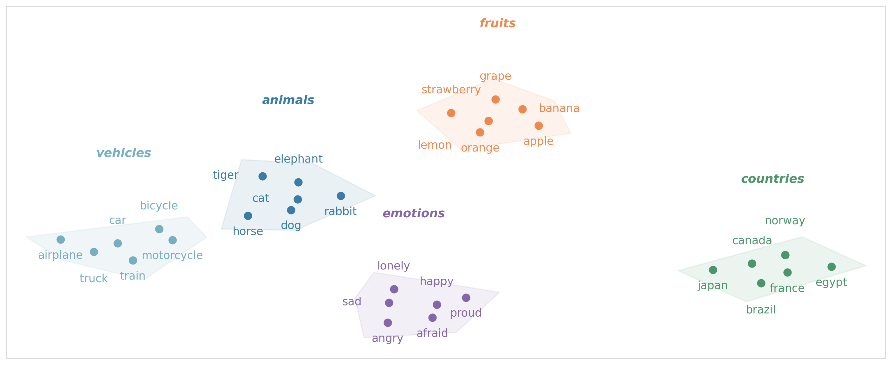*2D t-SNE projection of [GloVe 100d](https://nlp.stanford.edu/projects/glove/) representation vectors*]

---
# Transformers

- Key idea is to compute attention between all pairs of elements of a sequence
- Called **self-attention**: queries/keys/values all derived from the same sequence
- This computation .exponent[(1)] is done in several attention "heads" and several layers

.center.width-70.mt-2[*source: [https://github.com/jessevig/bertviz](https://github.com/jessevig/bertviz)*]

.footnote[(1) Not detailed in this course, but based on multiple parallel operations similar to the previous formulation of attention]

---
# Transformers

.row[
.col-40.center[
.width-90[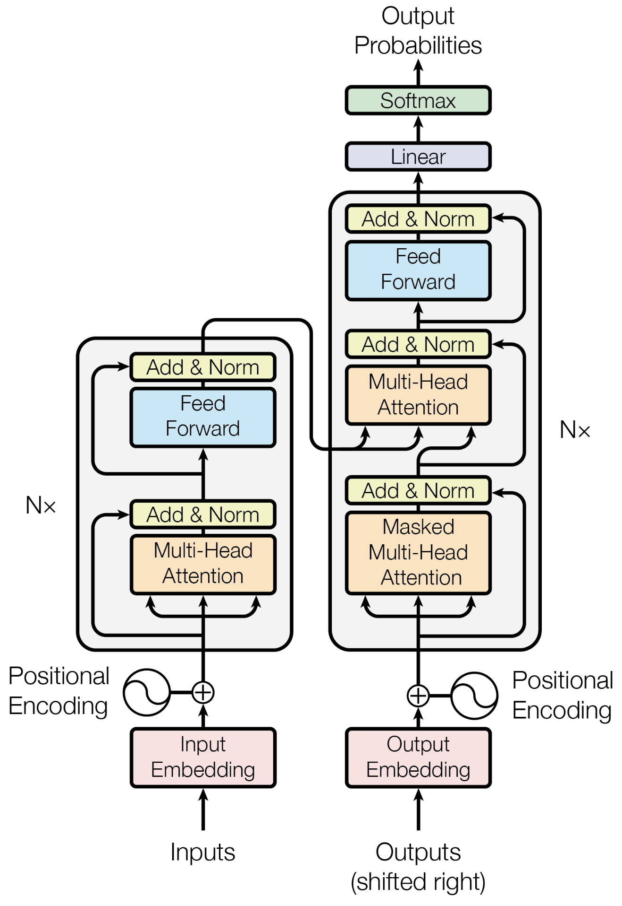*source: [Vaswani et al. "Attention is all you need", 2017](https://arxiv.org/abs/1706.03762)*]
]
.col-60[
- Encoder (left branch): representation learning part
- Once trained, it can be used as a **pre-trained representation model** for many downstream tasks (classification, labeling, etc.)
]
]

---
count: false
# Transformers

.row[
.col-40.center[
.width-90[*source: [Vaswani et al. "Attention is all you need", 2017](https://arxiv.org/abs/1706.03762)*]
]
.col-60[
- Decoder (right branch): sequence generation part (thanks to unidirectional attention)
.center.width-60.mt-2[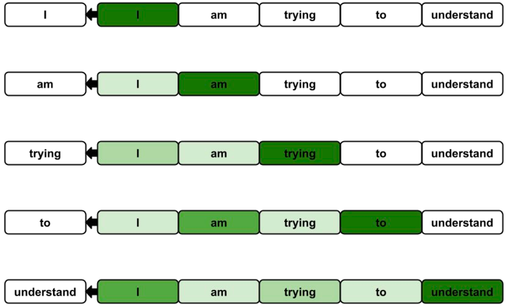*Unidirectional attention (source: [fidle.cnrs.fr](https://fidle.cnrs.fr))*]
- It's the core part of **Large Language Models (LLM)** (e.g. the GPT model of ChatGPT)
]
]

---
# Transformers

.row[
.col-40.center[
.width-90[*source: [Vaswani et al. "Attention is all you need", 2017](https://arxiv.org/abs/1706.03762)*]
]
.col-60[
Few important tricks to make it work in practice:
- **Text embeddings**: map discrete symbols to continuous vectors
- **Positional encoding**: add information about the position of each element
- **Residual connections and layer normalization**: stabilize training
- **MLPs**: add non-linearity and increase model capacity
]
]

---
# Self supervised training

- Now, the question is "how to train such a model to make it learn the semantics of language?"
- We have a lot of text available, but we don't have labels for it
- Solution: **self-supervised training**, i.e. create a supervised task from the text itself

Example:

.width-70[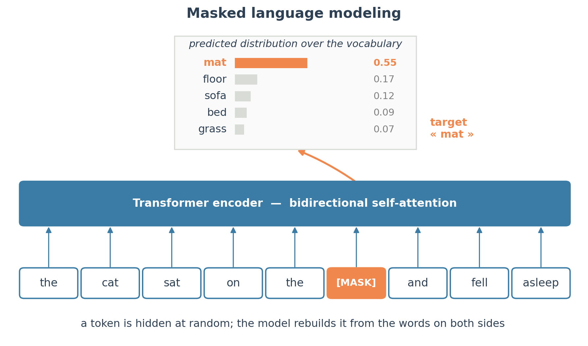]

---
count: false
# Self supervised training

- Now, the question is "how to train such a model to make it learn the semantics of language?"
- We have a lot of text available, but we don't have labels for it
- Solution: **self-supervised training**, i.e. create a supervised task from the text itself

Example:

.width-70[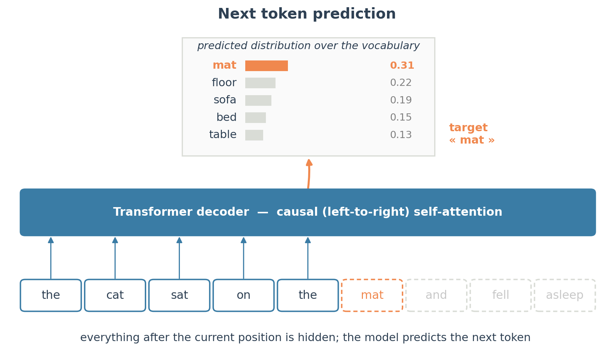]

---
# Large Language Models

- Transformers have been to text processing what CNN have been to image processing
- **Large Language Models (LLM) are transformer-based foundations models**
- Pre-trained on HUGE corpus of text
- Today: in much more complex systems with enhanced capabilities (RAG, Multi-modal, conversational agents, etc.)

.row.wrap.evenly.gap-2[
.height-2em[
  
]
.height-2em[
  
]
.height-2em[
  
]
.height-2em[
  
]
.height-2em[
  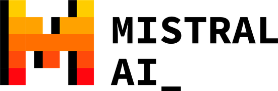
]
.height-2em[
  
]
.height-2em[
  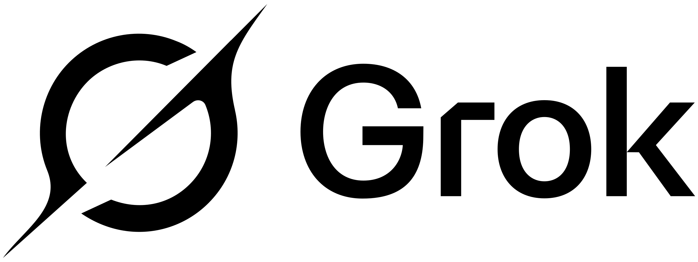
]
.height-2em[
  
]
.height-2em[
  
]
]

---
# Takeaways

.box[Sequences are variable-length data that can be discrete (text) or continuous (audio, signals).]

.box[Recurrent neural networks (RNN), designed to process sequences, have strong limitations in practice. LSTM and GRU cells are the best of the kind.]

.box[**Attention mechanisms allow models to focus on relevant parts** of the input sequence when generating outputs, enabling efficient sequence-to-sequence modeling.]

.box[**Transformers, based on self-attention, have become the state-of-the-art architecture for sequence modeling**, particularly in natural language processing. They are the foundation of Large Language Models (LLMs) like GPT.]