class: middle, center, title-slide
name: lecture6

# Machine Learning
## Lecture 6: Machine learning for physics
  
Simon BERNARD 
[simon.bernard@univ-rouen.fr](mailto:simon.bernard@univ-rouen.fr)  
.center.height-4em[]

---
class: middle, center
# AI for science

---
# AI for Science

.row[
.col-55[
**Major successes of AI: digital applications**
- Images, videos, texts, video games, etc.
- Massively available data

**What about sciences? Can we use AI:**
- as an alternative to traditional approaches?
- to solve problems more effectively?
- to accelerate scientific discovery?
]
.col-45[
.center.width-100[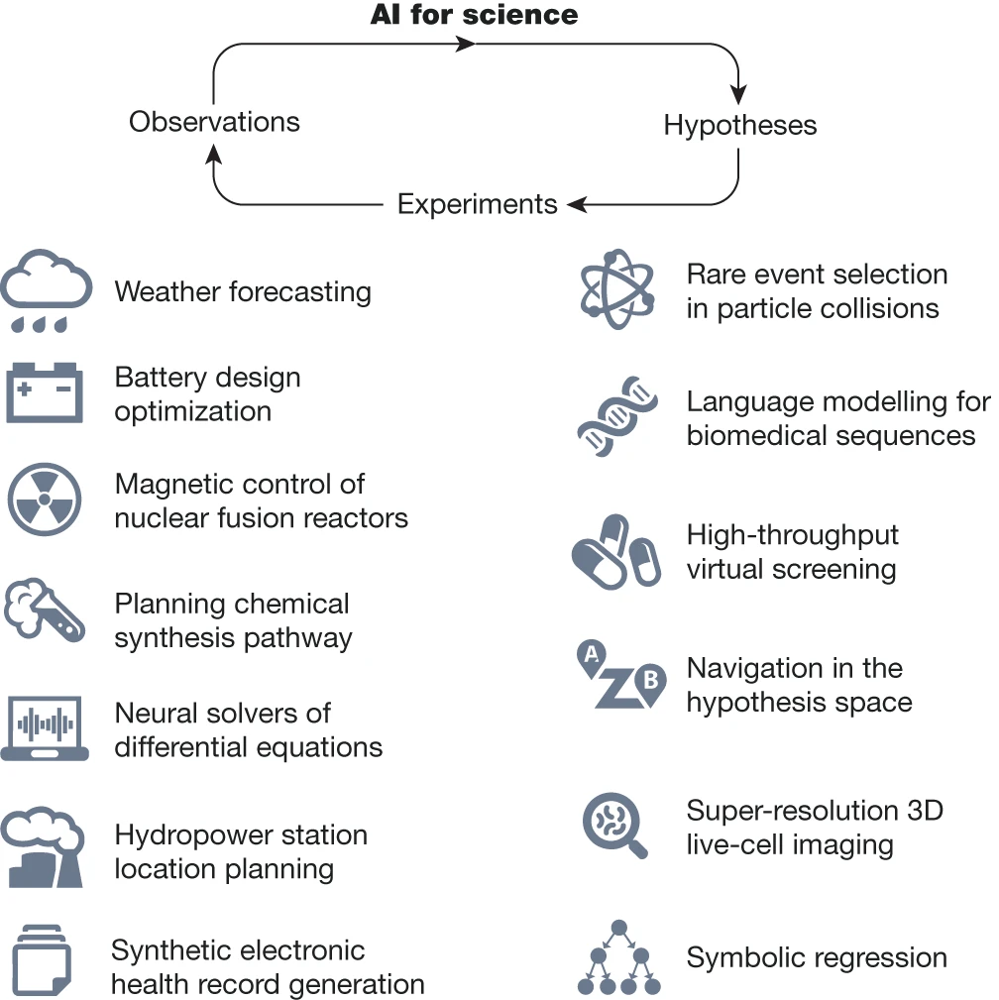*[Wang et al, "Scientific discovery in the age of artificial intelligence", Nature, 2023](https://www.nature.com/articles/s41586-023-06221-2)*]
]
]

---
# AI for Science: Notable recent works

## Weather forecasting

.row[
.col-55[
- **GraphCast** (2023) .exponent[(1)]
- Training data: 39 years of observations (ECMWF)
- Prediction of weather fields up to 10 days ahead
- 1.2 billion param., 128 TPUv4 chips for training

.center.width-80.mt-2[]
]
.col-45[
.center.width-90.mt-2[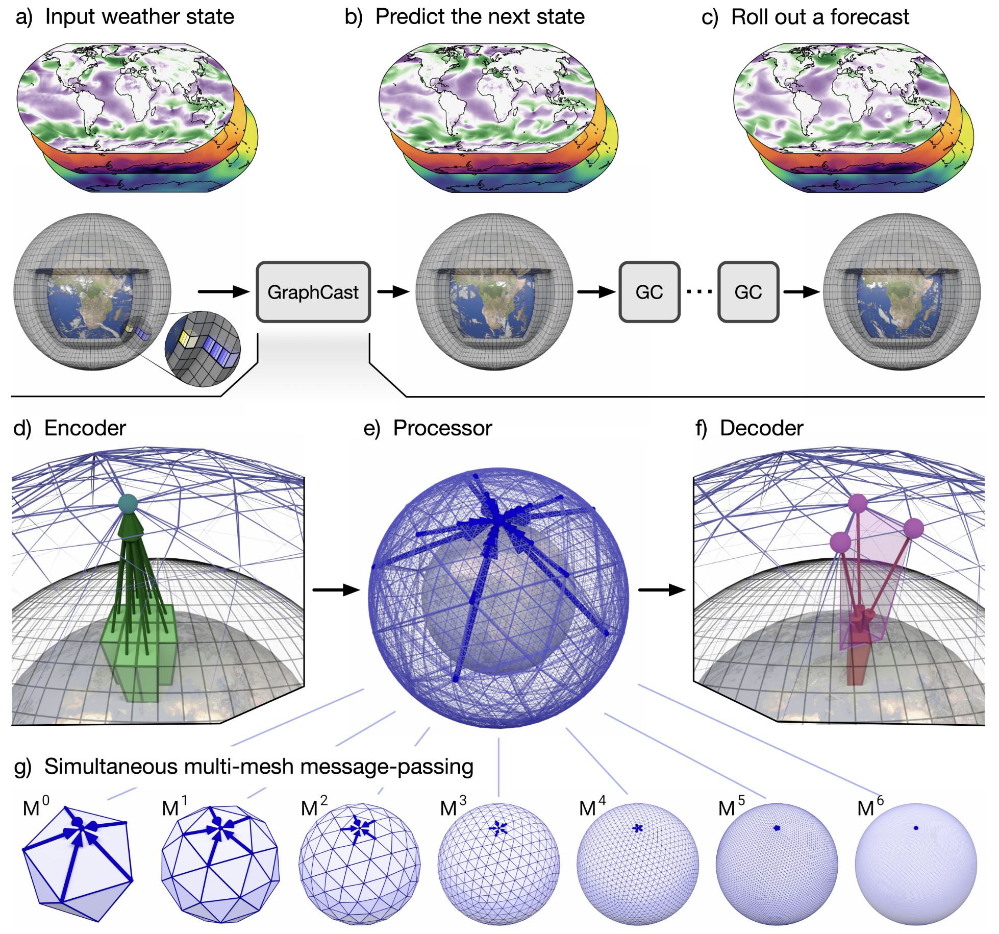*[https://deepmind.google/blog/graphcast-ai-model-for-faster-and-more-accurate-global-weather-forecasting/](https://deepmind.google/blog/graphcast-ai-model-for-faster-and-more-accurate-global-weather-forecasting/)*]
]
]

.footnote[(1) Renamed with newer versions: GenCast in 2024 and WeatherNext in 2025 ([github](https://github.com/google-deepmind/weathernext))]

---
# AI for Science: Notable recent works

## Nuclear fusion for sustainable energy production

- High-performance, clean and virtually inexhaustible energy
- Very difficult to control due to the unstable state of the plasma used for fusion
- AI for modeling and controlling the plasma:
  - Based on reinforcement learning
  - Simulated data and control policy that require significant domain expertise

.row[
.col-50[
.center.width-90.mt-2[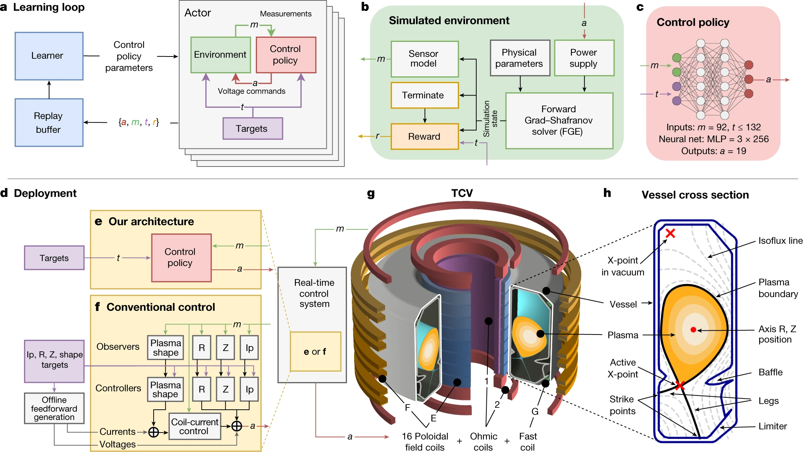]
]
.col-50[
.center.width-90.mt-2[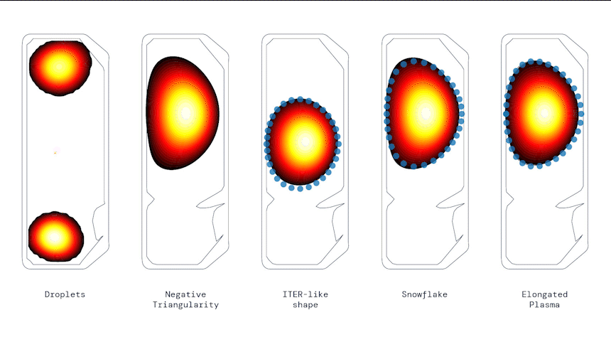]
]
]
.figcaption[**[Degrave et al., "Magnetic control of tokamak plasmas through deep reinforcement learning", Nature, 2023](https://www.nature.com/articles/s41586-021-04301-9)**]

---
# AI for Science: Notable recent works

## Protein structure prediction

.row[
.col-65[
- **Alphafold 2 (2021) and Alphafold 3 (2023)**
- Trained on 200k+ known structures
- Predictions for almost all known proteins (∼ 200M)
- Inspired by LLMs and with an iterative generation approach

.center.width-100[<video src="./medias/lec6/alphafold.mp4" controls autoplay loop muted playsinline></video>]
]
.col-35[
.center.width-90[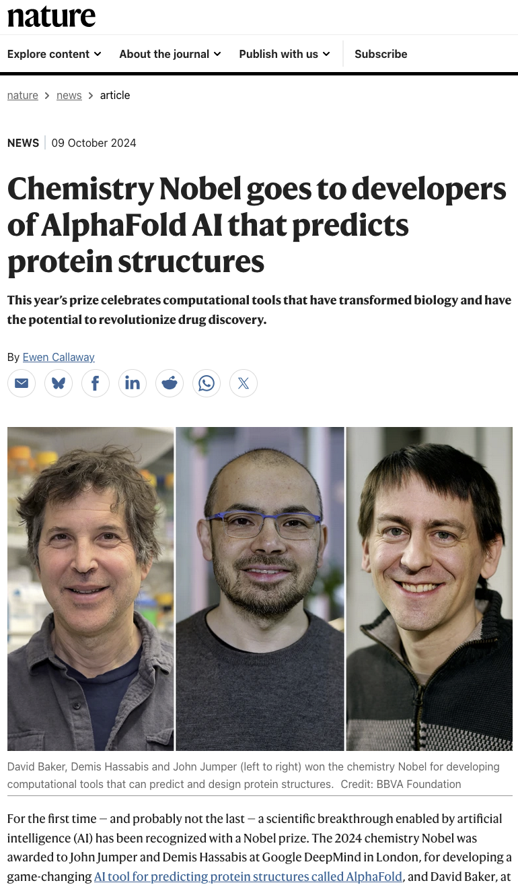]
]
]

---
# AI for Science: Notable recent works

.row[
.col-50[
**Main challenges:**
- Based on archituctural priors
- Need for a large amount of data
- No interpretability and trustworthiness
- Poor generalization to new regimes 

**Contradictory to the scientific approach:**
- Hypothesis, theory and experiments
- Must be interpretable and trustworthy
- Generalization to new regimes is the goal
- Must be consistent with scientific knowledge
]
.col-50[
**Solution:**
.center.width-80.mt-2[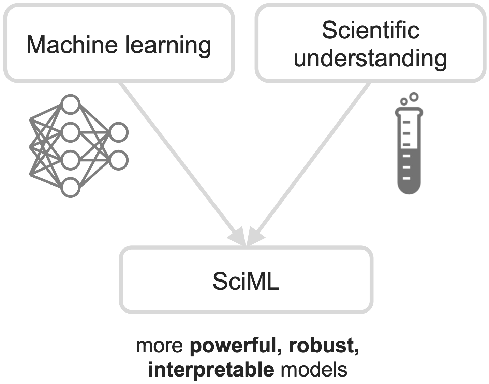*source: S. Mishra, B. Mosley, ETH Zürich, ["AI in the Sciences and Engineering"](https://camlab.ethz.ch/teaching/ai-in-the-sciences-and-engineering-2024.html) (2024)*]
]
]

---
# Computational Fluid Dynamics as a case study

**Partial Differential Equations are building blocks of science**

- Partial derivative of $u(x\_1, \ldots, x\_n) : \mathbb{R}^n \to \mathbb{R}$:
$$
  \frac{\partial u}{\partial x\_i} = \lim\_{\Delta x\_i \to 0} \frac{u(x\_1, \ldots, x\_i + \Delta x\_i, \ldots, x\_n) - u(x\_1, \ldots, x\_i, \ldots, x\_n)}{\Delta x\_i}
$$
i.e. the magnitude of variation of $u$ along the $x\_i$ direction
- Partial differential equations (PDEs):
$$
  F\left(x\_1, \ldots, x\_n, u, \frac{\partial u}{\partial x\_1}, \ldots, \frac{\partial u}{\partial x\_n}, \frac{\partial^2 u}{\partial x\_1^2}, \frac{\partial^2 u}{\partial x\_1 \partial x\_2}, \ldots \right) = 0
$$
- Physical (thermodynamics, electromagnetism, fluid dynamics, etc.), chemical (kinetics, reaction-diffusion, etc.) and biological (population dynamics, epidemiology, etc.) systems

---
# Computational Fluid Dynamics as a case study

**Example: Navier-Stokes equations for incompressible flow**
$$
    \begin{cases}
        \dfrac{\partial \mathbf{u}}{\partial t} + (\mathbf{u} \cdot \nabla) \mathbf{u} = -\nabla p + \nu \nabla^2 \mathbf{u} + \mathbf{f} & \text{(momentum equation)} \\\\
        \nabla \cdot \mathbf{u} = 0 & \text{(incompressibility condition)}
    \end{cases}
$$
with $\mathbf{u}$ the velocity field, $p$ the pressure, $\nu$ the kinematic viscosity and $\mathbf{f}$ the external forces

.center.width-60.mt-2[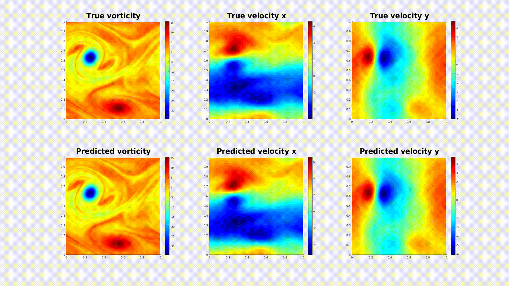*source: [https://zongyi-li.github.io/neural-operator/](https://zongyi-li.github.io/neural-operator/)*]

---
# Two ways to predict

.row.mt-2[
.col-50[
**Simulation**

- Start from the governing equations
- Discretize, then solve numerically
- $\text{knowledge} \rightarrow \text{prediction}$
- Trustworthy, interpretable... and **expensive**
]
.col-50[
**Machine learning**

- Start from observations
- Fit a model by minimizing an empirical risk
- $\text{data} \rightarrow \text{prediction}$
- Fast, flexible... and **physically ignorant**
]
]

.center.width-80.mt-3[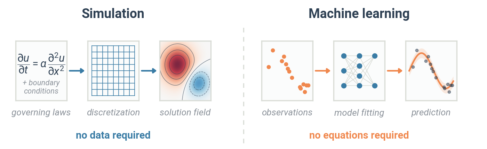]

---
# Forward and inverse problems

.row[
.col-50[
**Forward problem**: $\mu \longrightarrow y$

Given the physical parameters $\mu$ (materials, geometry, boundary conditions), predict the observations $y$.

*This is what a simulator does.*
]
.col-50[
**Inverse problem**: $y \longrightarrow \mu$

Given the measured observations, recover the physical parameters.

*This is what an experimentalist wants.*
]
]

.center.width-80.mt-2[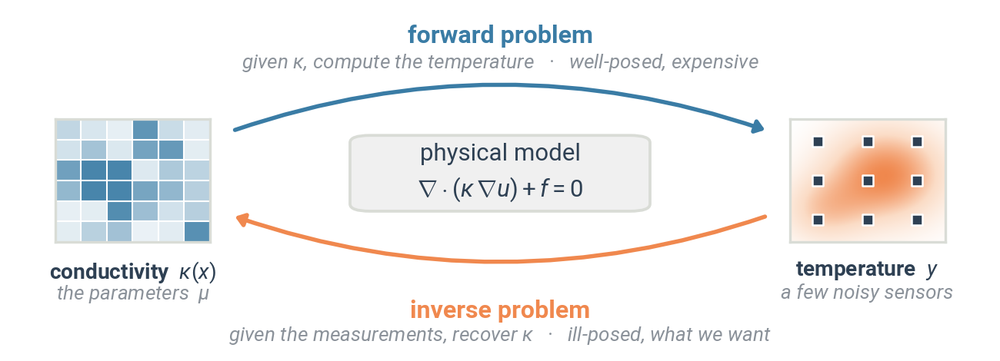]

---
# What makes physics data special

.row[
.col-55[
- **Expensive and scarce**: beam time, wind tunnel hours, DFT calculations
- **But unlimited synthetic data**: the simulator is a data generator
- **Characterized noise**: the instrument is calibrated, the noise model is known
- **Strong known constraints**: conservation laws, symmetries, dimensional homogeneity, positivity, boundary conditions
- **Extrapolation is the goal**: we want to predict *new* regimes
- **Accuracy matters**: a 5% error may simply be unacceptable
]
.col-45.center[
.width-90[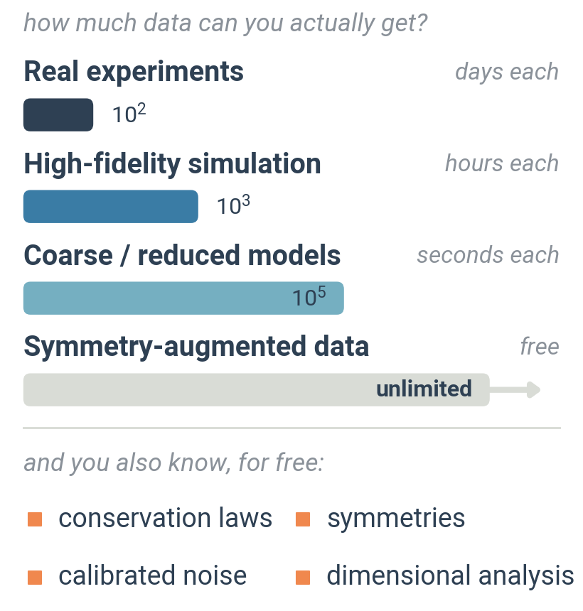]
]
]

.important.mt-2[A generic machine learning model ignores every single one of these.]

---
# The cost of simulation

.row[
.col-55[
- Electronic structure (DFT), 100 atoms: **hours** of CPU per configuration
- Large-eddy simulation of a full aircraft: **millions** of CPU-hours
- Kilometre-scale climate model: **months** on a supercomputer
]
.col-45.center[
.width-95[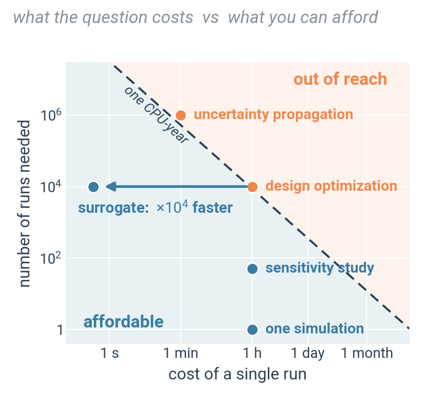]
]
]

Consequences: with a single run costing that much, we cannot afford

- **design optimization**: $10^3$ to $10^6$ evaluations
- **uncertainty propagation**: Monte-Carlo over the input distribution
- **real-time use**: control, data assimilation, digital twins

---
# Small data, strong priors

.row[
.col-50[
**Generic deep learning**

- $10^6$ samples, no prior
- The model learns *everything* from the data, including the laws of physics
]
.col-50[
**Machine learning for physics**

- $10^2$–$10^4$ samples, strong prior
- The model only has to learn what we **don't** already know
]
]

.center.width-80.mt-2[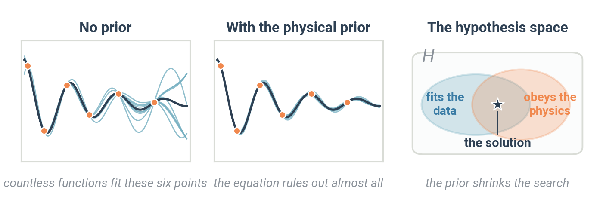]

- A physical prior restricts the hypothesis space $\mathcal{H}$
- Recall lecture 1: this reduces the **variance** of the model, at no bias cost *as long as the prior is true*

---
# Roadmap

.box[**Surrogate models** — replace an expensive simulator by a fast, differentiable approximation]

.box[**Physics-informed learning** — put the equations inside the loss function]

.box[**Symmetry as an inductive bias** — put the invariances inside the architecture]

.box[**Inverse problems and discovery** — go from observations back to parameters, and to equations]

---
class: middle, center

# Surrogate models

---
# Learning the simulator

- A simulator is a (very expensive) function
$$\mathcal{S}: \mu \longmapsto u\_{\mu}$$
- Run it $N$ times offline, then fit a model $h\_{\mathbf{W}} \approx \mathcal{S}$ on the pairs $(\mu\_i, u\_i)$

.center.width-90.mt-2[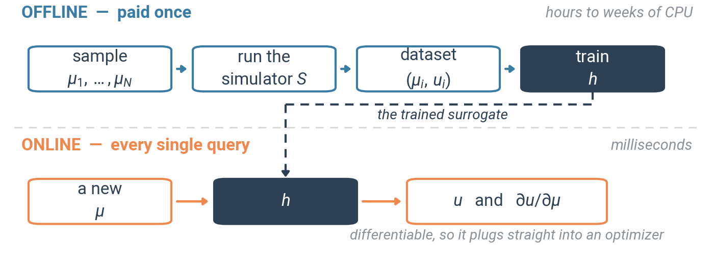]

- Inference in **milliseconds** instead of hours: speed-ups of $10^3$ to $10^6$
- And the surrogate is **differentiable**: $\partial u / \partial \mu$ comes for free by autodiff
- Also known as *emulator*, *response surface*, *reduced-order model*

---
# Building the training set

.row[
.col-58[
- Here **you** generate the data: the dataset is a *design choice*
- Fixed budget of $N$ simulations, how to place the $\mu\_i$?
  - regular grid: hopeless beyond $d \approx 4$
  - uniform random: clusters and holes
  - **Latin hypercube**, **Sobol sequences**: low-discrepancy, much better coverage
- **Active learning**: run the next simulations where the surrogate is the most uncertain
]
.col-42.center[
.width-95[]
]
]

.important.mt-1[The cost is in the data generation, not in the training.]

---
# Example: a parametric PDE

Steady heat equation on a plate, with a spatially varying conductivity
$$\nabla \cdot (\kappa(\mathbf{x}) \nabla u) + f(\mathbf{x}) = 0$$

.row.mt-2[
.col-50[
**Predicting a few scalars**

- Output: quantities of interest (max temperature, mean flux)
- $\mu \in \mathbb{R}^{d} \rightarrow y \in \mathbb{R}^{k}$
- A plain MLP does the job
]
.col-50[
**Predicting a whole field**

- Output: the temperature map on a grid
- $\mu \rightarrow u \in \mathbb{R}^{H \times W}$
- Encoder-decoder CNN (lecture 4)
]
]

.center.width-70.mt-2[]

---
# What surrogates unlock

.row[
.col-55[
- **Design optimization**: gradient-based search over shapes and materials, because the surrogate is differentiable
- **Uncertainty propagation** and sensitivity analysis: Monte-Carlo becomes affordable
- **Real-time systems**: digital twins, model predictive control (e.g. plasma shape control in a tokamak)
- **Multi-scale modelling**: a learned closure (sub-grid, turbulence, chemistry) inside a coarse solver
]
.col-45.center[
.width-95[]
]
]

---
# The catch: extrapolation

.row[
.col-55[
- A surrogate **interpolates** inside the training envelope
- Outside of it there is no guarantee at all, and the failure is **silent**: the network still outputs a smooth, plausible field
- Used autoregressively in time, errors **compound** and the rollout diverges
]
.col-45.center[
.width-95[]
]
]

.box[Always state the **validity domain**, detect out-of-distribution inputs, and check conservation laws on the outputs.]

---
# From functions to operators

.row[
.col-55[
- An MLP or a CNN trained on a fixed grid learns **one discretization**
- Change the mesh, the resolution or the geometry, and you have to retrain
- What physics really wants is a map between **function spaces**
$$\mathcal{G}: u\_{0} \longmapsto u(\cdot, t)$$
- **Neural operators** learn $\mathcal{G}$ directly, and are discretization-invariant: train at low resolution, evaluate at high resolution
]
.col-45.center[
.width-95[]
]
]

- Two main families: **DeepONet** (branch/trunk decomposition) and **Fourier Neural Operator** (FNO)

---
count: false
# From functions to operators
## Fourier Neural Operator .exponent[(1)]

- A convolution with a *global* kernel is a pointwise product in Fourier space
$$v\_{l+1} = \sigma\Big( \mathbf{W} v\_{l} + \mathcal{F}^{-1}\big( R\_{\phi} \cdot \mathcal{F}(v\_{l}) \big) \Big)$$
- Keep only the low-frequency modes: cheap, smooth, and independent of the grid

.center.width-85.mt-2[]

.footnote[(1) Zongyi Li, Nikola Kovachki, Kamyar Azizzadenesheli, Burigede Liu, Kaushik Bhattacharya, Andrew Stuart, Anima Anandkumar, "Fourier Neural Operator for Parametric Partial Differential Equations", ICLR 2021]

---
class: middle, center

# Physics-informed learning

---
# Four ways to inject physics

.box[**1. In the data** — augmentation by known symmetries, synthetic data from the simulator, non-dimensionalization (Reynolds, Mach, Péclet...)]

.box[**2. In the loss** — *soft* constraints: PDE residual, conservation penalty, boundary conditions]

.box[**3. In the architecture** — *hard* constraints: equivariance, output parameterization that is divergence-free, positive, or satisfies the boundary conditions by construction]

.box[**4. In the inference** — physically structured priors, constrained optimization, projection onto the feasible set]

.important.mt-2[Soft constraints are flexible but only approximately satisfied. Hard constraints are exact but rigid.]

---
# Physics-Informed Neural Networks (PINNs)

.row[
.col-55[
- Radical change of point of view: the network **is** the solution
$$u\_{\theta}: (\mathbf{x}, t) \longmapsto u(\mathbf{x}, t)$$
- Input: the coordinates. Output: the value of the field
- One network per problem instance, trained by minimizing the residual of the equation
- No mesh, and the solution is continuous and differentiable everywhere
]
.col-45.center[
.width-95[]
]
]

- Old idea (Lagaris, 1998), revived in 2019 by Raissi, Perdikaris and Karniadakis .exponent[(1)]

.footnote[(1) Maziar Raissi, Paris Perdikaris, George Em Karniadakis, "Physics-informed neural networks: A deep learning framework for solving forward and inverse problems involving nonlinear partial differential equations", Journal of Computational Physics, 2019]

---
# The residual loss

Given a PDE written as $\mathcal{N}[u] = 0$ on a domain $\Omega$, with boundary and initial conditions:

$$\mathcal{L}(\theta) = \lambda\_{r} \mathcal{L}\_{r}(\theta) + \lambda\_{b} \mathcal{L}\_{b}(\theta) + \lambda\_{d} \mathcal{L}\_{d}(\theta)$$

.row.mt-1[
.col-32[
**PDE residual**
$$\mathcal{L}\_{r} = \frac{1}{N\_{r}} \sum\_{i=1}^{N\_{r}} \big| \mathcal{N}[u\_{\theta}(\mathbf{x}\_{i})] \big|^{2}$$
]
.col-02[]
.col-32[
**Boundary / initial**
$$\mathcal{L}\_{b} = \frac{1}{N\_{b}} \sum\_{j=1}^{N\_{b}} \big| u\_{\theta}(\mathbf{x}\_{j}) - g\_{j} \big|^{2}$$
]
.col-02[]
.col-32[
**Measurements**
$$\mathcal{L}\_{d} = \frac{1}{N\_{d}} \sum\_{k=1}^{N\_{d}} \big| u\_{\theta}(\mathbf{x}\_{k}) - u\_{k} \big|^{2}$$
]
]

.center.width-55.mt-1[]

- The $\mathbf{x}\_{i}$ are **collocation points**, sampled anywhere in $\Omega$: no mesh, and **no labels needed**
- The data term is optional: a PDE can be solved with zero measurements

---
# Autodiff strikes back

.row[
.col-55[
- The residual needs $\partial\_{t} u\_{\theta}$, $\partial\_{xx} u\_{\theta}$, $\nabla \cdot u\_{\theta}$...
- These are derivatives of the network **with respect to its inputs**, and automatic differentiation (lecture 3) gives them **exactly**
- No finite differences, no truncation error, no grid
]
.col-45.center[
.width-95[]
]
]

- Cost: each derivative order is an extra pass through the graph. Second-order derivatives in 3D get expensive
- This is why the idea only became practical in 2019: the maths were known, the **autodiff frameworks** were not

---
# Example: the damped harmonic oscillator

.row[
.col-52[
$$m \ddot{u} + c \dot{u} + k u = 0, \quad u(0) = u\_{0}, \quad \dot{u}(0) = 0$$

- Network: $u\_{\theta}(t)$, one input, one output, a few hidden layers
- Loss: residual on $N\_{r}$ collocation times $+$ initial conditions
- Reference: the analytical solution
]
.col-48.center[
.width-95[]
]
]

- Here the observations cover only the first third of the interval, while the residual is enforced everywhere
- Without the residual, the network fits its training points and then drifts away
- With it, the physics carries the solution through the region where there is no data at all

---
count: false
# Example: the 1D heat equation

.row[
.col-52[
$$\frac{\partial u}{\partial t} = \alpha \frac{\partial^{2} u}{\partial x^{2}}, \quad (x,t) \in [0, L] \times [0, T]$$
$$u(x, 0) = u\_{0}(x), \quad u(0,t) = u(L,t) = 0$$

- Network: $u\_{\theta}(x, t)$, two inputs
- Exactly the same machinery, one more coordinate
- Output: the full space-time field, queryable at any $(x,t)$
]
.col-48.center[
.width-95[]
]
]

---
class: middle, dark-slide

# Notebook [lec6-pinn-oscillator.ipynb](./notebooks/lec6-pinn-oscillator.ipynb)

---
# Why PINNs are hard to train

- **Loss balancing**: the terms have different magnitudes and different physical units. Badly chosen $\lambda$ and one term dominates. Adaptive weighting schemes exist (gradient-norm based, NTK based)
- **Spectral bias**: networks fit low frequencies first, so oscillatory solutions converge painfully slowly (Fourier features help)
- **Stiff and multi-scale problems**: sharp fronts, boundary layers, long time horizons
- **Causality**: nothing forces the network to learn $t=0$ before $t=T$. Time-marching and domain decomposition are common fixes

.center.width-65.mt-2[]

.alert[For a standard forward problem on a well-behaved domain, a classical solver is usually **faster and more accurate**.]

---
# When PINNs actually win

.box[**Inverse problems**: an unknown physical parameter $\mu$ becomes a *trainable variable*, optimized jointly with the weights $\theta$. No outer loop of forward solves.]

.box[**Sparse and noisy measurements**: the PDE acts as a physical regularizer and fills the gaps, e.g. reconstructing a full velocity field from a handful of sensors.]

.box[**Awkward geometries and high dimensions**: no mesh to generate, and the cost does not explode with the dimension of the domain.]

.box[**When you need a continuous, differentiable solution**, for instance inside a larger differentiable pipeline.]

---
class: middle, center

# Symmetry as an inductive bias

---
# Invariance and equivariance

.row[
.col-52[
For a transformation $g$ of a group $G$:

- $f$ is **invariant**: $f(g \cdot \mathbf{x}) = f(\mathbf{x})$
  - the energy of a molecule under a rotation
- $f$ is **equivariant**: $f(g \cdot \mathbf{x}) = g \cdot f(\mathbf{x})$
  - the forces on its atoms under the same rotation
]
.col-48.center[
.width-95[]
]
]

- Ignoring a symmetry means spending capacity and data to learn something we already know
- **Data augmentation** gives *approximate* invariance. **Architecture** gives it *exactly*

---
# You already know one

.row[
.col-55[
- The convolution is **translation-equivariant by construction** (lecture 4): shift the input, the feature maps shift identically
- Pooling then buys approximate translation invariance
- That single prior is why CNNs beat MLPs on images with far fewer parameters and far less data
]
.col-45.center[
.width-95[]
]
]

The question to ask for any physical system: **which group acts on my data?**

- translations: images, time series, homogeneous media
- rotations and reflections: molecules, 3D fields, crystals
- permutations: sets of identical particles
- scaling, time reversal, gauge symmetries

---
# Point clouds and graphs

.row[
.col-55[
- Many physical systems are **sets of interacting entities**: atoms, particles, mesh nodes, bodies
- No grid, no fixed ordering, variable size
- **Graph neural networks**, message passing:
$$\mathbf{m}\_{ij} = \phi(\mathbf{h}\_{i}, \mathbf{h}\_{j}, \mathbf{x}\_{j} - \mathbf{x}\_{i})$$
$$\mathbf{h}\_{i}' = \psi\Big(\mathbf{h}\_{i}, \sum\_{j \in \mathcal{N}(i)} \mathbf{m}\_{ij}\Big)$$
- The sum makes the layer **permutation-equivariant** by construction
]
.col-45.center[
.width-95[]
]
]

- Applications: interatomic potentials, jet tagging at the LHC, mesh-based fluid simulation

---
# E(3)-equivariant networks

.row[
.col-55[
- Physics in 3D space is invariant under the Euclidean group **E(3)**: translations, rotations, reflections
- Recipe: use **relative positions** $\mathbf{x}\_{j} - \mathbf{x}\_{i}$ for translation, and features that transform as scalars, vectors and tensors (spherical harmonics) for rotation
- Machine-learned interatomic potentials: **NequIP**, **MACE**
]
.col-45.center[
.width-95[]
]
]

.box[DFT-level accuracy at molecular-dynamics cost, trained on $10^{2}$–$10^{3}$ configurations instead of $10^{6}$. **Data efficiency is the whole point of equivariance.**]

---
# Conservation by construction

.row[
.col-55[
- A network trained to predict $(\mathbf{q}, \mathbf{p}) \rightarrow (\dot{\mathbf{q}}, \dot{\mathbf{p}})$ drifts in energy over long rollouts
- **Hamiltonian neural networks**: learn the scalar $\mathcal{H}\_{\theta}(\mathbf{q}, \mathbf{p})$ instead, then
$$\dot{\mathbf{q}} = \frac{\partial \mathcal{H}\_{\theta}}{\partial \mathbf{p}}, \qquad \dot{\mathbf{p}} = -\frac{\partial \mathcal{H}\_{\theta}}{\partial \mathbf{q}}$$
- Energy conservation is now a property of the **architecture**, not of the training
]
.col-45.center[
.width-95[]
]
]

- **Lagrangian neural networks** do the same with $\mathcal{L}(\mathbf{q}, \dot{\mathbf{q}})$, for arbitrary generalized coordinates

---
class: middle, center

# Inverse problems and discovery

---
# The inverse problem

.row[
.col-55[
$$\mathbf{y} = \mathcal{A}(\mathbf{x}) + \varepsilon$$

- $\mathcal{A}$ is the (known) forward operator, $\varepsilon$ the noise, $\mathbf{x}$ the unknown
- **Ill-posed** in the sense of Hadamard: no uniqueness, or no stability. A tiny amount of noise produces a huge error
- Classical answer, regularization:
$$\hat{\mathbf{x}} = \arg\min\_{\mathbf{x}} \lVert \mathcal{A}(\mathbf{x}) - \mathbf{y} \rVert^{2} + \lambda R(\mathbf{x})$$
with $R$ hand-designed (Tikhonov, total variation, sparsity)
]
.col-45.center[
.width-95[]
]
]

- Examples: CT and MRI reconstruction, seismic inversion, spectral deconvolution, PSF deconvolution in astronomy

---
# Learned reconstruction

.row[
.col-55[
- The idea: **learn the prior** $R$ instead of designing it
- Naive approach, a CNN mapping $\mathbf{y} \rightarrow \mathbf{x}$ directly: fast, but it throws away the known operator $\mathcal{A}$ and hallucinates
- **Unrolled optimization**: take $K$ iterations of a classical solver and replace the denoising step by a learned network, then train end-to-end
- $\mathcal{A}$ stays in the loop, so **data consistency** is enforced
]
.col-45.center[
.width-95[]
]
]

.alert[Hallucination is a real danger: a learned prior can invent a structure that is not supported by the measurements. Critical in medical imaging.]

---
# Simulation-based inference

.row[
.col-55[
- We can **simulate** $p(\mathbf{y} \mid \mu)$ but not evaluate it: the likelihood is intractable
- Classical answer (ABC): simulate, reject what does not match. Desperately inefficient
- **Neural approach**: train a conditional density estimator (normalizing flow) on simulated pairs $(\mu, \mathbf{y})$ to approximate the posterior $p(\mu \mid \mathbf{y})$ directly
- **Amortized**: train once, then get a posterior for any new observation in milliseconds
]
.col-45.center[
.width-95[]
]
]

- Now standard in particle physics, cosmology, and gravitational-wave parameter estimation

---
# Uncertainty quantification

.row[
.col-55[
- **A prediction without an error bar is not a physical result**
- **Aleatoric** uncertainty: noise in the data, irreducible
- **Epistemic** uncertainty: the model does not know, reducible with more data
- Practical tools: deep ensembles, MC dropout, Bayesian last layer, **conformal prediction** (distribution-free coverage guarantee)
]
.col-45.center[
.width-95[]
]
]

.box[Epistemic uncertainty is also the signal that tells you when a surrogate is being used **outside its validity domain**.]

---
# Discovering equations

.row[
.col-55[
Beyond predicting: recovering an **interpretable law**.

**Symbolic regression**: search the space of mathematical expressions (genetic programming, PySR, AI Feynman)

**SINDy**: build a library of candidate terms
$$\Theta(\mathbf{X}) = \big[\, \mathbf{1} \;\; \mathbf{x} \;\; \mathbf{x}^{2} \;\; \sin \mathbf{x} \;\; x\_{1}x\_{2} \;\; \dots \big]$$
then solve a **sparse** regression
$$\dot{\mathbf{X}} = \Theta(\mathbf{X}) \, \Xi, \qquad \Xi \text{ sparse}$$
The few active terms *are* the equation.
]
.col-45.center[
.width-95[]
]
]

.small[Caveats: needs clean derivative estimates, a well-chosen library, and the true law must lie in its span.]

---
class: middle, center

# Perspectives

---
# Foundation models for science

.row[
.col-55[
- **AlphaFold 2/3**: protein structure prediction, a 50-year-old problem essentially solved at CASP14
- **GraphCast**, **Pangu-Weather**, **Aurora**: medium-range weather forecasting, more accurate than the operational physical model, in seconds on one GPU instead of hours on a supercomputer
- **GNoME**, **MatterGen**: materials discovery at the scale of millions of candidate crystals
]
.col-45.center[
.width-95[]
]
]

- Same recipe every time: a huge corpus (often *simulated*), strong architectural priors, one model reused across many downstream tasks
- Exactly the pretraining paradigm of lecture 5, applied to science

---
# Pitfalls and good practice

- **Data leakage**: splitting at random over samples coming from the same run gives absurdly optimistic scores. Split by **configuration**, by **experiment**, or by **time**
- **Validate on physics, not only on the MSE**: conservation of energy and mass, symmetries, asymptotic regimes, dimensional consistency
- **State the validity domain** of the model, and detect inputs that fall outside it
- **Report uncertainty**, always
- **Compare to honest baselines**: a linear model, a spline interpolation, or the classical solver *at equal computational budget*
- **Reproducibility**: version the data-generation scripts, not just the model weights

.center.width-60.mt-2[]

---
# Takeaways

.box[**Physics is not a generic ML problem**: little data, known laws, strong symmetries, and extrapolation as the actual goal.]

.box[**Surrogate models** trade accuracy outside the training envelope for a $10^{3}$–$10^{6}$ speed-up, and are differentiable.]

.box[**Physics can be injected in the data, in the loss, or in the architecture.** Soft constraints are flexible, hard constraints are exact.]

.box[**Symmetry is the most profitable prior**: equivariant architectures reach a given accuracy with orders of magnitude less data.]

.box[**Inverse problems are where machine learning brings the most**, because the classical approach requires thousands of forward solves.]

.box[**No error bar, no physics.** Always quantify uncertainty and state the validity domain.]
