class: middle, center, title-slide
name: lecture6

# Machine Learning
## Lecture 6: Machine learning for physics
  
Simon BERNARD 
[simon.bernard@univ-rouen.fr](mailto:simon.bernard@univ-rouen.fr)  
.center.height-4em[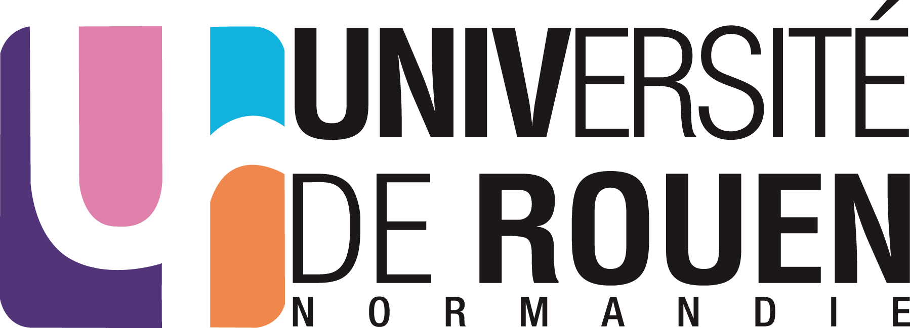]

---
class: middle, center
# AI for science

---
# AI for Science

.row[
.col-55[
**Major successes of AI: digital applications**
- Images, videos, texts, video games, etc.
- Massively available data

**What about sciences? Can we use AI:**
- as an alternative to traditional approaches?
- to solve problems more effectively?
- to accelerate scientific discovery?
]
.col-45[
.center.width-100[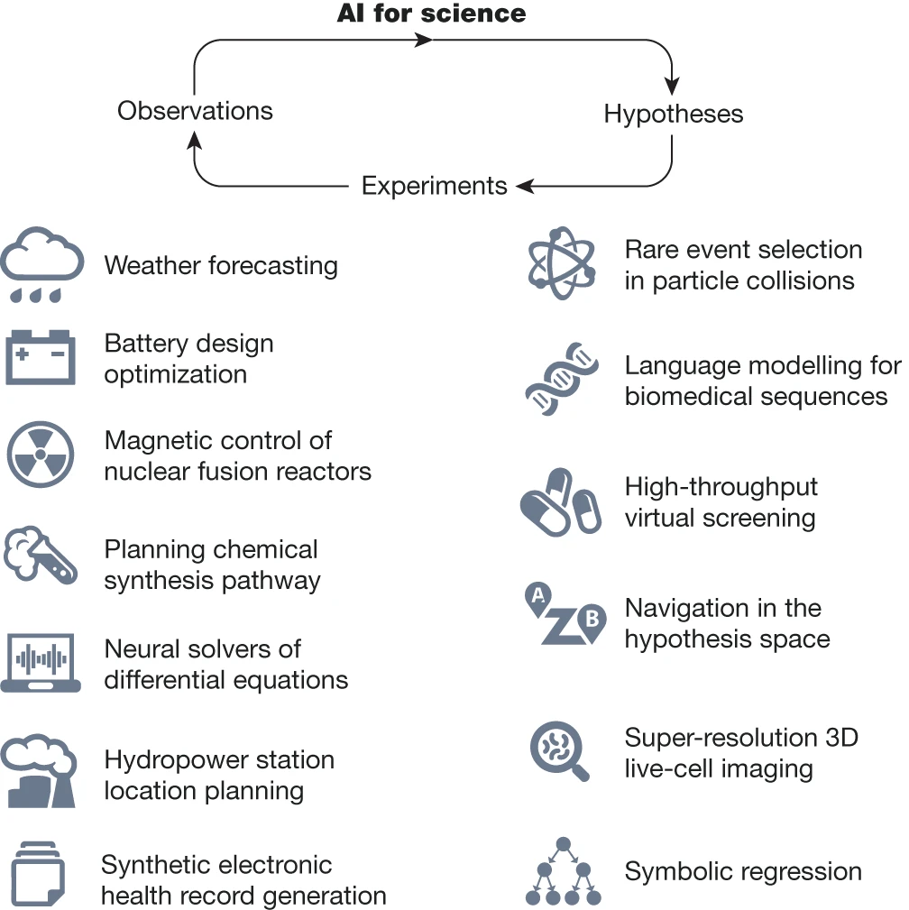*[Wang et al, "Scientific discovery in the age of artificial intelligence", Nature, 2023](https://www.nature.com/articles/s41586-023-06221-2)*]
]
]

---
# AI for Science: Notable recent works

## Weather forecasting

.row[
.col-55[
- **GraphCast** (2023) .exponent[(1)]
- Training data: 40+ years of observations (ECMWF)
- Prediction of weather fields up to 10 days ahead
- 1.2 billion param., 128 TPUv4 chips for training

.center.width-80.mt-2[]
]
.col-45[
.center.width-90.mt-2[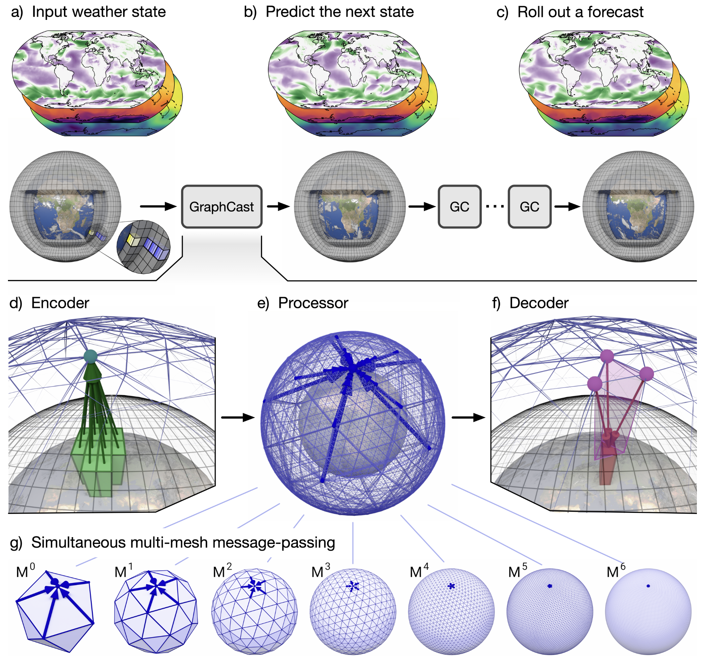*[https://deepmind.google/blog/graphcast-ai-model-for-faster-and-more-accurate-global-weather-forecasting/](https://deepmind.google/blog/graphcast-ai-model-for-faster-and-more-accurate-global-weather-forecasting/)*]
]
]

.footnote[(1) Renamed with newer versions: GenCast in 2024 and WeatherNext in 2025 ([github](https://github.com/google-deepmind/weathernext))]

---
# AI for Science: Notable recent works

## Nuclear fusion for sustainable energy production

- High-performance, clean and virtually inexhaustible energy
- Very difficult to control due to the unstable state of the plasma used for fusion
- AI for modeling and controlling the plasma:
  - Based on reinforcement learning
  - Simulated data and control policy that require significant domain expertise

.row[
.col-50[
.center.width-90.mt-2[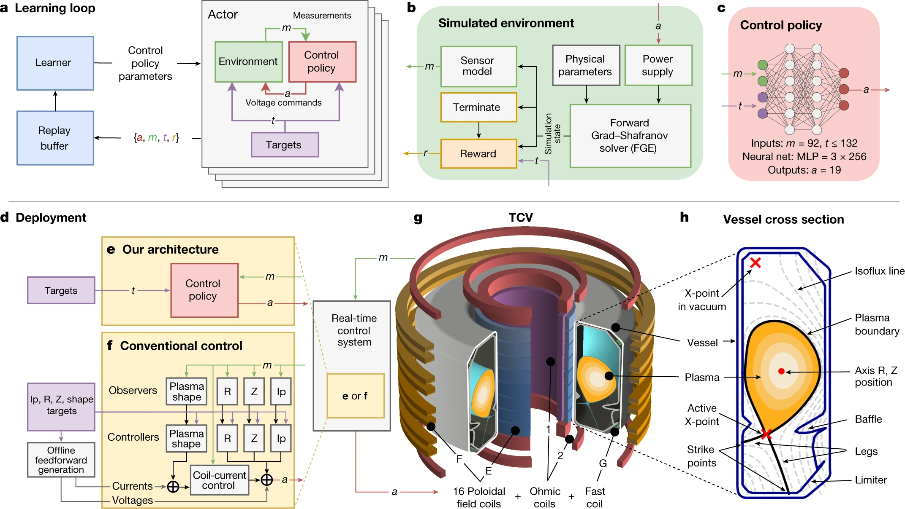]
]
.col-50[
.center.width-90.mt-2[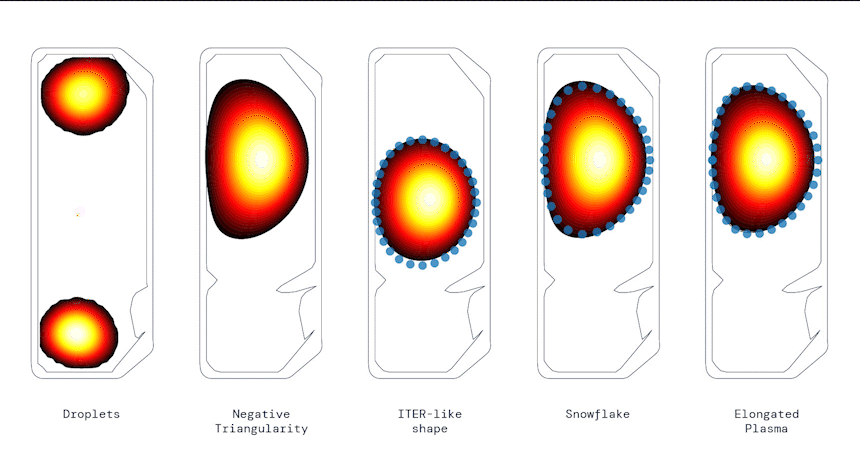]
]
]
.figcaption[**[Degrave et al., "Magnetic control of tokamak plasmas through deep reinforcement learning", Nature, 2023](https://www.nature.com/articles/s41586-021-04301-9)**]

---
# AI for Science: Notable recent works

## Protein structure prediction

.row[
.col-65[
- **Alphafold 2 (2021) and Alphafold 3 (2023)**
- Trained on 200k+ known structures
- Predictions for almost all known proteins (∼ 200M)
- Inspired by LLMs and with an iterative generation approach

.center.width-100[<video src="./medias/lec6/alphafold.mp4" controls autoplay loop muted playsinline></video>]
]
.col-35[
.center.width-90[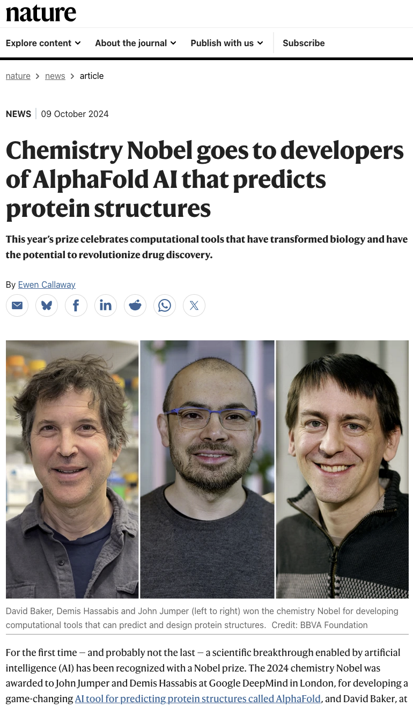]
]
]

---
# Scientific Machine Learning

.row[
.col-50[
**Limitations:**
- Based on architectural priors
- Need for a large amount of data
- No interpretability and trustworthiness
- Poor generalization to new regimes 

**Contradictory to the scientific approach:**
- Hypothesis, theory and experiments
- Must be interpretable and trustworthy
- Generalization to new regimes is the goal
- Must be consistent with scientific knowledge
]
.col-50[
**Solution:**
.center.width-80.mt-2[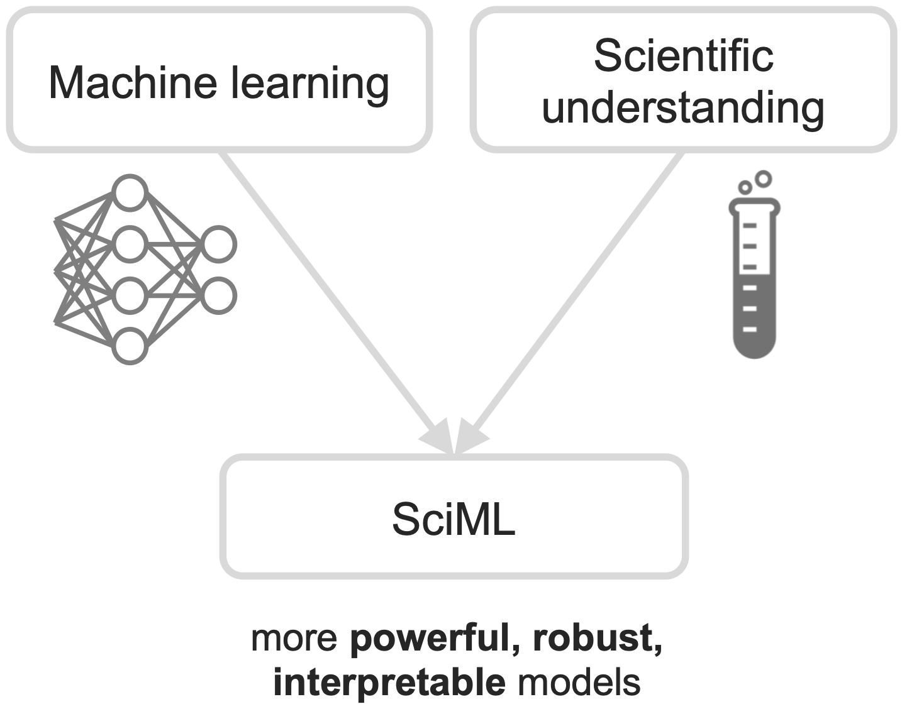*S. Mishra, B. Mosley, ETH Zürich, ["AI in the Sciences and Engineering"](https://camlab.ethz.ch/teaching/ai-in-the-sciences-and-engineering-2024.html) (2024)*]
]
]

---
# Scientific Machine Learning
## Three main ways to incorporate scientific constraints

.row.evenly.stretch.center.mt-5[
.col-30.border[
**Soft constraint**

Add a term to the loss function that penalizes violations of scientific laws (e.g. PDE residuals)

.width-80[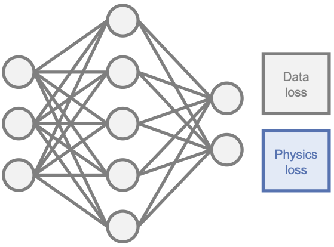]
]
.col-30.border[
**Hard constraint**

Adapt the architecture (e.g. re-parametrizing the output) to ensure compliance with a scientific law

.width-80[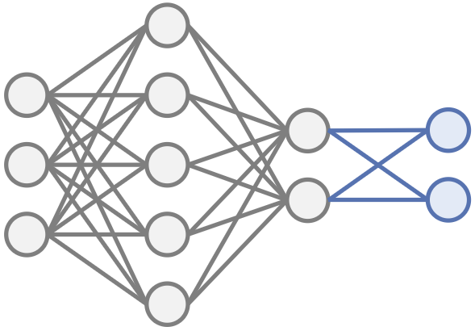]
]
.col-30.border[
**Hybrid**

Integrate a model into a scientific process, such that ML is not a surrogate, but a building block

.width-98[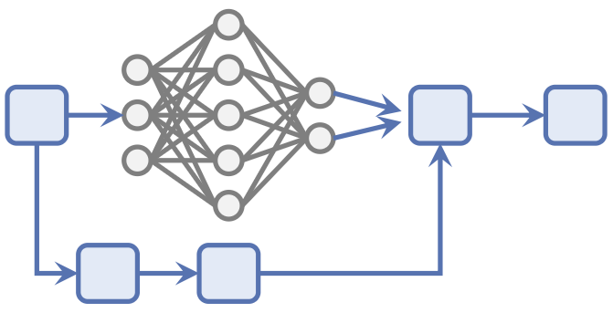]
]
]

---
# What are the machine learning tasks?
## Partial Differential Equations are building blocks of science

- Partial derivative of $u(x\_1, \ldots, x\_n) : \mathbb{R}^n \to \mathbb{R}$:
$$
  \frac{\partial u}{\partial x\_i} = \lim\_{\Delta x\_i \to 0} \frac{u(x\_1, \ldots, x\_i + \Delta x\_i, \ldots, x\_n) - u(x\_1, \ldots, x\_i, \ldots, x\_n)}{\Delta x\_i}
$$
i.e. the magnitude of variation of $u$ along the $x\_i$ direction
- Partial differential equations (PDEs):
$$
  F\left(x\_1, \ldots, x\_n, u, \frac{\partial u}{\partial x\_1}, \ldots, \frac{\partial u}{\partial x\_n}, \frac{\partial^2 u}{\partial x\_1^2}, \frac{\partial^2 u}{\partial x\_1 \partial x\_2}, \ldots \right) = 0
$$
- Exemple: the heat equation
$$
  \frac{\partial u}{\partial t} - \alpha \nabla^2 u = 0, \quad u: \mathbb{R}^d \times [0, T] \to \mathbb{R}
$$
where $u$ is the temperature field, $\alpha$ is the thermal diffusivity, and $\nabla^2$ is the Laplacian operator

---
count: false
# What are the machine learning tasks?
## Partial Differential Equations are building blocks of science

- Understanding and solving these equations is crucial for many scientific and industrial applications: aerodynamic simulation, weather forecasting, biological modeling, etc.
- **Numerical solvers are time-consuming, computationally intensive, and sometimes complex**

.row[
.col-50[
.center.width-90[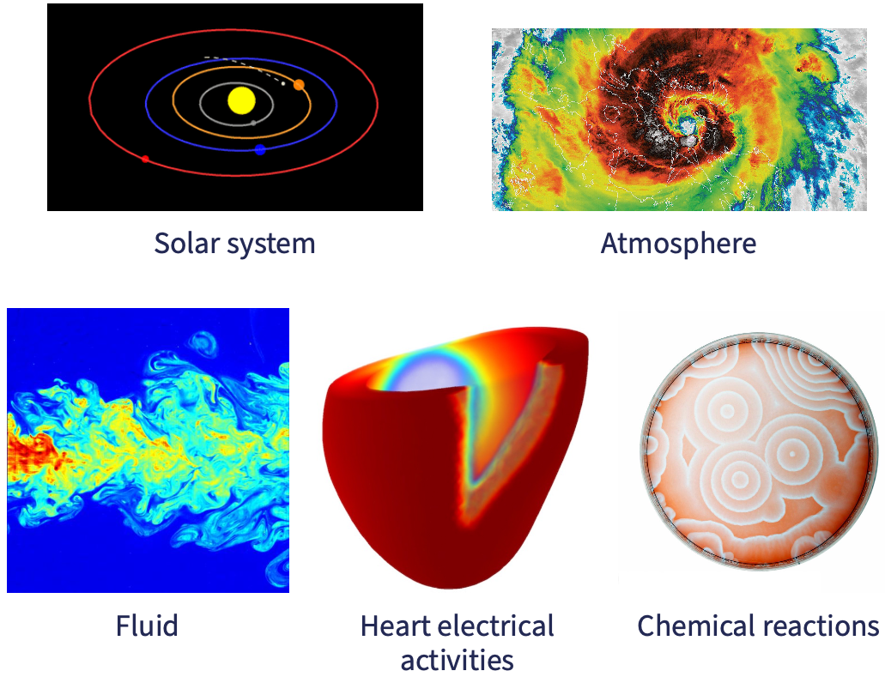*Yuan YIN, soutenance de thèse, Sorbonne Université, 2023*]
]
.col-50[
.center.width-60[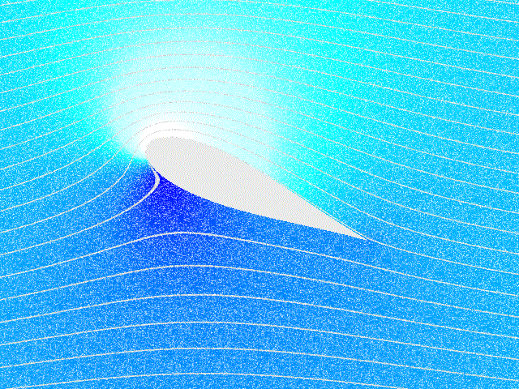]
.center.width-80[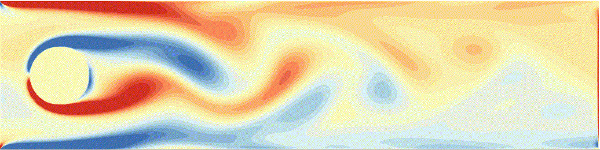]
]
]

---
# What are the machine learning tasks?

Generic form of PDEs:
$$
\begin{cases}
  \mathcal{N}[u, \mathbf{x}, t; \mu] = 0, &\quad \mathbf{x} \in \Omega \\\\
  u(\mathbf{x},t) = g(\mathbf{x},t), &\quad \mathbf{x} \in \partial\Omega \text{ (boundary condition)} \\\\
  u(\mathbf{x},0) = u\_0(\mathbf{x}), &\quad \mathbf{x} \in \Omega \text{ (initial condition)}
\end{cases}
$$
where $u$ is the unknown field, $\mu$ are the PDE parameters, $\mathcal{N}$ is a differential operator

The three main tasks in scientific machine learning are:
- **Simulation**: solving a PDE for given initial and boundary conditions, i.e. finding $u$ at any $(\mathbf{x}, t)$
- **Inverse problems**: inferring unknown parameters of a PDE from measurements, i.e. finding $\mu$
- **Scientific discovery**: finding new scientific laws from data, i.e. finding $\mathcal{N}$

---
# Example: Navier-Stokes equations for incompressible flow

$$
    \begin{cases}
        \dfrac{\partial \mathbf{u}}{\partial t} + (\mathbf{u} \cdot \nabla) \mathbf{u} = -\nabla p + \nu \nabla^2 \mathbf{u} + \mathbf{f} & \text{(momentum equation)} \\\\
        \nabla \cdot \mathbf{u} = 0 & \text{(incompressibility condition)}
    \end{cases}
$$
with $\mathbf{u}$ the velocity field, $p$ the pressure, $\nu$ the kinematic viscosity and $\mathbf{f}$ the external forces

.center.width-70.mt-2[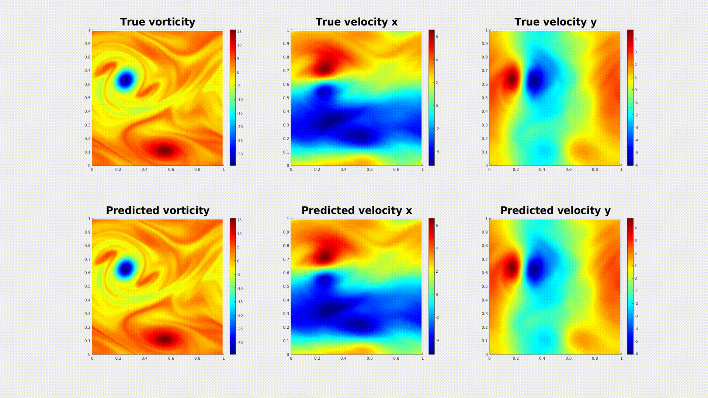*[https://zongyi-li.github.io/neural-operator/](https://zongyi-li.github.io/neural-operator/)*]

---
class: middle, center

# Physics-Informed Neural Network

---
# Implicit Neural Representation (or Coordinate-based Network)

- So far, a NN was a **predictor**: encode *rules* extracted from a dataset to map a sample to a label
- INR: the network maps **coordinates** to the **value of a field** at those coordinates
$$h\_{\theta}: (\mathbf{x},t) \longmapsto u(\mathbf{x},t)$$
- The NN no longer encode rules learned from many examples, it encodes **one single object**.

.row[
.col-50.center[
.width-80[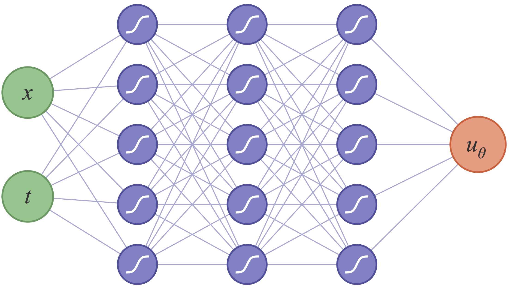*The network takes coordinates as input and outputs the value of the field at those coordinates*]
]
.col-50.center[
  .width-75[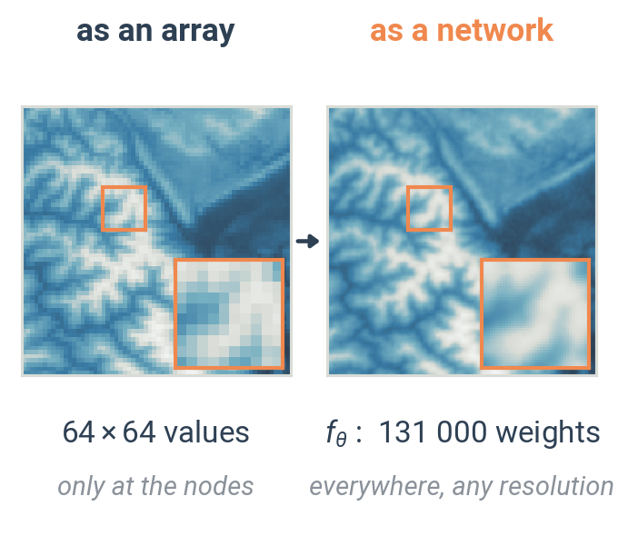]
]
]

---
class: middle, dark-slide

# Notebook [lec6-inr.ipynb](./notebooks/lec6-inr.ipynb)

---
count: false
# Implicit Neural Representation (or Coordinate-based Network)

Three consequences, and they are the whole point:

.box[**Continuous** — the field is defined everywhere, not only at the nodes of a grid. Query any $\mathbf{x}$, at any resolution.]

.box[**Compact** — the memory cost is the number of weights, no longer the number of pixels or mesh cells.]

.box[**Differentiable** — $\partial h\_{\theta} / \partial \mathbf{x}$ is available *exactly*, by automatic differentiation.]

.important.mt-3[This last property is the one that changes everything.]

---
# Physics-Informed Neural Network (PINN) .exponent[(1)]

.center.width-95[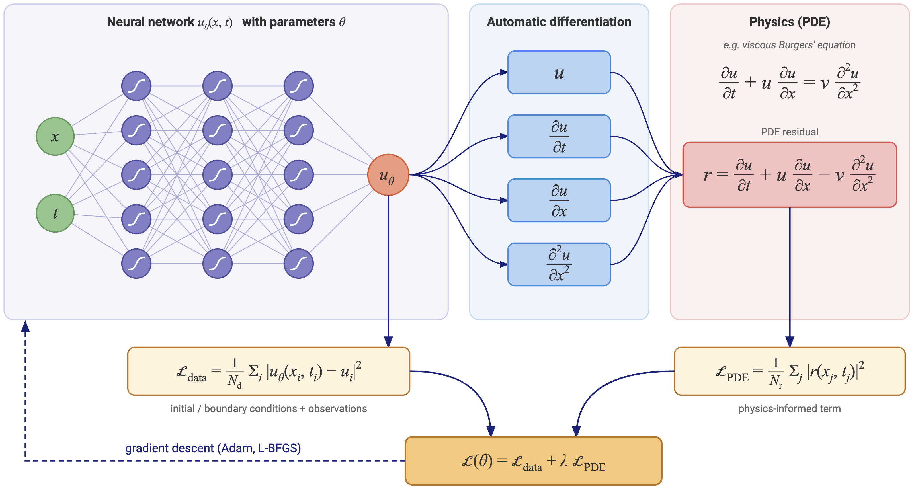]

.footnote[(1) Maziar Raissi, Paris Perdikaris, George Em Karniadakis, "Physics-informed neural networks: A deep learning framework for solving forward and inverse problems involving nonlinear partial differential equations", Journal of Computational Physics, 2019]

---
# The residual loss

Given a PDE written as $\mathcal{N}[u] = 0$ on a domain $\Omega$, with boundary and initial conditions:

$$\mathcal{L}(\theta) = \lambda\_{r} \mathcal{L}\_{r}(\theta) + \lambda\_{b} \mathcal{L}\_{b}(\theta) + \lambda\_{d} \mathcal{L}\_{d}(\theta)$$

.row.mt-1.small[
.col-32[
**PDE residual**
$$\mathcal{L}\_{r} = \frac{1}{N\_{r}} \sum\_{i=1}^{N\_{r}} \big| \mathcal{N}[u\_{\theta}(\mathbf{x}\_{i}, t\_i)] \big|^{2}$$
]
.col-02[]
.col-32[
**Boundary / initial**
$$\mathcal{L}\_{b} = \frac{1}{N\_{b}} \sum\_{j=1}^{N\_{b}} \big| u\_{\theta}(\mathbf{x}\_{j}, t\_j) - g\_{j} \big|^{2}$$
]
.col-02[]
.col-32[
**Measurements**
$$\mathcal{L}\_{d} = \frac{1}{N\_{d}} \sum\_{k=1}^{N\_{d}} \big| u\_{\theta}(\mathbf{x}\_{k}, t\_k) - u\_{k} \big|^{2}$$
]
]

- The $\mathbf{x}\_{i}$ are **collocation points**, sampled anywhere in $\Omega$ — no mesh, and **no labels needed**
- The third term is **optional**: a PDE can be solved with zero measurements

---
# Example: the Burgers' equation

Given $\nu = 0.01 / \pi$, $x \in [-1, 1]$, $t \in [0, 1]$ and $u: [-1, 1] \times [0, 1] \to \mathbb{R}$:

.row[
.col-40[
$$
\begin{cases}
  \frac{\partial u}{\partial t} + u \frac{\partial u}{\partial x} - \nu \frac{\partial^2 u}{\partial x^2} = 0\\\\
  u(x,0) = -\sin(\pi x)\\\\
  u(-1,t) = u(1,t) = 0
\end{cases}
$$

.small.mt-5[Right: INR trained with 
- $100$ points at $t=0$, $x=-1$ and $x=1$ 
- $10,000$ collocation points sampled in the domain $[-1, 1] \times [0, 1]$]
]
.col-55.center[
.center.width-100.mt-2[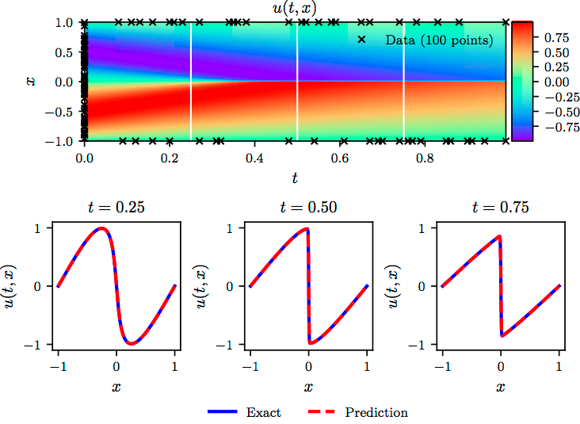]
]
]

---
# PINN in practice

Several practical issues arise when training a PINN:
- **Hard to train** 
The "data" and "physics" terms are difficult to balance during training, leading to convergence issues
- **Poor performance for large temporal and spatial scales** 
Usually fail to capture long-term temporal dynamics and large spatial domain needs very deep networks and a huge amount of collocation points
- **High computational cost** 
Training PINNs can be computationally expensive, especially for large-scale problems
- **Fail to capture multi-scale dynamics** 
Many spatio-temporal phenomena exhibit behavior across multiple scales, which is challenging for PINNs to capture accurately
- **Limited generalization ability** 
Models may not generalize well to unseen regions or different parameter values

---
class: middle, dark-slide

# Notebook [lec6-pinn-oscillator.ipynb](./notebooks/lec6-pinn-oscillator.ipynb)

---
# What PINNs are good for — and where they stop

.box[**Inverse problems** — an unknown physical parameter $\mu$ becomes a *trainable variable*, optimized jointly with $\theta$. No outer loop of forward solves.]

.box[**Sparse and noisy measurements** — the PDE acts as a physical regularizer and fills the gaps: a full velocity field from a handful of sensors.]

.box[**Awkward geometries** — nothing to mesh, and the cost does not explode with the dimension of the domain.]

.alert.mt-3[**But one network solves one problem instance.** Change the initial condition, the boundary conditions or a coefficient, and everything has to be retrained from scratch.]

.important[A PINN is a **solution**. What we would really like is a **solver**.]

---
class: middle, center

# Neural Operators

---
# Learning the solution operator

.row[
.col-60[
- PINN = **one** triple $(\mu, g, u\_0)$. 
- Change the initial condition and it needs to be retrained
- Solver = **map between functions**
$$\mathcal{G}: u\_0 \longmapsto u$$
from the initial condition to the whole solution
- A **neural operator** learns $\mathcal{G}$ itself, once, from a set of instances already solved by a classical solver
]
.col-40.center[
.width-95[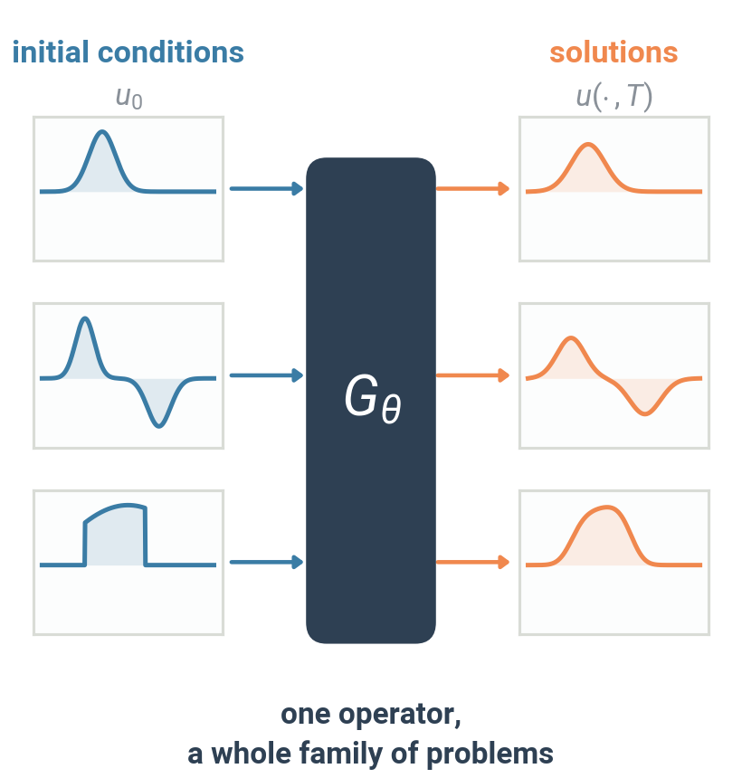]
]
]

---
# Why a convolutional network is not enough

.row[
.col-58[
- Natural idea: sample $u\_0$ on a $64 \times 64$ grid, feed it to a CNN, output $u$ on the same grid. **It works.**
- But what has been learned is a map between **vectors of fixed size**, not between functions
- Change the resolution, the mesh or the geometry, and the model is useless
]
.col-42.center[
.width-95[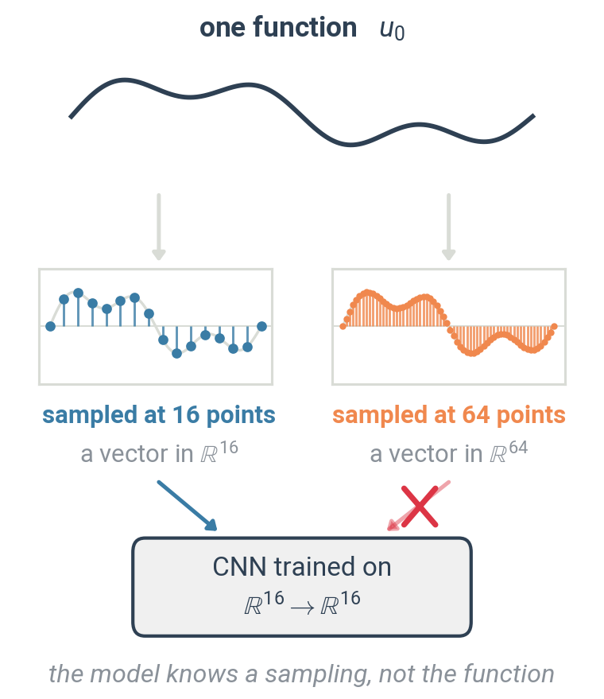]
]
]

.box[What we want is **discretization invariance**: a model trained at one resolution that can be evaluated at another, because it has learned something about the *functions*, not about the *samples*.]

---
# Learning in function space

- A neural operator maps a **function** to a **function** 
$$\mathcal{G}: a \in \mathcal{A} \longrightarrow u \in \mathcal{U}$$
 where $\mathcal{A}$ and $\mathcal{U}$ are **infinite-dimensional** spaces of functions over the domain.
- NN layers have finite numbers of neurons, and the update rule is a sum over neurons:
$$v\_{t+1, i} = \sigma\Big( \sum\_{j=1}^{n} W\_{ij}\, v\_{t,j} + b\_i \Big)$$
- We need layers that operates on **functions**, not on **vectors**. The sum becomes an integral over the domain:
$$v\_{t+1}(\mathbf{x}) = \sigma\Big( \mathbf{W} v\_{t}(\mathbf{x}) + \int\_{\Omega} \kappa(\mathbf{x}, \mathbf{y})\, v\_{t}(\mathbf{y})\, d\mathbf{y} \Big)$$
- Nothing in this formula mentions a grid: the architecture is defined on the *functions*, and any discretization is just a way to evaluate the integral
- The challenge: **how do we compute that integral cheaply?**

---
# Fourier Neural Operator: the idea .exponent[(1)]

.row[
.col-56[
- For a linear PDE, the solution is a convolution with the Green's function
$$u(\mathbf{x}) = \int G(\mathbf{x} - \mathbf{x}')\, f(\mathbf{x}')\, d\mathbf{x}'$$
- So the solution operator is, in essence, a **global convolution**
- And a global convolution is a **pointwise product in Fourier space**
- So: go to Fourier, multiply by learned coefficients, come back
]
.col-44.center[
.width-85[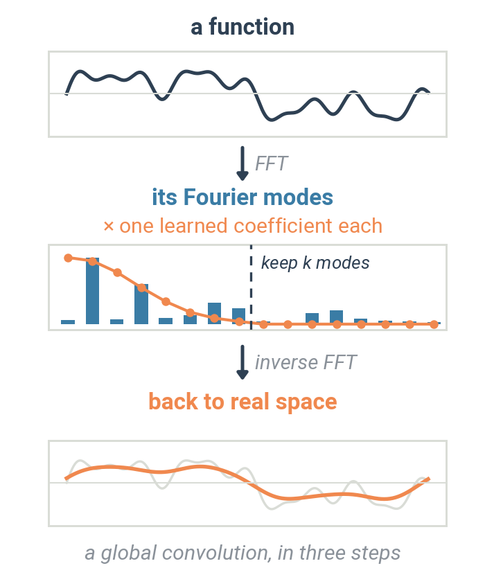]
]
]

.box[Lecture 4: a CNN kernel is **local** ($3 \times 3$) and defined on the grid. A Fourier kernel is **global** and defined on *frequencies* — a property of the function, not of the sampling.]

.footnote[(1) Zongyi Li, Nikola Kovachki, Kamyar Azizzadenesheli, Burigede Liu, Kaushik Bhattacharya, Andrew Stuart, Anima Anandkumar, "Fourier Neural Operator for Parametric Partial Differential Equations", ICLR 2021]

---
# Fourier Neural Operator: how it works

.center.width-95.mt-2[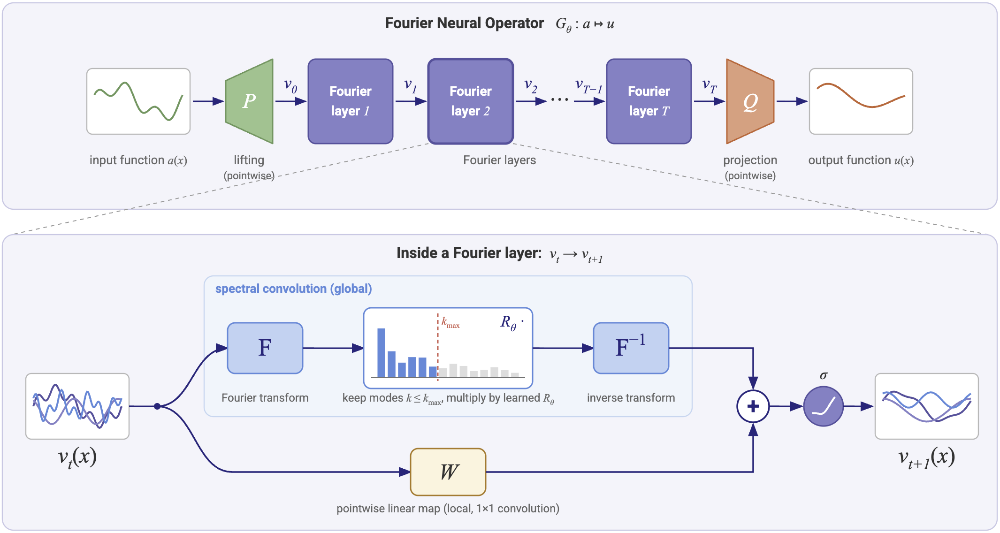]

$$v\_{t+1}(\mathbf{x}) = \sigma\Big( \underbrace{\mathbf{W} v\_{t}(\mathbf{x})}\_{\text{local}} + \underbrace{\mathcal{F}^{-1}\big( R\_{\phi} \cdot \mathcal{F}(v\_{t}) \big)(\mathbf{x})}\_{\text{global}} \Big)$$

---
# 50 shades of Neural Operators

FNO is just one example of a neural operator where the integral is computed in Fourier space. Other approaches exist, e.g.:

.center.width-90[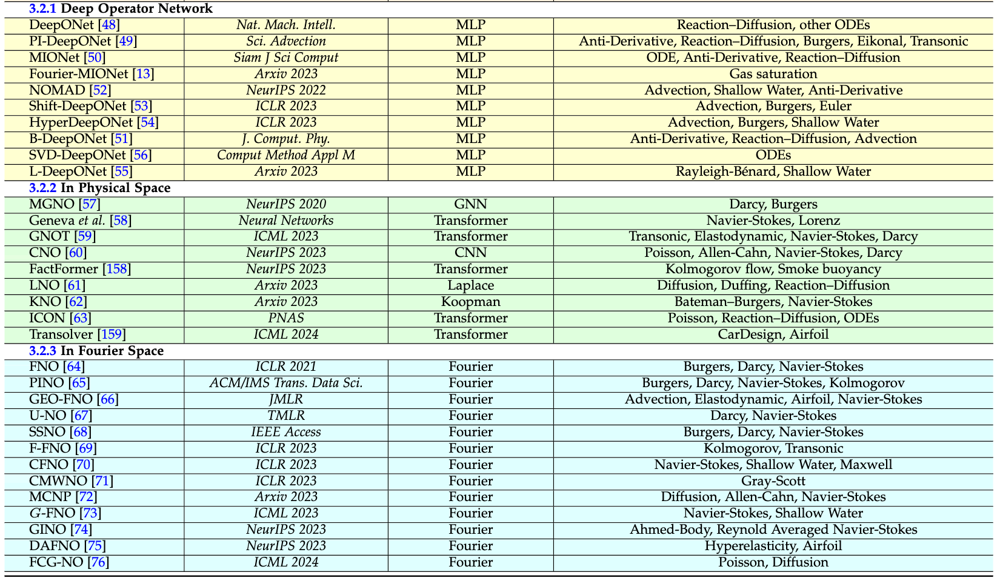*[Wang et al. ,"Recent Advances on Machine Learning for Computational Fluid Dynamics: A Survey", 2025](https://arxiv.org/pdf/2408.12171)*]

---
# 50 shades of Neural Operators

NO can be used for different types of tasks since $a \in \mathcal{A}$, $u \in \mathcal{U}$ can be different types of functions, e.g.:

- An initial condition and a solution for a time dependent PDE

.center.width-50[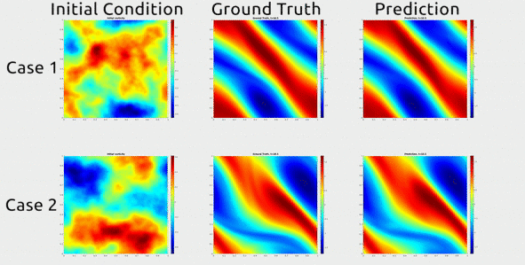]

- A parameter function and a solution for a time independent PDE

.center.width-60[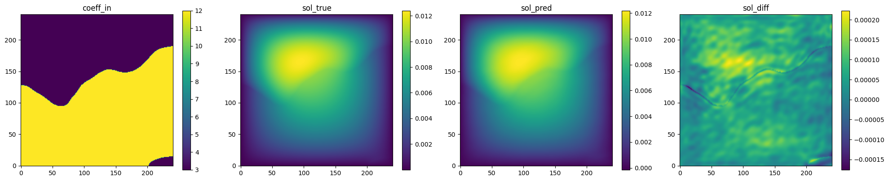]

- A solution at a coarse resolution and a solution at a fine resolution (super-resolution)

---
# Neural Operators vs traditional solvers

Where NOs win:
- **Low-to-moderate accuracy requirements**: outperforms solvers with massive speedups of $10^3$ to $10^5$ times faster.
- **Many-query scenarios** : engineering tasks requiring thousands of simulations, such as structural optimization, climate forecasting, or real-time digital twins
- **Resolution Invariance (Zero-Shot Super-Resolution)**: a model trained on a coarse grid can be evaluated on a finer grid without retraining, which is not possible with traditional solvers.

Where solvers win:
- **High-Precision/Safety Critical**: solvers can achieve machine precision, while NOs are limited to a few digits of accuracy.
- **Error Accumulation**: solvers can control and minimize error accumulation over time, while NOs may suffer from error propagation.
- **Out-of-Distribution Failures**: solvers are robust to changes in problem parameters, while NOs may fail when tested on scenarios outside their training distribution.

---
# What else in ML for Physics?
## The other two ways to incorporate scientific constraints

1. **Soft constraint** : The equation in the loss, this is the PINN we have just seen.

2. Example of **Hard constraint** : 
  - **Hamiltonian Neural Networks** ([Greydanus et al., 2019](https://arxiv.org/pdf/1906.01563)) and **Lagrangian Neural Networks** ([Cranmer et al., 2020](https://arxiv.org/pdf/2003.04630)) learn the *Hamiltonian* (potential energy plus kinetic energy) or *Lagrangian* (kinetic energy minus potential energy) instead of the dynamics itself, and then use classical mechanics to compute the dynamics → the network is guaranteed to conserve energy

3. Example of **Hybrid** : 
  - **Neural Ordinary Differential Equations** ([Chen et al., 2018](https://proceedings.neurips.cc/paper_files/paper/2018/file/69386f6bb1dfed68692a24c8686939b9-Paper.pdf)): 
  $\frac{d\mathbf{z}}{dt} = NN(\mathbf{z}, t, \theta)$ is a neural network and the solution is computed by a classical ODE solver
  - **Hamiltonian Neural Networks** and **Lagrangian Neural Networks** also belong to this category
  - **ML-accelerated solvers**, e.g. with learned preconditionners ([Lan et al. 2024](https://arxiv.org/pdf/2310.00177))
---
# What else in ML for Physics?
## The other two scientific tasks

Recall the three tasks: finding $u$, finding $\mu$, finding $\mathcal{N}$. We only developed the first one.

.row.mt-2[
.col-48[
**Inverse problems — finding $\mu$**

- **Trainable-parameter trick**: the unknown parameter $\mu$ is a trainable variable, optimized jointly with the network weights $\theta$ — PINN, learned preconditioner
- **Neural operator**: the unknown parameter $\mu$ is a function, and the neural operator learns the map from $u$ to $\mu$ — FNO, DeepONet
]
.col-04[]
.col-48[
**Discovery — finding $\mathcal{N}$**

- **Symbolic regression**: the unknown operator $\mathcal{N}$ is a symbolic expression, and the network learns to predict the coefficients of a library of candidate terms — PDE-FIND, SINDy
- **Neural operator**: the unknown operator $\mathcal{N}$ is a function, and the neural operator learns the map from $u$ to $\mathcal{N}[u]$ — DeepONet, FNO
]
]

But there exists many other ways to solve inverse problems and discover new laws, e.g. by combining neural networks with classical solvers, or by using reinforcement learning.

---
# What else in ML for Physics?
## And the questions that are still open

.box[**Uncertainty quantification** — everything we have built returns a single number. A prediction without an error bar is not a physical result.]

.box[**Generalization** — these models interpolate inside their training envelope. Extrapolating to a new regime is exactly what physics asks for, and what they do worst.]

.box[**Geometry** — the FFT of an FNO needs a regular grid. Real engineering lives on unstructured meshes, which is where graph-based operators come in.]

.box[**Data** — a neural operator needs a classical solver to produce its training set. Who pays for it, and on which benchmark do we compare?]

---
# Takeaways

.box[**Scientific machine learning is not generic machine learning.** The goal is not only to score well on a test set, but to stay consistent with known laws and to hold up in regimes never observed.]

.box[Scientific knowledge can be injected **in the loss**, **in the architecture**, or **in the solver**. This lecture developed the first route; the other two are just as active.]

.box[**A PINN is a solution.** The network *is* the field, training *is* solving, and the residual needs no labels at all — only derivatives with respect to the inputs. But one network solves one problem instance.]

.box[**A neural operator is a solver.** It maps a function to a function: the sum over neurons becomes an integral over the domain, and that is exactly what frees it from any grid.]

.box[**Neither replaces the classical solver.** On a plain forward problem a solver is still faster and more accurate, and a neural operator needs one to generate its training data. They win where the classical route is structurally expensive: inverse problems, sparse measurements, whole families of instances.]

